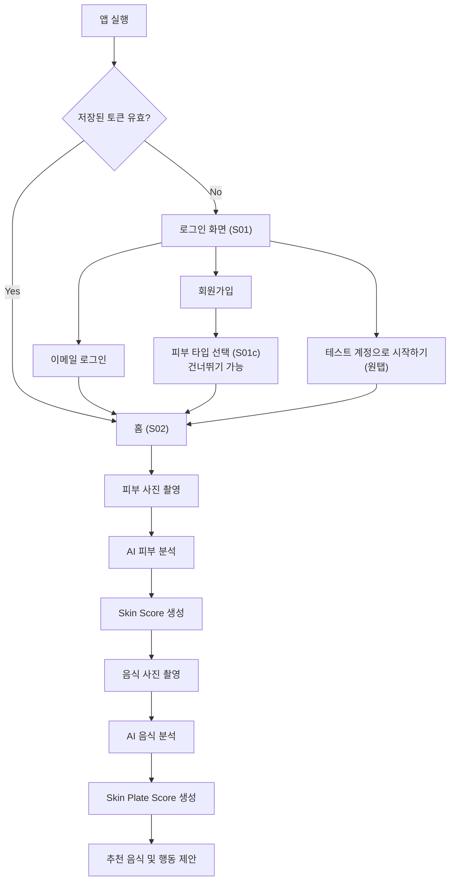
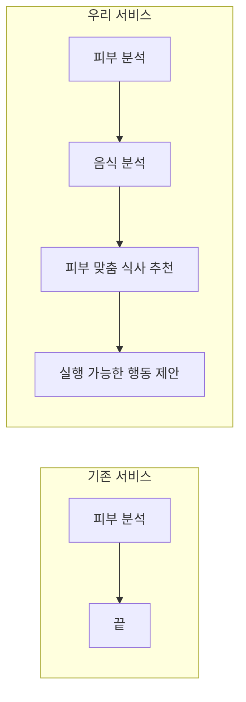
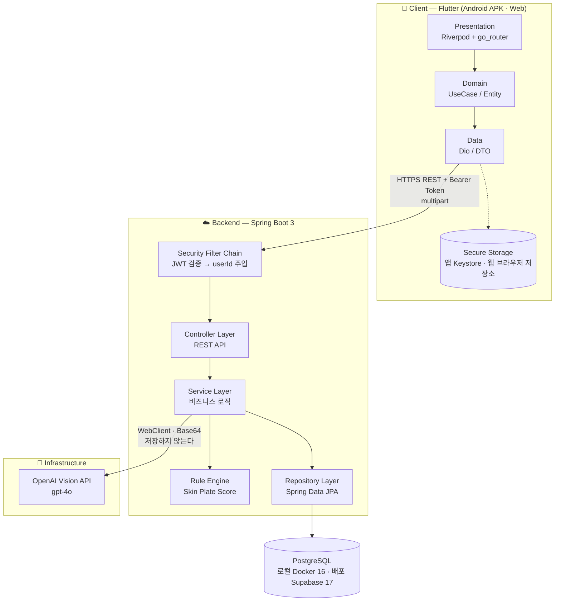
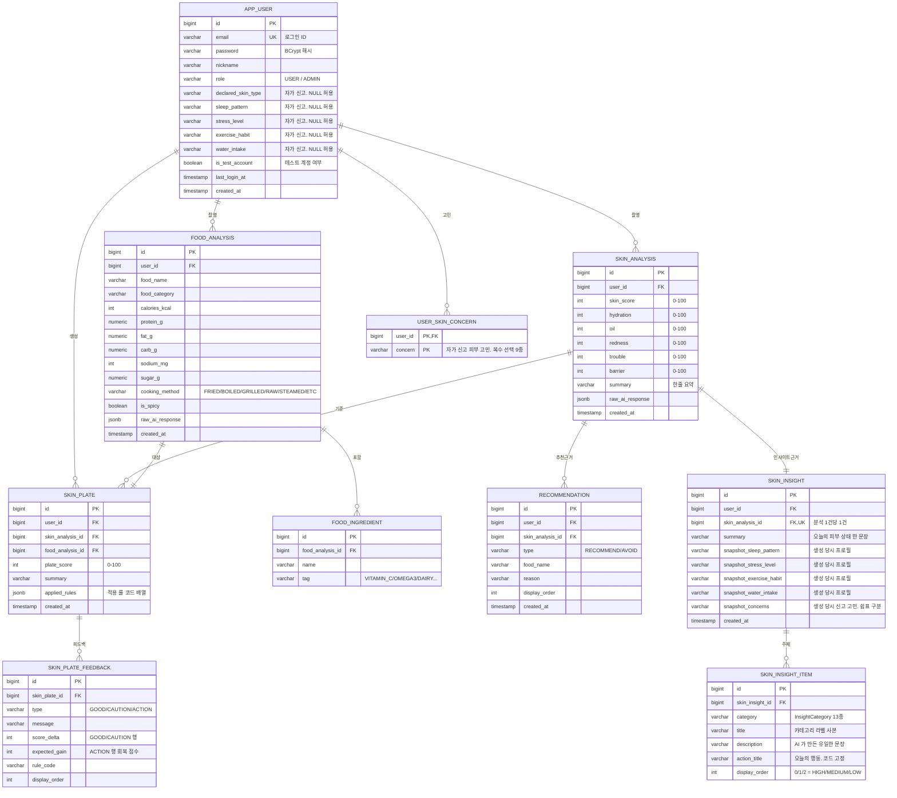
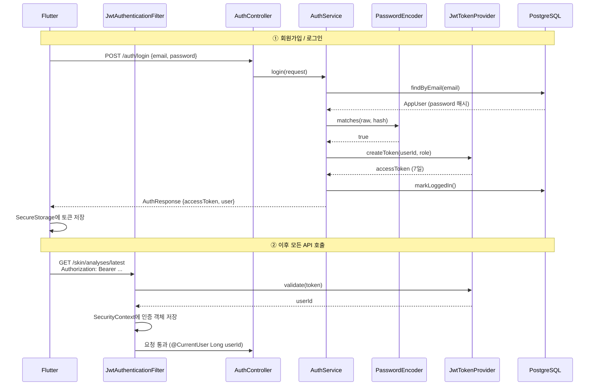
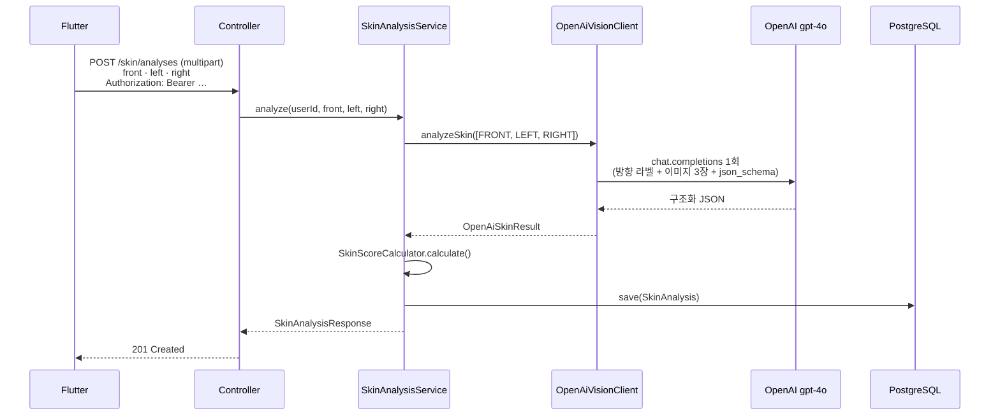
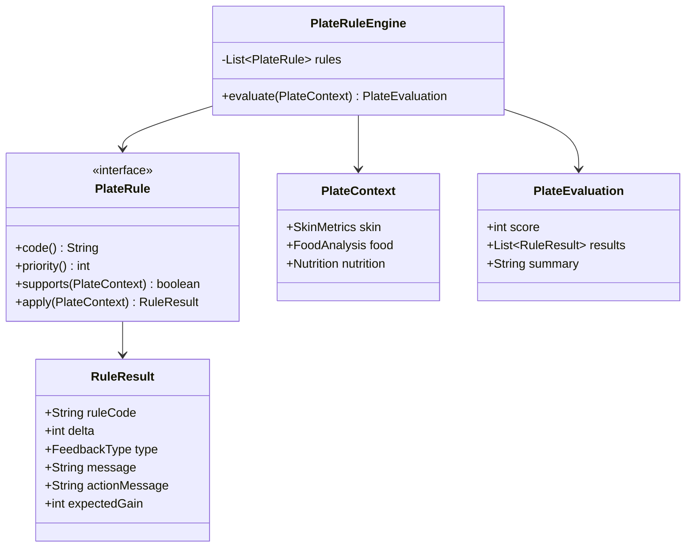
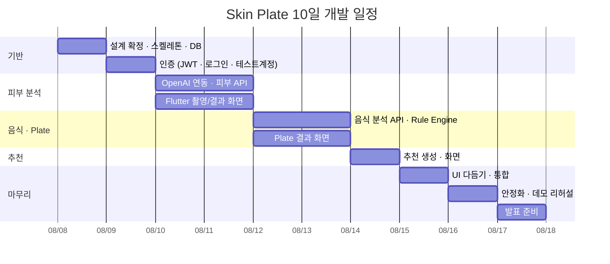

# Skin Plate — 제품 요구사항 정의서 (PRD) & 기술 설계서

> **"오늘의 피부를 위한 오늘의 한 끼"**
> AI 피부 분석 기반 식사 추천 서비스 · 해커톤 MVP

| 항목 | 내용 |
|---|---|
| 문서 버전 | v1.8 |
| 작성일 | 2026-08-07 · **v1.8 개정 2026-08-15** (개인화 피부 인사이트 · 수분 섭취 프로필 추가) |
| 문서 범위 | 제품 요구사항(PRD) + 기술 설계(Architecture / API / DB / Rule Engine) |
| 개발 기간 | **2026-08-08 ~ 08-21** · GitHub 업로드 마감 **08-21** · 발표 **08-25** |
| 대상 플랫폼 | **Android (Flutter) → iOS → Web (Flutter Web)** — 이 순서로 개발한다 (v1.7 §9.6) |
| 팀 구성 가정 | Flutter 1~2명, Backend 1~2명, 기획/디자인 1명 |

### 문서 사용 안내

본 문서는 두 개의 층으로 구성된다.

- **Part 1 · 제품 요구사항** — 무엇을, 왜 만드는가 (원문 PRD 기반)
- **Part 2 · 기술 설계** — 어떻게 만드는가 (아키텍처 / 구조 / 명세)

원문 PRD에 없던 항목(성공 지표, 화면 정의, 리스크)은 제목 옆에 **`[보강]`** 으로 표시했다. 원문에 있던 내용은 의미를 바꾸지 않고 구조화만 했다.

---

# 목차

**Part 1 · 제품 요구사항**

1. [프로젝트 개요](#1-프로젝트-개요)
2. [문제 정의](#2-문제-정의)
3. [핵심 가치](#3-핵심-가치)
4. [MVP 범위](#4-mvp-범위)
5. [User Flow](#5-user-flow)
6. [화면 정의 [보강]](#6-화면-정의-보강)
7. [차별점](#7-차별점)
8. [성공 지표 · KPI [보강]](#8-성공-지표--kpi-보강)

**Part 2 · 기술 설계**

9. [전체 시스템 아키텍처](#9-전체-시스템-아키텍처)
10. [Flutter 프로젝트 구조](#10-flutter-프로젝트-구조)
11. [Spring Boot 프로젝트 구조](#11-spring-boot-프로젝트-구조)
12. [DB ERD](#12-db-erd)
13. [Entity 설계](#13-entity-설계)
14. [API 명세](#14-api-명세)
15. [DTO 설계](#15-dto-설계)
16. [인증 · 보안 설계](#16-인증--보안-설계)
17. [OpenAI 연동 구조](#17-openai-연동-구조)
18. [Skin Plate Rule Engine 설계](#18-skin-plate-rule-engine-설계)
19. [개발 우선순위 · 일정](#19-개발-우선순위--일정)
20. [리스크 · 대응 방안 [보강]](#20-리스크--대응-방안-보강)
21. [최종 발표 메시지](#21-최종-발표-메시지)

**부록**

- [부록 A. 환경 변수](#부록-a-환경-변수)
- [부록 B. 로컬 실행](#부록-b-로컬-실행)
- [부록 C. 용어 정의](#부록-c-용어-정의)
- [부록 H. v1.6 변경 이력](#부록-h-v16-변경-이력)
- [부록 D. v1.1 변경 이력](#부록-d-v11-변경-이력)

---
---

# Part 1 · 제품 요구사항

---

## 1. 프로젝트 개요

AI 피부 분석을 기반으로 사용자가 촬영한 음식이 **현재 피부 상태에 적합한지** 평가하고, 더 나은 식사 선택을 제안하는 모바일 서비스(MVP)를 개발한다.

핵심 컨셉은 단순한 피부 분석이 아니라 다음의 연결이다.

```
피부 분석  →  음식 분석  →  행동 변화
```

기존 서비스가 "당신의 피부는 이렇습니다"에서 멈춘다면, 본 서비스는 **"그래서 오늘 이 음식을 이렇게 드세요"** 까지 도달한다.

---

## 2. 문제 정의

많은 사람들이 피부 고민이 생기면 화장품을 먼저 바꾼다. 그러나 실제 피부 건강은 **식습관과 생활습관**의 영향을 크게 받는다.

현재 대부분의 피부 분석 서비스는 아래의 한계를 갖는다.

| 한계 | 설명 |
|---|---|
| 분석에서 종료 | 피부 상태 수치만 제공하고 끝난다 |
| 행동 연결 부재 | 사용자가 **당장 실천할 수 있는 행동**으로 이어지지 않는다 |
| 맥락 없는 조언 | "물을 많이 드세요" 같은 일반론에 머문다 |
| 식사와의 단절 | 피부에 가장 직접적인 식사 선택을 다루지 않는다 |

우리는 AI를 통해

1. 현재 피부 상태를 분석하고
2. 오늘 먹으려는 음식을 분석한 뒤
3. 피부에 더 좋은 선택을 제안하는 서비스를 만든다.

---

## 3. 핵심 가치

> ### "오늘의 피부를 위한 오늘의 한 끼"

AI가 피부를 분석하는 것에서 끝나는 것이 아니라, **오늘 먹는 식사까지 함께 관리하는 것**이 목표이다.

이 가치를 제품에서 검증하는 기준은 하나다.

> **사용자가 앱을 닫은 뒤, 눈앞의 식사에서 실제로 무언가를 바꾸는가?**

"국물을 절반만 남기세요" 같은 **즉시 실행 가능한 한 문장**이 이 제품의 최소 성공 단위다.

---

## 4. MVP 범위

### 4.1 AI 피부 분석

**입력**

- 얼굴 사진 촬영
- 또는 갤러리 업로드

**AI 분석 결과**

| 지표 | 범위 | 설명 |
|---|---|---|
| Skin Score | 0~100 | 5개 세부 지표를 종합한 오늘의 피부 점수 |
| 피부 수분 (hydration) | 0~100 | 높을수록 촉촉함 |
| 피부 유분 (oil) | 0~100 | 높을수록 유분 과다 |
| 홍조 (redness) | 0~100 | 높을수록 붉음/자극 |
| 트러블 (trouble) | 0~100 | 높을수록 여드름/염증 |
| 피부 장벽 (barrier) | 0~100 | 높을수록 장벽 건강 |

> **지표 방향 주의** — `hydration`, `barrier`는 높을수록 좋고, `oil`, `redness`, `trouble`은 높을수록 나쁘다. Rule Engine과 UI 색상 로직이 이 방향성을 공유해야 한다.

**Skin Score 산출식 (확정)**

5개 지표의 방향을 "높을수록 좋음"으로 통일한 뒤 평균낸다.

```
SkinScore = round( ( hydration + barrier
                   + (100 − oil) + (100 − redness) + (100 − trouble) ) / 5 )
```

> **산식을 문서에 박아두는 이유** — 산식이 없으면 Day 4에 구현자가 아무 평균이나 짜고, 그때부터 문서의 예시 점수와 어긋난다. S05 화면은 **총점 게이지와 5개 지표 바를 한 화면에 동시에** 띄우기 때문에, 둘이 안 맞으면 심사위원이 3초 만에 본다.

**결과 예시** — `hydration 38 · oil 52 · redness 64 · trouble 25 · barrier 78`

```
(38 + 78 + 48 + 36 + 75) / 5 = 55

Skin Score : 55
· 피부 장벽 양호   (barrier 78 → GOOD)
· 건조 주의        (hydration 38 → CAUTION)
· 홍조 주의        (redness 정렬점수 36 → CAUTION)
```

> **55가 86보다 낫다.** 86점이면 사용자도 심사위원도 "괜찮네"에서 멈춘다. 55점이어야 "그래서 오늘 뭘 먹어야 하나"로 이어지고, 그게 이 제품이 존재하는 이유다.

**Highlights 산출 규칙 (확정)**

두 결정을 분리한다. **무엇을 보여줄지는 위치가, 어떤 상태로 보여줄지는 값이 정한다.**

| 단계 | 기준 |
|---|---|
| 무엇을 (3줄 선택) | 1행 = 가장 좋은 지표 · 2행 = 두 번째로 나쁜 지표 · 3행 = 가장 나쁜 지표 |
| 어떤 상태로 | 방향 정렬 점수 **60 이상 `GOOD` / 40 이상 `WARN` / 그 미만 `CAUTION`** |

상태까지 위치로 정하면 **화면이 거짓말을 한다.**

| 케이스 | 지표 | Skin Score | 위치로만 정하면 |
|---|---|---|---|
| 전부 나쁨 | `20/90/85/80/25` | **18** | "가장 좋은 것"이 장벽 25인데 **초록 GOOD "피부 장벽 양호"** |
| 전부 좋음 | `95/10/5/5/95` | **94** | "가장 나쁜 것"이 유분 10인데 **빨강 CAUTION "유분 과다"** |

이건 v1.2에서 Blocker로 고친 "86점 vs 수분 38"과 같은 종류의 사고다. 임계값(60/40)은 `SkinMetrics`의 판정 기준과 일치시킨다 — `isDry`·`isBarrierWeak`가 40 미만이므로, 두 기준이 어긋나면 "홍조 주의라면서 뱃지는 노랑"이 된다.

**위치로 3개를 뽑는 이유는 레이아웃 고정이다.** 고정되는 것은 줄 수(항상 3줄)이지 색이 아니다. 상태가 정말 나쁘면 세 줄 모두 `CAUTION`이 나오고, 그게 맞다.

지표별 문구는 **DTO 설계서 §1.12.1 `SkinHighlightBuilder`** 참조.

---

### 4.2 Skin Plate

사용자가 **음식 사진**을 촬영한다.

AI가 분석하는 항목

- 음식 종류
- 주요 재료
- 영양 정보 (칼로리 / 단백질 / 지방 / 탄수화물 / 나트륨 / 당류)

그리고 **현재 피부 분석 결과와 비교**하여 Skin Plate Score를 생성한다.

**결과 예시**

```
Skin Plate : 87점

좋은 점
· 단백질 충분
· 비타민 풍부

주의사항
· 나트륨 과다

추천 행동
· 국물을 절반만 남기면 Skin Plate 점수가 상승합니다.
```

> **핵심 포인트** — Skin Plate Score는 "이 음식이 건강한가"가 아니라 **"이 음식이 지금 당신의 피부에 맞는가"** 를 측정한다. 같은 라면이라도 홍조 지수가 높은 사용자에게는 더 낮은 점수가 나온다. 이것이 일반 식단 앱과의 결정적 차이다.

---

### 4.3 AI 추천

피부 상태와 음식을 종합하여 **오늘 추천하는 음식**과 **주의해야 하는 음식**을 제안한다.

**예시**

| 구분 | 항목 |
|---|---|
| 추천 | 키위, 브로콜리, 연어 |
| 주의 | 라면, 탄산음료 |

각 항목에 **추천 이유**도 함께 생성한다.

예: `연어 — 오메가3가 피부 장벽 회복을 돕습니다. 오늘 건조 지표가 낮게 나왔습니다.`

---

### 4.4 로그인 · 회원가입

사용자를 식별해야 **분석 기록이 축적**되고, 그래야 "어제보다 오늘 피부가 나아졌다"는 서사가 가능해진다. 이메일 + 비밀번호 방식의 자체 인증을 구현한다.

**구현 범위**

| 기능 | 포함 여부 | 비고 |
|---|---|---|
| 이메일 회원가입 | ✅ | 이메일 + 비밀번호 + 닉네임 |
| 이메일 로그인 | ✅ | JWT Access Token 발급 |
| 자동 로그인 | ✅ | 토큰을 기기 보안 저장소에 보관 |
| 로그아웃 | ✅ | 로컬 토큰 삭제 |
| 내 정보 조회 | ✅ | `GET /auth/me` |
| **피부 타입 선택** | ✅ | 가입 직후 1탭 선택 (S01c). **건너뛰기 가능** — 아래 4.4.1 |
| **테스트 계정** | ✅ | 아래 4.4.2 참조 |
| 이메일 인증 메일 발송 | ❌ | 해커톤 범위 외 |
| 비밀번호 재설정 | ❌ | 해커톤 범위 외 |
| 소셜 로그인 (카카오/애플) | ❌ | Phase 2 |
| Refresh Token 갱신 | ❌ | Access Token 유효기간 7일로 대체 |

> **왜 Refresh Token을 안 만드는가** — 해커톤 시연 기간은 10일이고, Access Token 유효기간을 7일로 두면 토큰 갱신 시나리오가 시연 중에 아예 발생하지 않는다. 갱신 로직은 코드량 대비 심사에서 얻는 게 없다. 다만 `TokenPair`를 반환할 자리는 DTO에 남겨 둬서 Phase 2에서 필드 추가만으로 붙게 한다.

#### 4.4.1 피부 타입 선택 (가입 직후)

회원가입이 끝나면 **"평소 본인 피부는 어떻다고 생각하세요?"** 를 한 번 묻는다.

| 선택지 | 코드 |
|---|---|
| 건성 | `DRY` |
| 지성 | `OILY` |
| 복합성 | `COMBINATION` |
| 민감성 | `SENSITIVE` |
| 잘 모르겠어요 | `UNKNOWN` |

**설계 원칙 3가지**

| 원칙 | 이유 |
|---|---|
| **회원가입 폼 안에 넣지 않는다.** 가입 완료 후 별도 화면(S01c) | 입력 필드 4개 옆에 라디오 그룹이 붙으면 폼이 길어 보인다. 가입을 끝낸 뒤 칩 하나 고르는 건 마찰이 아니라 참여다 |
| **건너뛰기가 항상 보인다.** 미선택 = `NULL` | 필수로 만들면 시연 흐름이 여기서 멈춘다. 미선택이어도 서비스는 완전히 동작한다 |
| **Rule Engine에는 넣지 않는다.** 표시·비교 전용 | 자가 신고값이 점수에 개입하면 "같은 사진 두 번 찍어도 같은 점수"라는 주장에 사용자 입력이라는 변수가 하나 더 끼어든다. `PlateContext`는 계속 `(SkinMetrics, FoodAnalysis)` 둘만 받는다 |

**어디에 쓰이는가 — S05의 갭 코멘트**

```
Skin Score 55
· 피부 장벽 양호 / 약간 건조 / 홍조 주의
──────────────────────────────────────
평소 생각하신 타입 : 지성
오늘 측정 기준     : 건성

"지성이라고 생각하셨지만 오늘은 유분보다 수분 부족이 두드러집니다.
 유분기는 수분이 모자랄 때도 늘어날 수 있습니다."
```

> **이 갭이 이 기능의 존재 이유다.** 피부 타입을 받아서 개인화에 쓰는 게 아니라, **"당신이 알고 있던 것과 오늘 측정이 다르다"를 보여주기 위해** 받는다. 이건 차별점 표(§7)의 "고정 타입이 아니라 오늘의 상태"라는 주장을 **화면에서 직접 증명하는 장치**이기도 하다.
>
> 미선택(`NULL`)이면 갭 카드 자리에 **"평소 본인 피부는?" 인라인 선택 칩**이 대신 뜬다. 건너뛴 사용자도 결과를 본 뒤에 마음이 바뀌면 그 자리에서 고를 수 있다.

**관찰 타입 판정 규칙 (결정론적)**

```
redness > 70                    → SENSITIVE
hydration < 40 && oil > 70      → COMBINATION   (수분 부족형 지성)
oil > 70                        → OILY
hydration < 40                  → DRY
그 외                           → NORMAL
```

> AI에게 "이 사람 피부 타입이 뭐야"를 묻지 않는다. **5개 지표에서 규칙으로 도출한다.** 같은 지표면 항상 같은 타입이 나와야 갭 코멘트도 재현 가능하다.

> 자가 신고값(피부 타입·고민·생활 습관)을 점수 계산에 넣지 않는 원칙은 **점수 계산 한정**이다 — 추천 보완(§18.9)에는 쓴다.

---

#### 4.4.2 테스트 계정

심사위원과 팀원이 **회원가입 없이 즉시 앱을 체험**할 수 있도록 고정 테스트 계정을 제공한다.

| 항목 | 값 |
|---|---|
| 이메일 | `test@skinplate.app` |
| 비밀번호 | `test1234!` |
| 닉네임 | `테스트유저` |
| 생성 시점 | 서버 기동 시 자동 생성 (`TestAccountInitializer`) |
| 활성 조건 | `app.auth.test-account.enabled=true` (local/dev 프로파일 기본 on, prod 기본 off) |

**로그인 화면에 "테스트 계정으로 시작하기" 버튼을 배치한다.**

> **이 버튼이 해커톤에서 갖는 의미** — 심사위원이 무대 위에서 이메일과 비밀번호를 타이핑하는 20초는 발표 시간의 11%다. 게다가 오타 한 번이면 흐름이 끊긴다. 원탭 버튼 하나로 그 리스크가 사라진다. 로그인을 구현하되 시연 마찰은 0으로 만드는 것이 목표다.

추가 테스트 계정 2개(`test2@skinplate.app`, `test3@skinplate.app`, 동일 비밀번호)를 함께 생성해 **여러 명이 동시에 시연**할 때 기록이 섞이지 않게 한다.

---

### 4.5 범위 정의 (In / Out)

**해커톤 기간 내 반드시 구현 (In Scope)**

- [x] **로그인 / 회원가입** (이메일 + 비밀번호, 테스트 계정 포함)
- [x] 피부 분석
- [x] 음식 분석
- [x] Skin Plate Score
- [x] AI 추천

**구현하지 않음 (Out of Scope)**

- [ ] 커뮤니티
- [ ] 관리자 페이지
- [ ] 결제
- [ ] SNS 연동 (소셜 로그인 포함)
- [ ] 푸시 알림
- [ ] 웰니스하우스 예약
- [ ] 이메일 인증 / 비밀번호 재설정

> **인증 도입의 설계적 영향** — 로그인·회원가입을 제외한 **모든 API가** `Authorization: Bearer {token}` 을 요구하고, 서버는 토큰에서 `userId`를 꺼내 쓴다. 컨트롤러는 `@AuthenticationPrincipal`로 사용자를 주입받으므로 요청 본문에 `userId`를 담지 않는다. **클라이언트가 보낸 userId를 신뢰하지 않는 것**이 인증을 넣는 진짜 이유다.

---

## 5. User Flow



**텍스트 버전**

```
앱 실행
  ↓
토큰 검사 → 없으면 로그인/회원가입 (또는 테스트 계정 원탭)
  ↓
(회원가입한 경우) 피부 타입 선택 — 건너뛰기 가능
  ↓
홈
  ↓
피부 사진 촬영
  ↓
AI 피부 분석
  ↓
Skin Score 생성
  ↓
음식 사진 촬영
  ↓
AI 음식 분석
  ↓
Skin Plate Score 생성
  ↓
추천 음식 및 행동 제안
```

**핵심 제약**: 이 플로우는 **처음부터 끝까지 3분 이내**에 완주 가능해야 한다. 해커톤 심사 시연이 곧 이 플로우이기 때문이다.

---

## 6. 화면 정의 [보강]

| ID | 화면 | 주요 요소 | 전환 |
|---|---|---|---|
| S00 | 스플래시 / 토큰 게이트 | 로고, 저장된 토큰 유효성 검사 | 유효 → S02 / 무효 → S01 |
| S01 | 로그인 | 이메일·비밀번호 입력, 로그인 버튼, **"테스트 계정으로 시작하기"**, 회원가입 링크 | → S02 / S01b |
| S01b | 회원가입 | 이메일·비밀번호·비밀번호 확인·닉네임, 유효성 안내 | → S01c |
| S01c | 피부 타입 선택 | "평소 본인 피부는?" 칩 5개, **건너뛰기** | → S02 |
| S02 | 홈 | 오늘의 Skin Score 카드(없으면 CTA), 최근 Plate, "피부 분석하기" 버튼 | → S03 / S06 |
| S03 | 피부 촬영 | 카메라 프리뷰, 얼굴 가이드 오버레이, 갤러리 버튼 | → S04 |
| S04 | 분석 로딩 | 진행 애니메이션, 단계 텍스트("피부 특징 추출 중…") | → S05 |
| S05 | 피부 결과 | Skin Score 원형 게이지, 5개 지표 바, 한 줄 요약 3개, "음식 분석하기" CTA | → S06 |
| S06 | 음식 촬영 | 카메라 프리뷰, 갤러리 버튼 | → S07 |
| S07 | Skin Plate 결과 | Plate Score, 좋은 점 / 주의사항 / **추천 행동** 카드, **"왜 60점인가" 접이식 계산 내역**, **행동 실행 버튼(점수 재계산 애니메이션)** | → S08 |
| S08 | AI 추천 | 추천 음식 리스트 + 이유, 주의 음식 리스트 + 이유, 공유 버튼 | → S02 |
| S09 | 히스토리 | 날짜별 Skin Score · Plate 기록 리스트 | → S05 / S07 |

**화면 설계 원칙**

1. **로딩 화면이 제품의 일부다.** AI 응답에 5~8초가 걸린다. 빈 스피너 대신 분석 단계를 순차로 보여주어 체감 대기시간을 줄인다.
2. **결과 화면의 주인공은 점수가 아니라 행동이다.** S07에서 "추천 행동" 카드를 시각적으로 가장 강조한다.
3. **모든 결과 화면은 다음 단계 CTA로 끝난다.** 사용자가 플로우 중간에서 멈추지 않도록 한다.
4. **로그인은 한 번만 보인다.** S00에서 토큰이 유효하면 로그인 화면을 건너뛴다. 재실행할 때마다 로그인을 요구하면 시연 흐름이 매번 끊긴다.
5. **회원가입 폼은 필수 입력 4개를 넘지 않는다.** 이메일·비밀번호·비밀번호 확인·닉네임. 성별·나이는 받지 않는다 — 피부 사진이 그걸 대신한다. 피부 타입은 폼 안이 아니라 **가입 완료 후 별도 화면(S01c)에서 칩 한 번**으로 받고, 건너뛸 수 있다.
6. **S07에서 점수가 눈앞에서 움직여야 한다.** "국물을 절반만 남기면 점수가 상승합니다"라는 *문장*과, 버튼을 눌러 `60 → 68`이 실제로 오르는 *경험*은 다른 제품이다. 이 5초가 이 서비스의 전부다.

### 6.1 앱 / 웹 기능 차이

하나의 Flutter 코드베이스로 **Android APK**와 **Flutter Web** 둘 다 낸다(§9.6). 화면은 같고, 갈리는 건 카메라 계열 두 가지뿐이다.

| 기능 | 앱 (APK) | 웹 |
|---|---|---|
| 로그인 · 회원가입 · 피부 타입 선택 | ✅ | ✅ |
| 결과 화면 3종 · 갭 카드 · 계산 내역 · 시뮬레이션 | ✅ | ✅ |
| 사진 업로드 | ✅ | ✅ 모바일 브라우저에서는 파일 선택 시 카메라가 열린다 |
| 실시간 카메라 프리뷰 + 얼굴 가이드 | ✅ | ❌ |
| ML Kit 얼굴 게이트 · 크롭 | ✅ | ❌ Android/iOS 전용 |
| 토큰 저장 | Keychain / Keystore | localStorage 수준 |

> **핵심 기능은 전부 웹에서 돈다.** 빠지는 건 게이트와 프리뷰뿐이고, 그 둘이 없어도 분석은 그대로 진행된다 — 얼굴이 아닌 사진이 올라오면 서버의 **`faceDetected:false` 폴백**이 받아 준다(§17.4). 게이트는 그 폴백을 *덜 겪게* 해주는 최적화이지, 없으면 기능이 죽는 관문이 아니다.

---

## 7. 차별점



| 비교 항목 | 기존 피부 분석 서비스 | Skin Plate |
|---|---|---|
| 분석 대상 | 피부만 | 피부 + 음식 |
| 결과 형태 | 수치와 진단 | 수치 + **오늘의 행동** |
| 개인화 기준 | 피부 타입 (고정) | **오늘의 피부 상태 (가변).** 자가 신고 타입은 받되 점수에는 쓰지 않고, "알고 있던 것과 오늘이 다르다"를 보여주는 데만 쓴다 |
| 사용자 다음 행동 | 화장품 구매 | 눈앞의 식사 조정 |
| 재방문 동기 | 낮음 (월 1회) | 높음 (식사마다) |

---

## 8. 성공 지표 · KPI [보강]

해커톤 기간에는 사용자 규모 지표가 무의미하다. **동작 신뢰성**과 **플로우 완주율**에 집중한다.

### 8.1 제품 지표

| 지표 | 목표 | 측정 방법 |
|---|---|---|
| 회원가입 완료율 | ≥ 85% | S01b 진입 → 가입 성공 비율 |
| 자동 로그인 성공률 | ≥ 99% | 재실행 시 S00에서 S02로 직행한 비율 |
| 전체 플로우 완주율 | ≥ 70% | 로그인 완료 → S08 도달 비율 (로컬 이벤트 로그) |
| 플로우 완주 소요 시간 | ≤ 3분 | S02 진입 ~ S08 도달 (로그인 제외) |
| 추천 행동 이해도 | 정성 평가 | 테스터 5인 대상 "무엇을 할지 알겠는가" 확인 |

### 8.2 기술 지표

| 지표 | 목표 |
|---|---|
| 로그인 / 회원가입 API 응답 시간 (p95) | ≤ 500ms |
| 유효 토큰의 인증 실패(오탐) | **0건** |
| 피부 분석 API 응답 시간 (p95) | ≤ 8초 |
| 음식 분석 API 응답 시간 (p95) | ≤ 6초 |
| AI 응답 파싱 성공률 | ≥ 95% |
| API 5xx 에러율 | ≤ 1% |
| 시연 중 앱 크래시 | **0건** |

### 8.3 해커톤 심사 대응 지표

| 지표 | 목표 |
|---|---|
| 데모 시나리오 무중단 성공 | 3회 연속 |
| **테스트 계정 원탭 로그인 소요 시간** | ≤ 5초 |
| 오프라인/네트워크 장애 시 데모 지속 가능 | Mock 모드로 전환 가능 |

---
---

# Part 2 · 기술 설계

> **설계 원칙**
> 1. 유지보수 가능한 구조 — 레이어 경계를 명확히
> 2. 확장 가능한 아키텍처 — 규칙과 프롬프트를 코드에서 분리
> 3. Clean Architecture 지향 — 단, 3계층까지만
> 4. Feature 기반 모듈 구조 — 기능 단위로 폴더를 자른다
> 5. **10일 내 구현 가능** — 위 4개와 충돌하면 이 항목이 이긴다
>
> **오버엔지니어링 금지 목록**: 멀티모듈 Gradle, CQRS, 이벤트 소싱, Kafka, Redis 캐시, 마이크로서비스, Kubernetes, 자동 롤백 CI/CD. 전부 하지 않는다.

---

## 9. 전체 시스템 아키텍처

### 9.1 구성도



> **이미지 저장소 노드가 없는 것이 맞다.** 서버는 이미지를 받아 Base64로 OpenAI에 보내고 버린다(§9.6). 결과 화면은 앱이 방금 찍은 로컬 파일을 쓴다.

### 9.2 책임 분리 (원문 "AI 역할" 반영)

| 주체 | 책임 |
|---|---|
| **OpenAI** | 피부 특징 추출, 음식 인식, 자연어 추천 생성 |
| **Backend** | Skin Plate Score 계산, 음식↔피부 상태 매칭, 추천 Rule Engine, 응답 생성 |
| **Flutter** | 촬영/업로드, 상태 표현, 결과 시각화 |

> **즉, AI는 "인식"을 담당하고 서비스의 핵심 로직은 Backend가 담당한다.**
>
> 이 분리가 중요한 이유: 점수 계산을 LLM에 맡기면 같은 입력에 다른 점수가 나와 **데모 중 재현이 불가능**해진다. 규칙 기반 계산은 항상 같은 결과를 낸다. 심사위원이 같은 사진을 두 번 찍어도 같은 점수가 나와야 한다.

### 9.3 기술 스택

| 영역 | 기술 | 버전 | 선정 이유 |
|---|---|---|---|
| Frontend | Flutter | 3.24+ | 크로스플랫폼, 빠른 UI 구현 |
| **웹** | **Flutter Web** | **3.24+ (동일 코드베이스)** | **같은 코드로 정적 번들을 뽑는다. 설치 없는 심사위원 체험용 (§6.1 · §9.6)** |
| 상태관리 | Riverpod | 2.x | 보일러플레이트 적음, 테스트 용이 |
| 라우팅 | go_router | 14.x | 선언적 라우팅 |
| 네트워크 | Dio + Retrofit | - | 인터셉터, multipart 지원 |
| 모델 | freezed + json_serializable | - | 불변 DTO 자동 생성 |
| 토큰 저장 | flutter_secure_storage | 9.x | Keychain / Keystore 기반 JWT 보관 |
| **얼굴 감지** | **google_mlkit_face_detection** | **0.11.x** | **온디바이스 얼굴 게이트 + 크롭 (§9.5)** |
| Backend | Spring Boot | 3.3.x | 팀 숙련도, 생태계 |
| Language | Java | 21 | record, sealed, pattern matching |
| **인증** | **Spring Security + jjwt** | **6.3 / 0.12.x** | **JWT 검증 필터, BCrypt 해싱** |
| ORM | Spring Data JPA | - | 빠른 CRUD |
| DB | PostgreSQL | 16 | JSONB로 AI 원본 응답 저장 |
| AI | OpenAI | gpt-4o | Vision + Structured Outputs 지원 |
| 문서화 | springdoc-openapi | 2.x | Swagger UI 자동 생성 |
| 로컬 DB | Docker Compose | - | 개발 중 Postgres만 컨테이너로 |
| **배포 · 백엔드** | **가비아 VM** (멋사 제공) | 2 vCore · 4GB · 1TB | **확정.** Docker 로 띄운다. HTTPS·본문 상한은 리버스 프록시 몫 (§9.6) |
| **배포 · 웹** | **Cloudflare Pages** | - | **정적 파일 호스팅. 무료·무제한 대역폭·HTTPS 자동** (§9.6) |
| **배포 · DB** | **Supabase 무료 Postgres** | 17 | **확정.** 서버와 분리해 재배포·호스팅 교체에도 데이터가 남는다 (§9.6) |

### 9.4 이미지 처리 파이프라인

```
[Flutter] 촬영            ★ 피부는 정면 · 왼쪽 · 오른쪽 3단계 (§9.5)
   → ML Kit 얼굴 게이트 (피부 사진만, 방향별 판정)  ★ §9.5
   → 얼굴 영역 크롭 (여백 20%)
   → 리사이즈 (긴 변 1024px) + JPEG 압축 (quality 80)
   → 세 장 모두 통과해야 multipart 업로드 (front · left · right)
[Backend] 수신
   → 세 장 각각 검증 (매직바이트, ≤5MB · 요청 합계 ≤20MB)
   → 각각 Base64 인코딩   ★ 저장하지 않는다 (§9.6)
   → OpenAI Vision 호출 1회 (피부 3장 detail: "high" / 음식 1장 detail: "low")
   → JSON 파싱 → DB 저장 (SkinAnalysis 1건)
```

> **비용·속도 최적화** — 클라이언트 리사이즈만으로 업로드 용량이 1/5로 줄어든다. 음식은 `detail: "low"`(고정 85토큰)로 충분하고, **피부만 `high`**로 보낸다. 홍조·트러블 판정이 512px 다운샘플로는 성립하지 않기 때문이다.
>
> 피부 사진은 **온디바이스로 얼굴만 크롭해서 올린다**(§9.5). 같은 토큰으로 얼굴의 실효 해상도가 3배 이상 올라간다.

---

### 9.5 온디바이스 얼굴 게이트 (ML Kit)

**결론부터: 넣는다. 단 "판정"이 아니라 "게이트 + 크롭"으로만 쓴다.**

#### 왜 필요한가

지금 설계에서 "얼굴이 아니다"를 알아내는 유일한 방법은 **OpenAI에 보내고 `faceDetected: false`를 받는 것**이다. 그 한 번에 5~8초와 API 비용이 나간다. 그리고 더 큰 문제가 셋 있다.

| 문제 | 게이트 없이 | 게이트 있으면 |
|---|---|---|
| **실효 해상도** | 상반신·배경 포함 사진을 1024px로 줄이면 **얼굴은 200px 남짓**이다. 그걸 다시 Vision이 타일로 자른다 | 얼굴만 크롭해 올리면 같은 용량으로 **얼굴이 1024px를 꽉 채운다.** 홍조·트러블 판정 근거가 실제로 생긴다 |
| **재현성** | 거리·각도·조도가 매번 달라 지표가 흔들린다. severityFactor가 그 숫자 위에 얹혀 있다 | 얼굴 크기·정면 각도를 강제하면 **입력 분산 자체가 줄어든다** |
| **시연 실패** | 어두운 곳에서 찍고 8초 기다린 뒤 "얼굴을 인식하지 못했습니다"를 본다 | 촬영 버튼이 애초에 비활성화되고 "조금 더 밝은 곳으로" 안내가 뜬다 |

#### 무엇을 쓰는가 — ML Kit이다, OpenCV·MediaPipe가 아니다

| 후보 | 판단 |
|---|---|
| **google_mlkit_face_detection** | ✅ **채택.** Flutter 공식 수준 플러그인, 온디바이스, 무료, Android/iOS 동시 지원. 바운딩 박스 + 머리 각도(Euler Y/Z) + 눈 뜸 확률까지 준다. 붙이는 데 반나절 |
| OpenCV (`opencv_dart`, FFI) | ❌ 네이티브 빌드 설정과 바이너리 크기가 해커톤에서 감당이 안 된다. Haar cascade는 정확도도 ML Kit보다 낮다 |
| MediaPipe Tasks | ❌ Flutter 플러그인 생태계가 아직 얇다. 플랫폼 채널을 직접 짜야 하고, 그 시간이 Day 4를 통째로 먹는다 |

**MediaPipe의 468점 랜드마크는 이 제품에 필요 없다.** 우리가 필요한 건 "얼굴이 있는가 / 충분히 큰가 / 정면인가" 세 가지뿐이고, ML Kit이 그걸 다 준다.

#### 게이트 조건 (촬영 버튼 활성화 기준)

| 조건 | 기준 | 실패 시 안내 |
|---|---|---|
| 얼굴 개수 | 정확히 1개 | "얼굴이 한 명만 보이게 해주세요" |
| 얼굴 크기 | 바운딩 박스 높이 ≥ 프레임 높이의 40% | "조금 더 가까이 와주세요" |
| 각도 (FRONT) | `headEulerAngleY`, `headEulerAngleZ` 절댓값 ≤ 15° | "정면을 봐주세요" |
| 각도 (LEFT / RIGHT) | `headEulerAngleY` 가 해당 방향으로 ≥ 25° | "얼굴을 조금 더 돌려주세요" |
| 밝기 | 얼굴 영역 평균 휘도 ≥ 60 (0~255) | "조금 더 밝은 곳에서 촬영해주세요" |

> **촬영은 3단계다** — 정면 → 왼쪽 → 오른쪽 순으로 각 단계에서 해당 방향의 게이트를 통과해야 다음으로 넘어간다. 세 장이 다 모인 뒤에야 서버를 한 번 호출한다(§14.3 ⑤). 단계마다 분석 API 를 부르면 결과가 세 개 나오고, 그중 무엇이 "오늘의 점수"인지 정할 방법이 없다.
>
> **`headEulerAngleY` 의 부호는 기기마다 뒤집힌다.** 전면 카메라 미러 처리 때문이다. 실기기에서 반드시 확인하고 상수 하나(`userLeftYawSign`)로 좌우를 통째로 뒤집는다.

> **밝기는 ML Kit이 주지 않는다.** 크롭한 얼굴 영역의 픽셀 평균 휘도를 직접 계산한다. 10줄이면 되고, 이게 시연 실패를 가장 많이 막아준다.

#### 쓰지 말아야 할 곳

**피부 상태 판정에는 절대 쓰지 않는다.** ML Kit이 주는 `smilingProbability`, `leftEyeOpenProbability` 같은 값으로 트러블이나 홍조를 추정하려 들면, "AI는 인식, 로직은 Backend"라는 우리 구조가 무너지고 근거 없는 숫자가 하나 더 생긴다. **게이트와 크롭까지가 전부다.**

**그리고 웹에서는 적용되지 않는다.** `google_mlkit_face_detection`은 Android/iOS 전용 플러그인이라 Flutter Web 빌드에 들어가지 않는다. 웹은 프리뷰·게이트 없이 파일 선택 경로만 쓴다(§6.1).

> **`kIsWeb` 만으로는 못 막는다.** `kIsWeb`은 런타임 분기이고 `import`는 컴파일 타임이다. 게이트 코드가 ML Kit을 import하고 그 파일이 웹에서 도달 가능하면, 분기를 아무리 걸어도 웹 빌드가 깨진다. **조건부 import로 ML Kit이 웹 번들에 들어가지 않게 막고, 웹은 파일 선택 경로만 쓴다. 구현은 설계서 §2.12 참조.**

```dart
// 호출부는 팩토리 하나만 부른다 — ML Kit 타입을 만나지 않는다
import 'face_gate_stub.dart' if (dart.library.io) 'face_gate_mlkit.dart';

final gate = faceGate();   // 웹이면 통과만 시키는 스텁이 온다
```

> 게이트가 없어도 웹 플로우는 끊기지 않는다. 얼굴이 아닌 사진이 올라오면 서버가 `faceDetected:false`로 응답하고 앱이 재촬영을 안내한다(§17.4) — 게이트가 하던 일을 한 번의 왕복으로 대신할 뿐이다.

#### 비용

| 항목 | 값 |
|---|---|
| 작업 시간 | 반나절 (Day 5~6 권장) |
| APK 증가 | 약 +3~5MB (번들 모델 기준) |
| iOS 추가 작업 | `pod install` + Podfile 최소 버전 상향 — 30분. **단 Xcode 설치(약 15GB)가 별도이고, 권한 문구는 이미 들어가 있다**(§9.6) |
| 런타임 | 프레임당 20~40ms, 온디바이스 |

> **컷오프: Day 6 종료 시점, FE-A가 판단해 팀에 통보한다.** 게이트가 그때까지 안 끝나면 **정적 얼굴 가이드 오버레이(원형 프레임 + "밝은 곳에서 정면으로 찍어주세요", 1시간)** 로 전환하고 게이트는 Phase 2로 넘긴다.
>
> 사람과 시각을 박아두지 않으면 Day 7까지 끌다가 **둘 다 못 한다.** 네이티브 의존성이 추가되는 작업이라 빌드가 깨지면 복구에 시간이 들고, Day 8은 기능 동결일이다.
>
> 오버레이로 전환해도 `detail:"high"`는 그대로 유지한다. 크롭이 없어도 `low`보다는 확실히 낫고, 심사 답변은 "온디바이스 크롭은 Phase 2, 지금은 촬영 가이드로 입력 분산을 줄입니다"로 정직하게 간다.

#### 심사 포인트

> "AI에 던지기 전에 온디바이스에서 품질을 한 번 거릅니다. 얼굴만 잘라 보내니까 같은 비용으로 해상도가 3배 올라가고, 촬영 조건이 일정해져서 점수도 안 흔들립니다."

이 한 문장이 §21의 예상 질문 "512px로 홍조를 판별할 수 있나요?"에 대한 답이 된다.

---

### 9.6 배포 구성 — 발표 형식이 아키텍처를 바꾼다

**전제가 바뀌었다.** 발표는 **사전 제작 영상**이고, 현장에서는 **배포된 앱**으로 시연한다. 그러면 이 문서 곳곳에 깔려 있던 "노트북 `bootRun` + 에뮬레이터 `10.0.2.2`" 전제가 성립하지 않는다.

#### 무엇이 달라지는가

| 항목 | 노트북 시연 전제 (구) | 배포본 시연 (현) |
|---|---|---|
| 서버 위치 | 노트북 localhost | **공인 주소에 배포** |
| 프로토콜 | HTTP | **HTTPS 필수** (Android API 28+ cleartext 차단) |
| `API_BASE_URL` | `http://10.0.2.2:8080` | `https://{배포 도메인}` |
| 앱 빌드 | 디버그 | **릴리즈** |
| 이미지 서빙 | 로컬 FS | 재배포 시 소실 — 아래 참조 |
| 첫 배포 시점 | Day 10 | **Day 4** |
| 배포 대상 | 앱 하나 | **백엔드 · 웹 · DB 세 곳** |

#### 백엔드 호스팅 — **가비아 VM 으로 확정** (멋쟁이사자처럼 대학 해커톤 제공)

| 항목 | 값 |
|---|---|
| Provider | **가비아** — 멋쟁이사자처럼 대학 해커톤 제공 서버 |
| 용도 | 스핀픽 Backend |
| CPU | High CPU · **2 vCore** |
| Memory | **4GB RAM** |
| 트래픽 | 월 **무료 1TB** |

> **Railway · Render · "512MB PaaS" 가정은 전부 폐기한다(superseded).** 그 아래의 크레딧·슬립·콜드스타트·UptimeRobot 논의는 PaaS 후보를 저울질하던 v1.6 시점의 검토 기록이며 **현재 운영 환경 설명이 아니다.** 이 개정 이후 배포 관련 판단은 위 표만 근거로 한다.

**PaaS 를 떠나면서 새로 생긴 일 두 가지.** 둘 다 v1.6 이 "PaaS 가 알아서 해준다"고 적어 두었던 것들이라, 환경이 바뀐 지금은 우리 작업이다.

| # | 항목 | 내용 |
|---|---|---|
| **H1** | **HTTPS 가 자동이 아니다** | v1.6 의 선택 기준이 "HTTPS 자동 발급"이었는데 VM 에는 그게 없다. **웹(Cloudflare Pages)은 `https://` 이므로 `http://` 백엔드를 부르면 브라우저가 mixed content 로 차단한다** — 서버는 멀쩡한데 웹 체험 경로만 죽고, 콘솔을 열기 전까지 원인이 안 보인다. 도메인 + **Caddy**(인증서 자동) 또는 nginx + certbot 이 필요하다 |
| **H2** | **리버스 프록시 본문 상한** | 피부 분석 요청이 **15MB**(5MB × 3장)다. **nginx 기본 `client_max_body_size` 는 1MB** 라 그대로 두면 업로드가 전부 413 이고, 앱에는 "분석 실패"만 뜬다. nginx 를 쓰면 `client_max_body_size 20m;` 을 반드시 넣는다. Caddy 는 기본 무제한이라 설정이 필요 없다 |

> **`server.port: ${PORT:8080}` 는 그대로 둔다.** PaaS 의 `PORT` 주입에 맞춘 값이지만 VM 에서는 기본값 8080 으로 떨어질 뿐이라 해가 없고, 지우면 로컬·컨테이너 실행 방식만 하나 더 갈린다.

**Caddy 구성은 `deploy/Caddyfile` 에 있다.** 도메인만 바꿔 넣으면 된다. 배포 순서와 함정:

| 순서 | 할 일 | 빠뜨리면 |
|---|---|---|
| 1 | `api.<도메인>` **A 레코드 → 가비아 공인 IP** | Let's Encrypt 발급이 실패하고 Caddy 가 재시도만 반복한다. 로그를 안 보면 "왜 https 가 안 되지"로 끝난다 |
| 2 | 방화벽 **80·443 개방** | 80 이 막히면 HTTP-01 챌린지가 통과하지 못한다. 443 만 열어도 발급이 안 된다 |
| 3 | 앱을 **`-p 127.0.0.1:8080:8080`** 으로 띄운다 | `0.0.0.0` 이면 HTTPS 를 세워 놓고도 **평문 8080 이 인터넷에 그대로 남는다.** 테스트 계정이 켜져 있으면 그 포트로 누구나 토큰을 받는다 |
| 4 | Caddy 기동 후 **3장 업로드를 한 번 통과**시킨다 | 413·502 는 배포 직후가 아니라 심사 중에 처음 만나게 된다 |

> **CORS 헤더를 Caddy 에서 붙이지 않는다.** 앱의 `WebConfig` 가 이미 `/api/**` 를 열어 두었고, 프록시가 한 번 더 붙이면 `Access-Control-Allow-Origin` 이 두 개 실려 **브라우저가 응답 전체를 거부한다.** 웹에서만 깨지고 앱은 멀쩡해서 원인을 찾기 어렵다.

**백업 후보**

| 후보 | 이유 |
|---|---|
| 노트북 + ngrok | ⚠️ 백업으로만. HTTPS는 되지만 무료 플랜은 URL이 재기동마다 바뀌어 릴리즈 빌드에 못 박을 수 없다 |
>
> **단, 로컬 개발은 여전히 HTTP다.** Day 2~5의 `http://10.0.2.2:8080`이 그대로 남아 있고, Flutter 디버그 매니페스트는 `INTERNET` 권한만 추가할 뿐 `usesCleartextTraffic`을 켜지 않는다. **Day 3 첫 API 호출에서 막히면 "서버가 안 떴나" 하고 백엔드를 뒤진다.** 10분이면 끝나므로 Day 2에 미리 넣는다.

```xml
<!-- android/app/src/main/res/xml/network_security_config.xml -->
<!-- 개발 호스트만 예외. 배포 도메인은 HTTPS이므로 여기 넣지 않는다. -->
<network-security-config>
  <domain-config cleartextTrafficPermitted="true">
    <domain includeSubdomains="false">10.0.2.2</domain>
    <domain includeSubdomains="false">localhost</domain>
  </domain-config>
</network-security-config>
```

이에 따라 **API도 컨테이너화한다.** §9.3에서 "API는 컨테이너화하지 않는다"고 적었던 것은 노트북 시연 전제였고, 지금은 무효다.

#### 실제 OpenAI 경로 실측 (2026-08-14)

부하 테스트는 OpenAI 를 지연 스텁으로 대체했으므로 **실제 `api.openai.com` 은 따로 확인했다.** 앱과 OpenAI 사이에 호출을 세는 프록시를 끼우고 3장을 올렸다.

| 시나리오 | 업로드(Flutter→Backend) | 나간 본문(Backend→OpenAI) | OpenAI 호출 | 응답 | 왕복 |
|---|---|---|---|---|---|
| 앱 크롭 사양 (1024px·q80, 장당 104KB) | 0.30MB | **0.41MB** | **1회** · 이미지 3장 | 200 | 5.1s |
| 중간 (장당 2.7~4.8MB) | 10.76MB | 14.35MB | **1회** · 이미지 3장 | 200 | 8.6s |
| **상한 근접** (장당 4.81MB) | **14.43MB** | **19.24MB** | **1회** · 이미지 3장 | **200** | 8.9s |

- **호출은 언제나 1회다.** 프록시가 센 값이고, 나간 본문에 `image_url` 이 3개·`[정면]` `[왼쪽 얼굴]` `[오른쪽 얼굴]` 라벨이 3개·`detail:"high"` 로 들어 있는 것까지 확인했다.
- **OpenAI 는 19.24MB 요청을 받는다.** 최악 조건이 실제 API 에서 통과한다는 뜻이다.
- **두 숫자를 헷갈리지 않는다.** `max-request-size: 20MB` 는 **들어오는** 요청(≤15MB)에 걸리는 값이고, OpenAI 로 **나가는** 본문(≈20MB)에는 아무 Spring 설정도 걸려 있지 않다. 나가는 쪽 상한은 OpenAI 가 정한다.
- 검증 이미지는 얼굴이 아니라 **`faceDetected:false` → 422** 가 정상 결과다. 구조화 응답 파싱과 얼굴 미검출 분기가 실제 응답으로 동작한다는 것까지 같이 확인된다.
- **요청 1회 = 분석 1건.** Mock 으로 201 을 받아 `skin_analysis` 행이 정확히 1 늘어나는 것을 확인했다(33 → 34).

#### 메모리 실측 — **JVM 옵션은 넣지 않는다** (2026-08-13)

3장 업로드로 요청 본문이 커졌으므로 실제 사양에서 재봤다. **배포 이미지를 그대로 `--memory=4g --cpus=2` 로 띄우고**, OpenAI 는 10초 지연 스텁으로 대체해 "AI 응답을 기다리는 동안의 점유"가 실제로 생기게 한 상태에서 측정했다.

| 동시 | 장당 | 요청 본문 | Peak RSS | Peak Heap | Peak CPU | 지연 | 결과 |
|---|---|---|---|---|---|---|---|
| 1 | 5MB | 15.0MB | 493 MiB | — | 72% | 10.9s | 201 |
| 2 | 5MB | 15.0MB | 668 MiB | — | 106% | 10.8s | 201 ×2 |
| **3** | **5MB** | **15.0MB** | **876 MiB** | **471 MiB** | **170%** | **10.9s** | **201 ×3** |
| 3 | 0.3MB | 0.9MB | — | — | **1%** | 10.1s | 201 ×3 |
| 6 | 5MB | 15.0MB | 1,133 MiB | 685 MiB | **208%** | 12.8s | 201 ×6 |

OOM 0 · 컨테이너 재시작 0 · 5xx 0.

**결론 세 가지**

1. **JVM 옵션을 넣지 않는다.** 4GB 컨테이너에서 JVM 기본 힙은 `MaxRAMPercentage=25%` → **1,024 MiB** 다. 심사위원 3명 동시(§16.5)를 최악 크기로 돌려도 힙 471 MiB(46%)·RSS 876 MiB(전체의 21%)라 **손댈 근거가 없다.** `-Xmx3g` 나 `MaxRAMPercentage=75` 를 넣으면 힙만 늘고 Metaspace·Direct·Netty·native 몫이 줄어 오히려 컨테이너 OOM-kill 쪽으로 옮겨간다.
2. **먼저 닿는 벽은 메모리가 아니라 CPU다.** 동시 6건에서 CPU 208%(2 vCore 포화)·지연 +18%인데 힙은 여전히 685/1,024 MiB 다. 이 구간의 CPU 는 대부분 **Base64 인코딩과 multipart 파싱**이라 업로드 크기에 직접 비례한다.
3. **그래서 프론트 크롭 정책이 곧 서버 여유다.** 같은 동시 3건인데 1024px 크롭(장당 0.3MB) 경로는 **CPU 1%** 다. 무료 트래픽 1TB 를 이유로 크롭·리사이즈를 느슨하게 하면 트래픽이 아니라 **CPU 에서 먼저 대가를 치른다.**

> **v1.6 이후의 "512MB PaaS · 힙 128MB → 동시 3건 OOM" 분석은 폐기한다.** 512MB × 25% = 128MB 라는 전제 자체가 실제 서버와 다르다. 다만 그 분석이 지목한 **요청당 20MB 요청 본문**은 실측으로 확인됐다(스텁이 받은 본문 20,974,031 바이트). 크기 자체는 사실이고, 그것을 감당할 여유가 4GB 에는 있다는 것이 달라진 결론이다.

```dockerfile
# Dockerfile — 멀티스테이지, 20줄이면 끝난다
FROM eclipse-temurin:21-jdk AS build
WORKDIR /src

# 빌드 스크립트를 소스보다 먼저 복사해 의존성 레이어를 분리한다.
# 소스만 고친 재배포에서 내려받기를 건너뛴다 — 첫 배포는 여러 번 다시 올리게 된다.
COPY gradlew settings.gradle build.gradle ./
COPY gradle ./gradle
RUN chmod +x gradlew && ./gradlew dependencies --no-daemon

COPY src ./src
RUN ./gradlew bootJar --no-daemon

FROM eclipse-temurin:21-jre
WORKDIR /app
COPY --from=build /src/build/libs/*.jar app.jar
ENV SPRING_PROFILES_ACTIVE=prod
RUN useradd --system --create-home app && chown -R app /app
USER app
ENTRYPOINT ["java", "-jar", "app.jar"]
```

> **`.dockerignore` 가 Dockerfile 만큼 중요하다.** 없으면 `COPY` 가 `.env` 를 그대로 이미지에 굽는다. `JWT_SECRET`·`OPENAI_API_KEY`·`DB_PASSWORD` 는 **레이어에 한 번 들어가면 뒤에서 지워도 남는다.** `build/`·`.gradle/` 도 함께 제외한다 — 호스트 캐시가 컨테이너 빌드를 오염시킨다.
>
> **`SPRING_PROFILES_ACTIVE=prod` 를 이미지에 박는다.** 기본 프로파일은 `local` 이고 `application-local.yml` 은 테스트 계정을 켜 두므로, 플랫폼에서 이 변수 하나를 빠뜨리면 **공개 배포에서 `POST /auth/test-login` 이 열린 채로 뜬다.** 빈 본문만 보내면 누구나 7일짜리 토큰을 받는데, 로그도 헬스체크도 전부 정상이라 아무도 눈치채지 못한다. `docker run -e` 와 플랫폼 환경변수가 이 값을 덮으므로 **같은 이미지를 로컬에서 `local` 로 띄워 확인하는 것도 그대로 된다** — 박아두는 쪽에 잃는 게 없다.
>
> **`PORT` 와 `EXPOSE` 관련 서술은 PaaS 전제였다(superseded).** 가비아 VM 에서는 `docker run -p` 로 우리가 포트를 정하고, `server.port: ${PORT:8080}` 은 기본값 8080 으로 떨어진다. 둘 다 그대로 두는 이유는 §9.6 호스팅 절에 적었다 — 지워서 얻는 게 없다.
>
> **대신 VM 에서는 리버스 프록시가 새 함정이다.** 인증서(H1)와 본문 상한(H2)이 거기 걸린다. 컨테이너만 띄우고 프록시를 안 세우면 앱은 HTTP 로 멀쩡히 뜨는데 **웹에서만 mixed content 로 막히고**, nginx 를 기본 설정으로 세우면 **15MB 업로드가 전부 413** 이다. 둘 다 로그에 에러가 안 남는 종류다.

#### DB — Supabase 무료 Postgres로 **확정**

**서버가 가비아 VM 으로 확정된 뒤에도 DB는 Supabase 로 둔다.** 4GB VM 에 Postgres 를 같이 올릴 수는 있지만, 그러면 앱과 DB 가 같은 메모리·CPU 를 나눠 쓰고 컨테이너를 지우는 순간 데이터가 사라진다. **분리해 두면 서버를 재배포하거나 VM 을 다시 만들어도 계정·분석 기록이 남는다.**

> **다만 지연이 하나 붙는다.** DB 가 외부에 있으므로 쿼리마다 네트워크 왕복이 생긴다. 이 API 는 요청당 쿼리가 몇 개뿐이고 무거운 건 OpenAI 대기라 체감되지 않지만, **VM 안에 Postgres 를 올리는 쪽이 빠르다는 사실 자체는 맞다.** 그 속도보다 데이터가 남는 쪽을 택한 것이다.

**연결은 Session Pooler 로 붙는다.** Direct connection(`db.<project-ref>.supabase.co`)은 IPv4 애드온(유료) 없이는 **IPv6 전용**이라 가비아 VM 에서 이름은 풀리는데 연결이 안 된다. Transaction Pooler(6543)는 **Flyway 가 깨진다** — 마이그레이션 중 잡는 advisory lock 이 세션 단위인데 트랜잭션 풀링은 트랜잭션마다 백엔드를 갈아끼운다. Session Pooler(5432)만 IPv4 이면서 세션 의미론이 그대로라 Flyway·Hibernate·HikariCP 를 아무것도 안 고치고 쓴다.

> **실측(2026-08-15, ap-northeast-2 프로젝트).** Pooler 호스트는 A 레코드만 있고 AAAA 가 없다 — 문서대로 IPv4 전용이다. `sslmode=require` 로 TLSv1.3 이 붙고, V1~V3 이 이 경로로 실제 적용됐다(재기동 시 정상 skip). 서버는 **PostgreSQL 17.6**, `max_connections=60` 이고 Supabase 자체 서비스가 20 안팎을 상시 점유한다 — HikariCP 기본값(최대 10)은 그 안에 충분히 들어가므로 손대지 않는다.
>
> **`sslmode` 를 생략하면 안 된다.** 이 프로젝트는 SSL 을 강제하지 않아 `sslmode=disable` 로도 연결이 된다. pgjdbc 기본값 `prefer` 는 TLS 협상이 실패하면 **조용히 평문으로 떨어지는데**, 그 평문 경로가 실제로 열려 있다는 뜻이다.
>
> **Flyway 는 10.22.0 으로 올려 뒀다.** Spring Boot 3.3.5 가 핀하는 10.10.0 은 PostgreSQL 16 까지만 지원해서 기동마다 `PostgreSQL 17.6 is newer than this version of Flyway` 경고가 떴다. `build.gradle` 의 `ext['flyway.version']` 한 줄로 올린다. **11.x 로 가면 안 된다** — Spring Boot 3.4 부터 지원이라 `FlywayAutoConfiguration` 이 깨진다.
>
> 올릴 때 확인한 것: 이미 V1~V3 이 적용된 DB 가 새 버전에서 checksum 검증을 통과하고(`up to date`), 빈 DB 에 새로 적용해도 checksum 3개가 이전과 동일하다. 즉 **이미 배포된 DB 와 앞으로 만들 DB 어느 쪽도 재적용이 필요 없다.**

| 환경변수 | 값 | 비고 |
|---|---|---|
| `DB_JDBC_URL` | `jdbc:postgresql://aws-<region>.pooler.supabase.com:5432/postgres?sslmode=require` | 대시보드 **Connect > Session pooler** 에서 복사. `DB_HOST`·`DB_PORT`·`DB_NAME` 을 대신한다 |
| `DB_USER` | `postgres.<project-ref>` | ★ Pooler 는 사용자명에 project-ref 가 붙는다. 그냥 `postgres` 면 인증이 실패한다 |
| `DB_PASSWORD` | 프로젝트 생성 시 지정한 값 | `.env`·저장소 커밋 금지 |

> **DB 이름은 `postgres`다. `skinplate`가 아니다.** 위 URL 에 이미 반영돼 있지만, `DB_HOST` 방식으로 되돌린다면 `DB_NAME=postgres` 를 반드시 같이 넘긴다. 로컬 `.env`를 그대로 복사해 붙이면 기동 로그가 `FATAL: database "skinplate" does not exist`로 끝난다. 애플리케이션 코드는 멀쩡한데 원인을 앱에서 찾게 되는 종류의 실패다.
>
> **`spring.flyway.baseline-version` 은 `0`이어야 한다.** `baseline-on-migrate: true` 와 Flyway 기본값 `1`이 만나면, public 스키마에 객체가 하나라도 있는 DB — Supabase 는 SQL 에디터를 한 번 쓰거나 확장을 하나 깔면 그렇게 된다 — 에서 **V1 을 "이미 적용됨"으로 기록하고 건너뛴다.** 그 다음 V2 가 `relation "skin_analysis" does not exist` 로 죽는데, 로그만 보면 V2 가 잘못된 것처럼 보인다.
>
> **개발 중에는 로컬 Docker Postgres를 그대로 쓴다.** Supabase는 배포용이다. `docker compose up -d postgres` + `DB_NAME=skinplate` 조합은 Day 2~10 내내 바뀌지 않는다.

#### 웹 호스팅 — Cloudflare Pages [신설]

**Flutter Web은 정적 파일이다.** 서버가 필요 없으므로 백엔드 호스팅 결정과 무관하게 지금 확정할 수 있다. 무료 · 무제한 대역폭 · HTTPS 자동.

**빌드는 Pages가 아니라 로컬/CI에서 한다.** Pages 빌드 환경에 Flutter SDK를 얹는 것보다 뽑아서 올리는 쪽이 짧다.

```bash
flutter build web --release --dart-define=API_BASE_URL=https://<백엔드>/api/v1
npx wrangler pages deploy build/web --project-name=skinplate
```

> **`API_BASE_URL`이 빌드 시점에 박힌다.** 백엔드 호스팅이 정해진 뒤에 웹을 빌드해야 하고, 백엔드 주소가 바뀌면 웹도 다시 빌드해 올린다. 두 줄이라 부담은 없지만 순서는 있다.

> **CORS 함정이 없다.** `WebConfig`가 `/api/**`를 전체 허용으로 열어 두었고(설계서 §1.9), 우리는 **쿠키가 아니라 `Authorization` 헤더로 토큰을 보낸다.** `allowCredentials`·`SameSite`·프리플라이트 쿠키 같은 문제가 **처음부터 발생하지 않는다.**
>
> **다만 그 `WebConfig` 가 실제로는 없었다(2026-08-14 발견·수정).** 설계서 §1.9 에 클래스가 적혀 있는데 스켈레톤에서 빠진 채로 넘어왔고, `SecurityConfig` 의 `.cors(withDefaults())` 는 `CorsConfigurationSource` 빈이 없으면 **빈 설정으로 풀려 헤더를 한 줄도 안 내보낸다.** 그 상태로 배포했으면 **APK 는 멀쩡하고 웹만 전부 막힌 채** 심사에 들어갔을 것이다 — 앱에서 안 보이는 종류라 배포 후에나 드러난다. 지금은 클래스를 넣었고 `WebConfigTest` 가 매핑 존재를 고정한다.

#### 앱 배포 — **Android → iOS → 웹** 순 (2026-08-14 우선순위 확정)

| 대상 | 판단 |
|---|---|
| **① Android APK** | ✅ **GitHub Releases에 올리고 QR로 배포.** Firebase App Distribution은 필요 없다 — 테스터 이메일 등록 절차가 QR보다 마찰이 크다. **시연 영상은 이 빌드로 찍는다** |
| **② iOS — Xcode USB 직접 설치** | ✅ **무료.** 팀에 실기기가 있다. **Android 가 끝난 뒤에 붙인다** |
| ~~iOS / TestFlight~~ | ❌ **$99/년.** 다만 이건 **TestFlight 경로에만** 해당한다 — 아래 정정 참조 |
| **③ 웹** | 우선순위 최하위. 붙으면 체험 폭이 넓어지지만 **시연 경로는 APK 다** |

> **§9.6 v1.6 의 "iOS 제외" 근거는 절반이 틀렸다(2026-08-14 정정).** 근거가 "Apple Developer $99/년 + 심사 대기"였는데 그건 **TestFlight 배포에만** 걸린다. **Xcode 로 USB 직접 설치하는 경로는 무료 Apple ID 로 되고 심사도 없다.**
>
> 무료 설치(Personal Team)의 제약은 **7일 후 앱 만료**·기기당 앱 3개·유료 entitlement(Push·App Groups) 사용 불가인데, **우리는 셋 다 걸리지 않는다.** 카메라와 ML Kit 은 무료 서명으로 그대로 돌고, Day 8 에 설치하면 Day 9 촬영과 Day 10 발표를 덮는다.

**iOS 에 실제로 드는 것은 돈이 아니라 시간이다.**

| 항목 | 상태 (2026-08-14) |
|---|---|
| **Xcode** | ❌ **설치 안 돼 있다** — Command Line Tools 뿐. App Store 에서 약 15GB. §9.5 가 적어 둔 "iOS 추가 작업 30분"에 **이게 빠져 있었다** |
| iOS 프로젝트 골격 | ✅ `Runner.xcworkspace` 존재 |
| 카메라·사진 권한 문구 | ✅ `Info.plist` 에 이미 있다 |
| Podfile 최소 버전 | ⚠️ `platform :ios` 미지정 → ML Kit 요구 버전으로 올리고 `pod install` |
| iOS FaceGate 코드 | ⚠️ `bgra8888` 분기는 있으나 **실기기에서 한 번도 안 돌았다** |

> **마지막 줄이 진짜 리스크다.** 설계서 §2.12.2 가 경고한 대로 **iOS 에서 프레임 포맷이 어긋나면 예외가 안 나고 검출이 0개로 나온다.** 게이트는 "얼굴이 화면 안에 들어오게 해주세요"만 계속 띄우고, 원인을 게이트 조건에서 찾게 된다. **실기기에 올려 보기 전에는 되는지 알 수 없다.**
>
> **그래서 iOS 는 Android 가 G5 를 통과한 뒤에만 착수한다.** 네이티브 의존성이 걸린 작업이라 빌드가 깨지면 복구에 시간이 들고, 그게 Day 8 기능 동결이 막으려는 바로 그 상황이다. **Day 8 안에 Android 가 안 끝나면 iOS 는 발표 이후로 넘긴다** — 순서를 정한 것이지 둘 다 하겠다고 정한 것이 아니다.
>
> **아이폰 심사위원 경로는 iOS 가 붙으면 iOS 로, 못 붙으면 웹으로 간다.** 웹을 최하위로 내렸어도 **버린 것은 아니다** — 둘 다 없으면 아이폰 심사위원은 체험할 방법이 없다.

#### 이미지 서빙 — 아예 의존하지 않는다

배포 환경에서 로컬 파일 시스템은 컨테이너를 재시작하면 사라진다. 볼륨을 붙이거나 S3를 쓰면 되지만, **더 간단한 답이 있다.**

> **서버는 이미지를 저장하지 않는다.** 받아서 Base64로 OpenAI에 보내고 버린다.

두 결정이 이미 내려진 뒤라 **저장된 이미지를 읽을 소비자가 하나도 남지 않았다.**

| 결정 | 결과 |
|---|---|
| 결과 화면은 앱이 30초 전에 찍은 **로컬 파일**을 표시 | S05·S07이 서버 이미지를 안 쓴다 |
| 히스토리(S09) 응답에 사진 필드가 없다(§14.2 #13) | 과거 사진을 다시 꺼내 볼 화면이 없다 |

그런데도 `ImageStorage` · 리소스 핸들러 · `/uploads/**` 공개 · `STORAGE_BASE_URL`을 만들면, **아무도 안 읽는 데이터를 PaaS 컨테이너 재배포마다 잃는 코드**를 유지하게 된다.

```java
// 세 장 모두 저장하지 않는다. 장수가 늘어도 보관 정책은 그대로다.
List<FacePhoto> photos = List.of(
        encode(FacePhotoType.FRONT, front),
        encode(FacePhotoType.LEFT, left),
        encode(FacePhotoType.RIGHT, right));
OpenAiSkinResult ai = visionClient.analyzeSkin(photos);   // 호출 1회
```

**이 결정이 주는 것 세 가지**

1. **반나절 회수** — `ImageStorage`·`LocalImageStorage`·`WebConfig` 리소스 핸들러·`STORAGE_BASE_URL` 전부 불필요
2. **리스크 소멸** — 호스트 불일치(R17)와 배포 환경 이미지 유실이 함께 사라진다
3. **심사 답변 확보** — *"얼굴 사진은 서버에 저장하지 않습니다. 분석에만 쓰고 버립니다."* 피부 사진이라 이 답이 실제로 세다

디버깅은 `raw_ai_response`(jsonb)가 DB에 남으므로 그대로 된다. 히스토리에 사진을 붙일 소비자가 생기면 그때 저장을 붙이면 되고, **지금 안 붙일 거면 지금 없는 게 맞다.**

#### 환경별 설정 3벌

| 환경 | `SPRING_PROFILES_ACTIVE` | 테스트 계정 | `API_BASE_URL` |
|---|---|---|---|
| 로컬 개발 | `local` | 활성 | `http://10.0.2.2:8080/api/v1` (cleartext 예외 필요) · DB는 로컬 Docker |
| 배포 (시연) | `prod` + `TEST_ACCOUNT_ENABLED=true` | **활성** | `https://{백엔드 도메인}/api/v1` · **APK·웹 빌드 모두 이 값** · DB는 Supabase |
| 배포 (실서비스) | `prod` | 비활성 | 〃 |

> **시연용 배포는 `prod` 프로파일이면서 테스트 계정은 켜야 한다.** 그래서 테스트 계정 스위치를 프로파일이 아니라 **독립 프로퍼티**(`app.auth.test-account.enabled`)로 뽑아둔 것이다. 심사위원이 현장에서 원탭 로그인을 해야 하기 때문이다.

#### 배포 일정 — Day 4에 한 번 올린다

**첫 배포는 예외 없이 반나절을 먹는다.** 환경변수 누락, 포트, DB 연결 문자열(★ `DB_NAME`), 헬스체크, 빌드 캐시. 그걸 Day 10에 처음 하면 발표 당일에 한다는 뜻이다.

| 시점 | 할 일 |
|---|---|
| **Day 4** | **1차 배포.** 기능이 절반만 돌아도 올린다. 목적은 파이프라인을 뚫는 것. **가비아 VM + 리버스 프록시(HTTPS·본문 20MB)를 같이 세운다**(R23) |
| Day 7 | 릴리즈 APK로 실기기에서 배포 서버 호출 확인 · **웹 빌드 → Cloudflare Pages 연결**(§19.2) |
| Day 8 | **배포본 E2E 1회 완주 — APK 1회 · 웹 1회.** 이게 시연에서 쓸 바로 그 빌드다 |
| G5 통과 이후 | 영상 촬영·편집. 코드는 동결 |

---

## 10. Flutter 프로젝트 구조

### 10.1 원칙

- **Feature-first**: 기능 폴더가 최상위, 레이어는 그 하위
- **레이어 3개만**: `data` / `domain` / `presentation`
- **의존 방향**: `presentation → domain ← data` (domain은 아무것도 모른다)
- **한 기능을 지우면 폴더 하나만 지우면 된다**

### 10.2 디렉토리 구조

```
lib/
├── main.dart
│
├── app/                                # 앱 전역 설정
│   ├── app.dart                        # MaterialApp, ProviderScope
│   ├── router/
│   │   └── app_router.dart             # go_router 라우트 정의
│   └── theme/
│       ├── app_colors.dart
│       ├── app_text_styles.dart
│       └── app_theme.dart
│
├── core/                               # 기능 무관 공통 인프라
│   ├── config/
│   │   └── env.dart                    # API_BASE_URL, MOCK_MODE 플래그
│   ├── network/
│   │   ├── dio_client.dart             # Dio 인스턴스 + 타임아웃
│   │   ├── auth_interceptor.dart       # Authorization: Bearer 자동 주입
│   │   ├── unauthorized_interceptor.dart  # 401 감지 → 토큰 삭제 → 로그인 이동
│   │   └── api_envelope.dart          # 공통 응답 래퍼 { success, data, error }
│   ├── storage/
│   │   └── token_storage.dart          # flutter_secure_storage 래퍼
│   ├── error/
│   │   └── failure.dart                # Network / Server / Auth / Analysis Failure
│   ├── result/
│   │   └── result.dart                 # Result<T> (Success | Failure)
│   ├── di/
│   │   └── providers.dart              # Riverpod 전역 Provider 등록
│   ├── utils/
│   │   ├── image_compressor.dart       # 리사이즈 + 압축
│   │   └── validators.dart             # 이메일/비밀번호 형식 검증
│   └── widgets/
│       ├── score_gauge.dart            # 원형 점수 게이지 (재사용)
│       ├── metric_bar.dart             # 지표 막대 (재사용)
│       ├── loading_steps.dart          # 단계형 로딩 인디케이터
│       └── primary_button.dart
│
├── features/
│   │
│   ├── auth/                           # ⓪ 로그인 / 회원가입
│   │   ├── data/
│   │   │   ├── datasources/
│   │   │   │   └── auth_remote_datasource.dart
│   │   │   ├── models/
│   │   │   │   └── auth_dtos.dart              # freezed (요청·응답 한 파일)
│   │   │   └── repositories/
│   │   │       └── auth_repository_impl.dart
│   │   ├── domain/
│   │   │   ├── entities/
│   │   │   │   └── auth_user.dart              # AuthUser + AuthSession
│   │   │   ├── repositories/auth_repository.dart
│   │   │   └── usecases/
│   │   │       ├── login.dart
│   │   │       ├── get_me.dart
│   │   │       ├── signup.dart
│   │   │       ├── login_with_test_account.dart   # 원탭 로그인
│   │   │       ├── restore_session.dart           # 앱 시작 시 토큰 복원
│   │   │       └── logout.dart
│   │   └── presentation/
│   │       ├── pages/
│   │       │   ├── splash_page.dart            # S00 토큰 게이트
│   │       │   ├── login_page.dart             # S01
│   │       │   └── signup_page.dart            # S01b
│   │       ├── providers/
│   │       │   └── auth_notifier.dart          # 전역 인증 상태
│   │       └── widgets/
│   │           ├── auth_text_field.dart
│   │           └── test_account_button.dart    # "테스트 계정으로 시작하기"
│   │
│   ├── skin_analysis/                  # ① 피부 분석
│   │   ├── data/
│   │   │   ├── datasources/
│   │   │   │   └── skin_remote_datasource.dart
│   │   │   ├── models/
│   │   │   │   └── skin_dtos.dart              # freezed
│   │   │   └── repositories/
│   │   │       └── skin_repository_impl.dart
│   │   ├── domain/
│   │   │   ├── entities/
│   │   │   │   └── skin_analysis.dart
│   │   │   ├── repositories/
│   │   │   │   └── skin_repository.dart        # 추상 인터페이스
│   │   │   └── usecases/
│   │   │       ├── analyze_skin.dart
│   │   │       └── get_latest_skin_analysis.dart
│   │   └── presentation/
│   │       ├── pages/
│   │       │   ├── skin_capture_page.dart      # S03
│   │       │   ├── skin_loading_page.dart      # S04
│   │       │   └── skin_result_page.dart       # S05
│   │       ├── providers/
│   │       │   └── skin_analysis_notifier.dart
│   │       └── widgets/
│   │           ├── skin_score_card.dart
│   │           └── skin_metric_list.dart
│   │
│   ├── skin_plate/                     # ② 음식 분석 + Plate Score
│   │   ├── data/
│   │   │   ├── datasources/plate_remote_datasource.dart
│   │   │   ├── models/
│   │   │   │   └── plate_dtos.dart             # freezed
│   │   │   └── repositories/plate_repository_impl.dart
│   │   ├── domain/
│   │   │   ├── entities/
│   │   │   │   ├── skin_plate.dart
│   │   │   │   └── plate_feedback.dart
│   │   │   ├── repositories/plate_repository.dart
│   │   │   └── usecases/create_skin_plate.dart
│   │   └── presentation/
│   │       ├── pages/
│   │       │   ├── food_capture_page.dart      # S06
│   │       │   └── plate_result_page.dart      # S07
│   │       ├── providers/plate_notifier.dart
│   │       └── widgets/
│   │           ├── plate_score_card.dart
│   │           ├── feedback_section.dart       # 좋은 점/주의/행동
│   │           └── action_highlight_card.dart  # 추천 행동 강조
│   │
│   ├── recommendation/                 # ③ AI 추천
│   │   ├── data/ …
│   │   ├── domain/ …
│   │   └── presentation/
│   │       ├── pages/recommendation_page.dart  # S08
│   │       └── widgets/food_recommend_tile.dart
│   │
│   └── home/                           # ④ 홈
│       └── presentation/
│           └── pages/home_page.dart            # S02
│
└── shared/
    └── enums/
        ├── feedback_type.dart          # GOOD / CAUTION / ACTION
        └── recommendation_type.dart    # RECOMMEND / AVOID
```

### 10.3 레이어별 역할

| 레이어 | 역할 | 하지 말아야 할 것 |
|---|---|---|
| `presentation` | 화면, 상태 관리, 사용자 입력 | HTTP 직접 호출, JSON 파싱 |
| `domain` | 비즈니스 규칙, 순수 Dart 객체 | Flutter/Dio import |
| `data` | API 통신, DTO ↔ Entity 변환 | UI 상태 참조 |

### 10.4 상태 관리 패턴

```dart
// skin_analysis_notifier.dart
@riverpod
class SkinAnalysisNotifier extends _$SkinAnalysisNotifier {
  @override
  AsyncValue<SkinAnalysis?> build() => const AsyncData(null);

  /// 세 장이 다 모인 뒤 한 번만 부른다. 촬영 단계마다 부르면 분석이 세 건 생기고
  /// 그중 무엇이 오늘의 점수인지 정할 방법이 없다. (§14.3 ⑤)
  Future<void> analyze({
    required File front,
    required File left,
    required File right,
  }) async {
    state = const AsyncLoading();
    final result = await ref.read(analyzeSkinUseCaseProvider)(
        front: front, left: left, right: right);
    state = result.when(
      success: (data) => AsyncData(data),
      failure: (f) => AsyncError(f, StackTrace.current),
    );
  }
}
```

화면은 `AsyncValue`의 3상태(`loading` / `data` / `error`)만 분기하면 된다. 별도 로딩 플래그를 만들지 않는다.

### 10.5 인증 상태 관리 · 라우트 가드

```dart
// auth_notifier.dart — 전역 인증 상태
sealed class AuthState {}
class AuthInitial       extends AuthState {}   // 토큰 확인 중
class Authenticated     extends AuthState { final AuthUser user; Authenticated(this.user); }
class Unauthenticated   extends AuthState {}

@riverpod
class AuthNotifier extends _$AuthNotifier {
  @override
  AuthState build() {
    _restore();                       // 앱 시작 시 1회
    return AuthInitial();
  }

  Future<void> _restore() async {
    final token = await ref.read(tokenStorageProvider).read();
    if (token == null) { state = Unauthenticated(); return; }
    final result = await ref.read(getMeUseCaseProvider)();
    state = result.when(
      success: (user) => Authenticated(user),
      failure: (_) => Unauthenticated(),   // 만료·위조 토큰이면 로그인으로
    );
  }

  Future<void> loginWithTestAccount() async { … }
  Future<void> logout() async {
    await ref.read(tokenStorageProvider).clear();
    state = Unauthenticated();
  }
}
```

**go_router 리다이렉트**

```dart
final router = GoRouter(
  refreshListenable: authListenable,          // AuthState 변화 시 재평가
  redirect: (context, state) {
    final auth = ref.read(authNotifierProvider);
    final goingToAuth = state.matchedLocation.startsWith('/auth');

    return switch (auth) {
      AuthInitial()      => '/splash',
      Unauthenticated()  => goingToAuth ? null : '/auth/login',
      Authenticated()    => goingToAuth ? '/home' : null,
    };
  },
  routes: [ … ],
);
```

> **가드를 화면마다 넣지 않는다.** 라우터 한 곳에서 리다이렉트를 처리하면, 새 화면을 추가할 때 인증 체크를 잊는 사고가 구조적으로 불가능해진다. 화면이 11개인 지금은 차이가 작지만, 서둘러 화면을 추가하는 해커톤 8~9일차에 이 차이가 드러난다.

**토큰 저장 (`token_storage.dart`)**

```dart
class TokenStorage {
  static const _key = 'access_token';
  final _storage = const FlutterSecureStorage();

  Future<void> save(String token) => _storage.write(key: _key, value: token);
  Future<String?> read()          => _storage.read(key: _key);
  Future<void> clear()            => _storage.delete(key: _key);
}
```

`SharedPreferences`가 아니라 `flutter_secure_storage`를 쓴다. iOS Keychain / Android Keystore에 저장되므로 루팅되지 않은 기기에서 다른 앱이 토큰을 읽을 수 없다. 코드량 차이는 거의 없다.

---

## 11. Spring Boot 프로젝트 구조

### 11.1 원칙

- **단일 모듈**(멀티모듈 Gradle 금지) + **패키지로 경계 분리**
- **Domain-first 패키징**: `domain/{aggregate}/` 아래에 controller~entity를 모은다
- **`global/`**: 전역 설정·예외·공통 응답
- **`infra/`**: 외부 시스템 연동 (OpenAI, Storage) — 도메인이 여기에 의존하되 반대는 금지

### 11.2 패키지 구조

```
src/main/java/com/skinplate/api/
│
├── SkinPlateApplication.java
│
├── global/
│   ├── config/
│   │   ├── WebConfig.java              # CORS, multipart 설정
│   │   ├── SecurityConfig.java         # ★ 필터 체인, 인가 규칙, PasswordEncoder
│   │   ├── OpenAiConfig.java           # WebClient Bean, 타임아웃
│   │   ├── JpaConfig.java              # Auditing
│   │   └── SwaggerConfig.java
│   ├── security/                       # ★ 인증 인프라
│   │   ├── JwtTokenProvider.java       # 발급 / 검증 / 파싱
│   │   ├── JwtAuthenticationFilter.java# OncePerRequestFilter
│   │   ├── JwtAuthenticationEntryPoint.java  # 401 JSON 응답
│   │   └── CurrentUser.java            # @AuthenticationPrincipal 메타 애노테이션
│   ├── common/
│   │   ├── ApiResponse.java            # 공통 응답 래퍼
│   │   ├── BaseTimeEntity.java         # createdAt / updatedAt
│   │   └── PageResponse.java
│   ├── exception/
│   │   ├── BusinessException.java
│   │   ├── ErrorCode.java              # enum
│   │   └── GlobalExceptionHandler.java # @RestControllerAdvice
│   └── init/
│       └── TestAccountInitializer.java # ★ 테스트 계정 자동 생성 (ApplicationRunner)
│
├── domain/
│   │
│   ├── auth/                           # ★ 인증 도메인
│   │   ├── controller/AuthController.java
│   │   ├── service/AuthService.java
│   │   └── dto/
│   │       ├── SignupRequest.java
│   │       ├── LoginRequest.java
│   │       ├── TestLoginRequest.java
│   │       ├── UpdateProfileRequest.java
│   │       ├── AuthResponse.java       # accessToken + user
│   │       └── MeResponse.java
│   │
│   ├── user/
│   │   ├── service/UserService.java
│   │   ├── repository/AppUserRepository.java
│   │   ├── entity/
│   │   │   ├── AppUser.java
│   │   │   ├── Role.java               # USER (ADMIN은 자리만)
│   │   │   └── SkinType.java           # declared + observed
│   │   └── dto/UserSummaryDto.java
│   │
│   ├── skin/
│   │   ├── controller/SkinAnalysisController.java
│   │   ├── service/
│   │   │   ├── SkinAnalysisService.java        # 흐름 조율
│   │   │   ├── SkinScoreCalculator.java        # Skin Score 산출
│   │   │   ├── SkinHighlightBuilder.java       # 3줄 요약
│   │   │   └── SkinTypeGapAnalyzer.java        # 자가 진단 갭
│   │   ├── repository/SkinAnalysisRepository.java
│   │   ├── entity/SkinAnalysis.java
│   │   └── dto/
│   │       ├── SkinAnalysisResponse.java
│   │       ├── SkinMetricsDto.java
│   │       ├── HighlightDto.java
│   │       └── SkinTypeGapDto.java
│   │
│   ├── food/
│   │   ├── service/
│   │   │   ├── FoodAnalysisService.java
│   │   │   └── StandardNutrition.java          # 시연 음식 표준 영양값
│   │   ├── repository/
│   │   │   ├── FoodAnalysisRepository.java
│   │   │   └── FoodIngredientRepository.java
│   │   ├── entity/
│   │   │   ├── FoodAnalysis.java
│   │   │   └── FoodIngredient.java
│   │   └── dto/FoodAnalysisResponse.java
│   │
│   ├── plate/                                  # ★ 핵심 도메인
│   │   ├── controller/SkinPlateController.java
│   │   ├── service/SkinPlateService.java
│   │   ├── engine/
│   │   │   ├── PlateRuleEngine.java            # 룰 수집·집계
│   │   │   ├── PlateContext.java               # 룰 입력 (피부+음식)
│   │   │   ├── RuleResult.java                 # 룰 출력
│   │   │   ├── PlateRule.java                  # 룰 인터페이스
│   │   │   └── rules/
│   │   │       ├── SodiumRule.java
│   │   │       ├── SugarTroubleRule.java
│   │   │       ├── ProteinRule.java
│   │   │       ├── HydrationFoodRule.java
│   │   │       ├── SpicyRednessRule.java
│   │   │       ├── FriedOilRule.java
│   │   │       ├── VitaminRule.java
│   │   │       ├── Omega3BarrierRule.java
│   │   │       └── ProbioticRule.java
│   │   ├── repository/
│   │   │   ├── SkinPlateRepository.java
│   │   │   └── SkinPlateFeedbackRepository.java
│   │   ├── entity/
│   │   │   ├── SkinPlate.java
│   │   │   ├── SkinPlateFeedback.java
│   │   │   └── PlateActionCode.java            # 시뮬레이션 액션
│   │   └── dto/
│   │       ├── SkinPlateCreateRequest.java
│   │       ├── SkinPlateResponse.java
│   │       ├── PlateSimulateRequest.java
│   │       ├── PlateSimulateResponse.java
│   │       └── PlateFeedbackDto.java
│   │
│   ├── recommendation/
│   │   ├── controller/RecommendationController.java
│   │   ├── service/
│   │   │   ├── RecommendationService.java
│   │   │   └── RecommendationCandidates.java   # 취약 항목 → 후보 음식
│   │   ├── repository/RecommendationRepository.java
│   │   ├── entity/Recommendation.java
│   │   └── dto/RecommendationResponse.java
│   │
│   └── insight/                                 # v1.8 — 개인화 인사이트 (§18.10)
│       ├── controller/SkinInsightController.java
│       ├── service/
│       │   ├── SkinInsightService.java
│       │   └── InsightTopics.java              # 주제 선정 (슬롯·순서·상한 3)
│       ├── repository/SkinInsightRepository.java
│       ├── entity/
│       │   ├── SkinInsight.java
│       │   ├── SkinInsightItem.java
│       │   └── InsightCategory.java            # 13종 · 제목·행동 문구 고정
│       └── dto/SkinInsightResponse.java
│
└── infra/
    ├── openai/
    │   ├── OpenAiVisionClient.java             # WebClient 호출
    │   ├── prompt/
    │   │   ├── SkinAnalysisPrompt.java
    │   │   ├── FoodAnalysisPrompt.java
    │   │   ├── PlateCommentPrompt.java
    │   │   └── SkinInsightPrompt.java          # v1.8 — 인사이트 문장 (§18.10)
    │   ├── schema/
    │   │   ├── skin-analysis-schema.json       # Structured Outputs
    │   │   └── food-analysis-schema.json
    │   ├── dto/
    │   │   ├── OpenAiSkinResult.java
    │   │   └── OpenAiFoodResult.java
    │   └── exception/OpenAiClientException.java
    # infra/storage 는 만들지 않는다 — 서버가 이미지를 저장하지 않는다 (§9.6)

src/main/resources/
├── application.yml
├── application-local.yml
├── application-prod.yml
└── db/migration/
    ├── V1__init.sql
    └── V2__seed.sql          # 추천 매핑 등 정적 데이터 (테스트 계정은 코드로 생성)
```

### 11.3 계층 의존 규칙

```
SecurityFilter  →  Controller  →  Service  →  Repository  →  Entity
   (JWT 검증)                        ↓
                                Engine (plate)
                                     ↓
                                infra (openai / storage)
```

- Controller는 Entity를 직접 반환하지 않는다. 항상 DTO.
- Service만 `@Transactional`을 갖는다.
- **OpenAI 호출은 트랜잭션 밖에서 한다.** AI 호출 25초를 트랜잭션 안에 두면 DB 커넥션 하나가 25초 잠긴다. 기본 풀 10이면 동시 10명에서 고갈되는데, 심사위원 3명이 슬롯 1·2·3으로 동시에 체험하는 시나리오를 우리가 직접 상정하고 있다(§16.5).
- **Entity → DTO 변환은 `@Transactional(readOnly = true)` 메서드 안에서만.** `open-in-view: false`이므로 컨트롤러에서 `SkinPlateResponse.from()`을 호출하면 LAZY 연쇄(`foodAnalysis` → `ingredients` → `feedbacks`)에서 `LazyInitializationException`이 난다.
- Engine은 Spring 컨텍스트에 의존하되 DB에는 접근하지 않는다 (순수 계산).
- **Controller는 사용자 식별에 `@CurrentUser Long userId`만 받는다.** 요청 본문의 userId는 존재하지 않으며, 존재하더라도 무시한다.

---

## 12. DB ERD

### 12.1 ERD



### 12.2 테이블 설계 근거

| 테이블 | 설계 포인트 |
|---|---|
| `app_user` | `declared_skin_type`은 **NULL 허용**이다. 건너뛴 사용자와 "잘 모르겠어요(UNKNOWN)"를 고른 사용자는 다르게 다뤄야 한다 — 전자에겐 다시 물어보고, 후자에겐 안 물어본다. `email`이 로그인 ID이자 유니크 키. `password`는 **BCrypt 해시만** 저장하고 평문은 어디에도 남기지 않는다(로그 포함). `is_test_account`로 시연용 계정을 구분해 나중에 통계에서 제외할 수 있게 한다 |
| `skin_analysis` | 5개 지표를 **정규화하지 않고 컬럼으로** 둔다. 지표 개수가 고정이고 조회가 항상 전체이므로 EAV는 과설계 |
| `raw_ai_response` (jsonb) | AI 원본 응답 보존. 프롬프트를 바꿔도 과거 데이터 재해석 가능. 디버깅 시 필수 |
| `food_ingredient` | 재료는 개수가 가변이므로 별도 테이블. `tag`로 룰 엔진이 매칭 |
| `skin_plate.applied_rules` | 어떤 룰이 점수에 기여했는지 저장 → "왜 87점인가"를 사후 설명 가능 |
| `skin_plate_feedback` | 좋은 점/주의/행동을 **하나의 테이블 + type 컬럼**으로. 테이블 3개로 쪼개지 않는다 |
| `recommendation` | 피부 분석 1건당 N개 생성. 음식 분석과 독립적으로 조회 가능 |
| `skin_insight` | `skin_analysis_id`에 **UNIQUE**. "분석 1건당 인사이트 1건"이 정책인데, 애플리케이션 검사만으로는 READ COMMITTED 동시 요청을 막을 수 없다(V3가 추천에서 겪은 그대로다). `snapshot_*`는 **생성 당시** 프로필이다 — 프로필을 바꿔도 과거 인사이트의 근거는 안 바뀌어야, 남아 있는 문장과 그 근거가 어긋나지 않는다 |
| `skin_insight_item` | `display_order`가 **곧 우선순위**다(0/1/2 = HIGH/MEDIUM/LOW). 등급을 따로 저장하면 "0번인데 LOW" 같은 모순 상태가 표현 가능해진다. `title`·`action_title`은 코드 라벨의 사본이라, 라벨 문구를 바꿔도 이미 만들어진 화면은 안 바뀐다 |
| 변화량(`changes`) | **저장하지 않는다.** 직전 분석이 불변이므로 조회 때마다 다시 계산해도 같은 값이 나온다 — 저장하면 같은 사실이 두 곳에 생긴다 |

### 12.3 인덱스

```sql
CREATE UNIQUE INDEX idx_app_user_email ON app_user(lower(email));   -- 대소문자 무시 유니크
CREATE INDEX idx_skin_analysis_user_created ON skin_analysis(user_id, created_at DESC);
CREATE INDEX idx_food_analysis_user_created ON food_analysis(user_id, created_at DESC);
CREATE INDEX idx_skin_plate_user_created   ON skin_plate(user_id, created_at DESC);
CREATE INDEX idx_feedback_plate            ON skin_plate_feedback(skin_plate_id);
CREATE INDEX idx_recommendation_skin       ON recommendation(skin_analysis_id);
CREATE INDEX idx_skin_insight_item_insight ON skin_insight_item(skin_insight_id);
```

> `skin_insight` 는 별도 인덱스를 두지 않는다 — `skin_analysis_id` UNIQUE 제약이 이미 인덱스이고, 조회가 전부 그 컬럼으로 들어온다.

> 조회 패턴이 전부 "특정 유저의 최신 N건"이므로 `(user_id, created_at DESC)` 복합 인덱스면 충분하다.

### 12.4 확장 옵션 (Phase 2, MVP 미포함)

`nutrient_rule` 테이블 — 룰을 DB에서 관리하면 재배포 없이 조정 가능하다. 다만 **해커톤 10일 안에는 코드 기반 룰이 더 빠르고 디버깅이 쉽다.** 룰 인터페이스만 잘 잡아두면 나중에 DB 기반 `DynamicPlateRule` 하나를 추가하는 것으로 마이그레이션된다.

---

## 13. Entity 설계

### 13.1 공통 베이스

```java
@Getter
@MappedSuperclass
@EntityListeners(AuditingEntityListener.class)
public abstract class BaseTimeEntity {

    @CreatedDate
    @Column(updatable = false)
    private LocalDateTime createdAt;

    @LastModifiedDate
    private LocalDateTime updatedAt;
}
```

### 13.2 AppUser

```java
@Entity
@Table(name = "app_user")
@Getter
@NoArgsConstructor(access = AccessLevel.PROTECTED)
public class AppUser extends BaseTimeEntity {

    @Id @GeneratedValue(strategy = GenerationType.IDENTITY)
    private Long id;

    @Column(nullable = false, unique = true, length = 100)
    private String email;

    @Column(nullable = false, length = 100)
    private String password;          // BCrypt 해시. 평문 금지

    @Column(nullable = false, length = 30)
    private String nickname;

    @Enumerated(EnumType.STRING)
    @Column(nullable = false, length = 20)
    private Role role;

    @Column(nullable = false)
    private boolean testAccount;

    /** 사용자가 스스로 고른 피부 타입. NULL = 아직 안 정함 (건너뜀) */
    @Enumerated(EnumType.STRING)
    @Column(length = 20)
    private SkinType declaredSkinType;

    /** 자가 신고 피부 고민 (복수 선택). 표시·추천 보완 전용 — 점수 계산에는 넣지 않는다 */
    @ElementCollection(fetch = FetchType.LAZY)
    @CollectionTable(name = "user_skin_concern", joinColumns = @JoinColumn(name = "user_id"))
    @Column(name = "concern", nullable = false, length = 20)   // 생략하면 skin_concerns 로 잡혀 validate 가 죽는다
    @Enumerated(EnumType.STRING)
    private Set<SkinConcern> skinConcerns = new HashSet<>();   // 초기화 생략 시 순수 객체 픽스처에서 NPE

    /** 생활 습관 4종. NULL = 미선택 (declaredSkinType 과 같은 의미론) */
    @Enumerated(EnumType.STRING) @Column(length = 20)
    private SleepPattern sleepPattern;

    @Enumerated(EnumType.STRING) @Column(length = 20)
    private StressLevel stressLevel;

    @Enumerated(EnumType.STRING) @Column(length = 20)
    private ExerciseHabit exerciseHabit;

    @Enumerated(EnumType.STRING) @Column(length = 20)   // v1.8 — 인사이트 습관 슬롯 (§18.10)
    private WaterIntake waterIntake;

    private LocalDateTime lastLoginAt;

    public static AppUser create(String email, String encodedPassword, String nickname) {
        AppUser u = new AppUser();
        u.email = email.toLowerCase(Locale.ROOT);
        u.password = encodedPassword;
        u.nickname = nickname;
        u.role = Role.USER;
        u.testAccount = false;
        return u;
    }

    public static AppUser createTestAccount(String email, String encodedPassword, String nickname) {
        AppUser u = create(email, encodedPassword, nickname);
        u.testAccount = true;
        return u;
    }

    public void markLoggedIn() {
        this.lastLoginAt = LocalDateTime.now();
    }

    public void declareSkinType(SkinType skinType) {
        this.declaredSkinType = skinType;
    }

    public void changeNickname(String nickname) {
        this.nickname = nickname;
    }

    public void updateSkinConcerns(Collection<SkinConcern> concerns) {
        // 참조 교체가 아니라 내용 교체 — Hibernate 가 delete+insert 로 처리한다
        this.skinConcerns.clear();
        this.skinConcerns.addAll(concerns);
    }

    public void changeSleepPattern(SleepPattern sleepPattern)    { this.sleepPattern = sleepPattern; }

    public void changeStressLevel(StressLevel stressLevel)       { this.stressLevel = stressLevel; }

    public void changeExerciseHabit(ExerciseHabit exerciseHabit) { this.exerciseHabit = exerciseHabit; }

    public void changeWaterIntake(WaterIntake waterIntake)       { this.waterIntake = waterIntake; }
}
```

```java
public enum Role {
    USER,
    ADMIN     // 현재 미사용. 관리자 기능은 Out of Scope이나 enum 자리만 확보
}
```

> **`toLowerCase()`를 팩토리에서 처리하는 이유** — `Test@skinplate.app`으로 가입한 뒤 `test@skinplate.app`으로 로그인하려는 사용자는 반드시 나온다. 저장 시점에 정규화하면 조회 코드 전체가 이 문제를 신경 쓰지 않아도 된다.

### 13.3 SkinAnalysis

```java
@Entity
@Table(name = "skin_analysis")
@Getter
@NoArgsConstructor(access = AccessLevel.PROTECTED)
public class SkinAnalysis extends BaseTimeEntity {

    @Id @GeneratedValue(strategy = GenerationType.IDENTITY)
    private Long id;

    @ManyToOne(fetch = FetchType.LAZY)
    @JoinColumn(name = "user_id", nullable = false)
    private AppUser user;

    @Column(nullable = false)
    private int skinScore;

    @Embedded
    private SkinMetrics metrics;

    @Column(length = 300)
    private String summary;

    @JdbcTypeCode(SqlTypes.JSON)
    @Column(columnDefinition = "jsonb")
    private String rawAiResponse;

    public static SkinAnalysis create(AppUser user,
                                      SkinMetrics metrics, int skinScore,
                                      String summary, String raw) {
        SkinAnalysis s = new SkinAnalysis();
        s.user = user;
        s.metrics = metrics;
        s.skinScore = skinScore;
        s.summary = summary;
        s.rawAiResponse = raw;
        return s;
    }
}
```

```java
@Embeddable
@Getter
@NoArgsConstructor(access = AccessLevel.PROTECTED)
@AllArgsConstructor
public class SkinMetrics {
    private int hydration;   // 높을수록 좋음
    private int oil;         // 높을수록 나쁨
    private int redness;     // 높을수록 나쁨
    private int trouble;     // 높을수록 나쁨
    private int barrier;     // 높을수록 좋음

    public boolean isDry()          { return hydration < 40; }
    public boolean isOily()         { return oil > 70; }
    public boolean hasRedness()     { return redness > 60; }
    public boolean hasTrouble()     { return trouble > 60; }
    public boolean isBarrierWeak()  { return barrier < 40; }
}
```

> **`@Embeddable` 선택 이유** — 5개 지표를 값 객체로 묶으면 `isDry()` 같은 판정 로직을 Entity 안에 둘 수 있다. Rule 클래스가 `if (metrics.getHydration() < 40)` 대신 `if (metrics.isDry())`를 쓰게 되어 기준값 변경이 한 곳에서 끝난다.

### 13.4 FoodAnalysis / FoodIngredient

```java
@Entity
@Table(name = "food_analysis")
@Getter
@NoArgsConstructor(access = AccessLevel.PROTECTED)
public class FoodAnalysis extends BaseTimeEntity {

    @Id @GeneratedValue(strategy = GenerationType.IDENTITY)
    private Long id;

    @ManyToOne(fetch = FetchType.LAZY)
    @JoinColumn(name = "user_id", nullable = false)
    private AppUser user;

    @Column(nullable = false, length = 100)
    private String foodName;

    @Column(length = 50)
    private String foodCategory;

    @Embedded
    private Nutrition nutrition;

    @Enumerated(EnumType.STRING)
    @Column(length = 20)
    private CookingMethod cookingMethod;   // FRIED, BOILED, GRILLED, RAW, STEAMED, ETC

    private boolean spicy;

    @OneToMany(mappedBy = "foodAnalysis", cascade = CascadeType.ALL, orphanRemoval = true)
    private List<FoodIngredient> ingredients = new ArrayList<>();

    @JdbcTypeCode(SqlTypes.JSON)
    @Column(columnDefinition = "jsonb")
    private String rawAiResponse;

    public void addIngredient(FoodIngredient ingredient) {
        ingredients.add(ingredient);
        ingredient.assignTo(this);
    }

    public boolean hasTag(IngredientTag tag) {
        return ingredients.stream().anyMatch(i -> i.getTag() == tag);
    }
}
```

```java
@Embeddable
@Getter
@NoArgsConstructor(access = AccessLevel.PROTECTED)
@AllArgsConstructor
public class Nutrition {
    private int caloriesKcal;
    private BigDecimal proteinG;
    private BigDecimal fatG;
    private BigDecimal carbG;
    private int sodiumMg;
    private BigDecimal sugarG;
}
```

```java
public enum IngredientTag {
    VITAMIN_C, VITAMIN_A, OMEGA3, ANTIOXIDANT, PROBIOTIC,
    DAIRY, GLUTEN, CAPSAICIN, CAFFEINE, ALCOHOL, HIGH_GI, ETC
}
```

### 13.5 SkinPlate / SkinPlateFeedback

```java
@Entity
@Table(name = "skin_plate")
@Getter
@NoArgsConstructor(access = AccessLevel.PROTECTED)
public class SkinPlate extends BaseTimeEntity {

    @Id @GeneratedValue(strategy = GenerationType.IDENTITY)
    private Long id;

    @ManyToOne(fetch = FetchType.LAZY) @JoinColumn(name = "user_id")
    private AppUser user;

    @ManyToOne(fetch = FetchType.LAZY) @JoinColumn(name = "skin_analysis_id")
    private SkinAnalysis skinAnalysis;

    @OneToOne(fetch = FetchType.LAZY) @JoinColumn(name = "food_analysis_id")
    private FoodAnalysis foodAnalysis;

    @Column(nullable = false)
    private int plateScore;

    @Column(length = 300)
    private String summary;

    @JdbcTypeCode(SqlTypes.JSON)
    @Column(columnDefinition = "jsonb")
    private String appliedRules;

    @OneToMany(mappedBy = "skinPlate", cascade = CascadeType.ALL, orphanRemoval = true)
    @OrderBy("displayOrder ASC")
    private List<SkinPlateFeedback> feedbacks = new ArrayList<>();

    public void addFeedback(SkinPlateFeedback f) {
        feedbacks.add(f);
        f.assignTo(this);
    }
}
```

```java
@Entity
@Table(name = "skin_plate_feedback")
@Getter
@NoArgsConstructor(access = AccessLevel.PROTECTED)
public class SkinPlateFeedback extends BaseTimeEntity {

    @Id @GeneratedValue(strategy = GenerationType.IDENTITY)
    private Long id;

    @ManyToOne(fetch = FetchType.LAZY) @JoinColumn(name = "skin_plate_id")
    private SkinPlate skinPlate;

    @Enumerated(EnumType.STRING) @Column(nullable = false, length = 20)
    private FeedbackType type;     // GOOD, CAUTION, ACTION

    @Column(nullable = false, length = 200)
    private String message;

    private int scoreDelta;      // GOOD / CAUTION 행에서 사용 (± 점수)

    private int expectedGain;    // ACTION 행에서 사용 (행동 시 회복 점수)

    @Column(length = 30)
    private String ruleCode;

    private int displayOrder;
}
```

> **`scoreDelta`와 `expectedGain`을 하나로 합치지 않는다.** R02는 감점 −12지만 "매운 양념을 덜어내면" 회복되는 폭은 +6이다. 매운맛을 완전히 없앨 수는 없으니 감점 전액이 돌아오지 않는다. 두 값이 다르다는 사실 자체가 추천 행동을 정직하게 만든다.

### 13.6 Recommendation

```java
@Entity
@Table(name = "recommendation")
@Getter
@NoArgsConstructor(access = AccessLevel.PROTECTED)
public class Recommendation extends BaseTimeEntity {

    @Id @GeneratedValue(strategy = GenerationType.IDENTITY)
    private Long id;

    @ManyToOne(fetch = FetchType.LAZY) @JoinColumn(name = "user_id")
    private AppUser user;

    @ManyToOne(fetch = FetchType.LAZY) @JoinColumn(name = "skin_analysis_id")
    private SkinAnalysis skinAnalysis;

    @Enumerated(EnumType.STRING) @Column(nullable = false, length = 20)
    private RecommendationType type;   // RECOMMEND, AVOID

    @Column(nullable = false, length = 100)
    private String foodName;

    @Column(length = 300)
    private String reason;

    private int displayOrder;
}
```

---

## 14. API 명세

### 14.1 공통 규약

| 항목 | 값 |
|---|---|
| Base URL | `https://{host}/api/v1` |
| 인증 | **JWT Bearer.** 헤더 `Authorization: Bearer {accessToken}` |
| 인증 예외 경로 | `/auth/signup`, `/auth/login`, `/auth/test-login`, `/health`, `/swagger-ui/**`, `/v3/api-docs/**` |
| Content-Type | `application/json` / 업로드는 `multipart/form-data` |
| 문자 인코딩 | UTF-8 |
| 이미지 제한 | JPEG/PNG, 최대 5MB |
| API 문서 | `/swagger-ui/index.html` |

**공통 응답 포맷**

```json
{
  "success": true,
  "data": { },
  "error": null
}
```

```json
{
  "success": false,
  "data": null,
  "error": {
    "code": "AI_ANALYSIS_FAILED",
    "message": "얼굴을 인식하지 못했습니다. 밝은 곳에서 다시 촬영해 주세요."
  }
}
```

**에러 코드**

| 코드 | HTTP | 설명 |
|---|---|---|
| `INVALID_INPUT` | 400 | 요청 값 검증 실패 (이메일 형식, 비밀번호 규칙 등) |
| `EMAIL_ALREADY_EXISTS` | 409 | 이미 가입된 이메일 |
| `INVALID_CREDENTIALS` | 401 | 이메일 또는 비밀번호 불일치 |
| `UNAUTHORIZED` | 401 | 토큰 없음 / 형식 오류 |
| `TOKEN_EXPIRED` | 401 | 토큰 만료 → 클라이언트는 로그인 화면으로 이동 |
| `TEST_LOGIN_DISABLED` | 403 | 테스트 계정 로그인이 비활성화된 환경 |
| `INVALID_IMAGE` | 400 | 형식/용량 위반 |
| `FACE_NOT_DETECTED` | 422 | 얼굴 미인식 |
| `FOOD_NOT_DETECTED` | 422 | 음식 미인식 |
| `ANALYSIS_EXPIRED` | 422 | 분석 토큰 만료(30분) — 다시 촬영해야 한다 |
| `SKIN_ANALYSIS_NOT_FOUND` | 404 | 기준 피부 분석 없음 |
| `AI_ANALYSIS_FAILED` | 502 | OpenAI 호출 실패 |
| `AI_TIMEOUT` | 504 | OpenAI 타임아웃 |
| `RESOURCE_NOT_FOUND` | 404 | 존재하지 않는 경로 |
| `METHOD_NOT_ALLOWED` | 405 | 허용되지 않은 HTTP 메서드 |
| `INTERNAL_ERROR` | 500 | 기타 |

> **`@ExceptionHandler(Exception.class)` 포괄 핸들러가 요청 오류를 삼키지 않게 한다.** 경로 오타·메서드 오류·multipart 파트 이름 오타는 전부 클라이언트 잘못인데, 포괄 핸들러에 맡기면 500 + 스택트레이스가 된다. 프론트는 "일시적인 오류가 발생했습니다"를 보고 원인을 백엔드에서 찾고, §8.2의 **5xx 에러율 ≤ 1% 지표도 오염**된다. 구현은 설계서 §1.7 참조.

---

### 14.2 엔드포인트 목록

| # | Method | Path | 인증 | 설명 | 우선순위 |
|---|---|---|---|---|---|
| 1 | POST | `/auth/signup` | — | 회원가입 | P0 |
| 2 | POST | `/auth/login` | — | 로그인 (JWT 발급) | P0 |
| 3 | POST | `/auth/test-login` | — | **테스트 계정 원탭 로그인** | P0 |
| 4 | GET | `/auth/me` | ✅ | 내 정보 조회 (토큰 유효성 확인 겸용) | P0 |
| 4-b | **PATCH** | **`/auth/me`** | ✅ | **피부 타입·닉네임·프로필(고민·습관) 수정** | **P0** |
| 5 | POST | `/skin/analyses` | ✅ | 피부 사진 분석 | P0 |
| 6 | GET | `/skin/analyses/latest` | ✅ | 최신 피부 분석 조회 | P0 |
| 7 | GET | `/skin/analyses/{id}` | ✅ | 피부 분석 상세 | P1 |
| 8 | **POST** | **`/plates/analyze`** | ✅ | **음식 분석 + 분석 토큰 발급 (저장 안 함)** | **P0** |
| 8-b | **POST** | **`/plates/records`** | ✅ | **분석 토큰으로 기록 저장** | **P0** |
| 9 | **POST** | **`/plates/{id}/simulate`** | ✅ | **추천 행동 실행 시 점수 재계산 (저장 안 함)** | **P0** |
| 9-b | **POST** | **`/plates/simulate`** | ✅ | **분석 토큰으로 저장 전 시뮬레이션 (저장 안 함)** | **P0** |
| 10 | GET | `/plates/{id}` | ✅ | Plate 상세 | P1 |
| 11 | GET | `/recommendations` | ✅ | 피부 기반 음식 추천 | P0 |
| 11-b | **GET** | **`/skin-insights`** | ✅ | **개인화 피부 인사이트 (지표 × 생활 습관)** | **P1** |
| 12 | GET | `/health` | — | 헬스체크 | P0 |
| 13 | GET | `/plates?from=&to=` | ✅ | 날짜별 식단 기록 (히스토리) | P1 |
| 14 | GET | `/reports?period=` | ✅ | 오늘·이번 주 리포트 | P1 |

> **로그아웃 API가 없는 이유** — Access Token 단독 구조에서 서버는 상태를 갖지 않는다. 로그아웃은 클라이언트가 저장된 토큰을 지우는 것으로 끝난다. 서버 측 무효화(블랙리스트)는 Redis가 필요하고, 해커톤에서 그 비용을 치를 이유가 없다.

---

### 14.3 상세 명세

#### ① POST `/api/v1/auth/signup`

**Request**

```json
{
  "email": "duing@example.com",
  "password": "myPassw0rd!",
  "nickname": "두잉"
}
```

**검증 규칙**

| 필드 | 규칙 | 실패 메시지 |
|---|---|---|
| `email` | RFC 형식, 최대 100자 | "올바른 이메일 형식이 아닙니다." |
| `password` | 8~30자, 영문 + 숫자 필수 | "비밀번호는 영문과 숫자를 포함해 8자 이상이어야 합니다." |
| `nickname` | 2~10자 | "닉네임은 2자 이상 10자 이하로 입력해 주세요." |

**Response 201**

```json
{
  "success": true,
  "data": {
    "accessToken": "eyJhbGciOiJIUzI1NiJ9...",
    "tokenType": "Bearer",
    "expiresIn": 604800,
    "user": { "userId": 12, "email": "duing@example.com", "nickname": "두잉" }
  },
  "error": null
}
```

> 가입 직후 바로 토큰을 발급한다. "가입 완료 → 로그인 화면으로 이동 → 다시 입력"은 불필요한 마찰이다.

**Response 409**

```json
{
  "success": false,
  "data": null,
  "error": { "code": "EMAIL_ALREADY_EXISTS", "message": "이미 가입된 이메일입니다." }
}
```

---

#### ② POST `/api/v1/auth/login`

**Request**

```json
{ "email": "duing@example.com", "password": "myPassw0rd!" }
```

**Response 200** — ①과 동일 구조 (`accessToken` + `user`)

**Response 401**

```json
{
  "success": false,
  "data": null,
  "error": {
    "code": "INVALID_CREDENTIALS",
    "message": "이메일 또는 비밀번호가 올바르지 않습니다."
  }
}
```

> **"이메일이 없습니다"와 "비밀번호가 틀립니다"를 구분하지 않는다.** 구분하면 공격자가 가입된 이메일 목록을 수집할 수 있다. 메시지 하나로 통일하는 데 드는 추가 비용은 0이다.

---

#### ③ POST `/api/v1/auth/test-login` ★시연용

이메일·비밀번호 입력 없이 테스트 계정으로 로그인한다. 로그인 화면의 **"테스트 계정으로 시작하기"** 버튼이 이 API를 호출한다.

**Request** — 본문 전체가 선택 사항이다. 빈 본문(`{}`)이거나 본문을 생략하면 슬롯 1로 로그인된다.

```json
{ "slot": 1 }
```

| 필드 | 필수 | 설명 |
|---|---|---|
| `slot` | ❌ | 1~3. 생략 또는 `null`이면 **1**. `test{slot}@skinplate.app` 계정에 매핑 (slot 1은 `test@skinplate.app`) |

**Response 200** — ①과 동일 구조

**Response 403** — `app.auth.test-account.enabled=false` 인 환경

```json
{
  "success": false,
  "data": null,
  "error": { "code": "TEST_LOGIN_DISABLED", "message": "테스트 로그인이 비활성화된 환경입니다." }
}
```

> **이 엔드포인트는 prod 프로파일에서 기본 비활성화된다.** 해커톤 이후 실서비스로 이어질 경우 설정 한 줄로 닫히도록 처음부터 플래그를 걸어둔다. 비밀번호가 문서에 적힌 계정이 운영 환경에 열려 있는 것은 사고다.

---

#### ④ GET `/api/v1/auth/me`

토큰 유효성 확인 겸 내 정보 조회. 앱 시작 시 S00에서 호출한다.

**Header**: `Authorization: Bearer {accessToken}`

**Response 200**

```json
{
  "success": true,
  "data": {
    "userId": 12,
    "email": "duing@example.com",
    "nickname": "두잉",
    "declaredSkinType": "OILY",
    "skinConcerns": ["DARK_CIRCLE", "DRYNESS"],
    "sleepPattern": "LACKING",
    "stressLevel": "HIGH",
    "exerciseHabit": "NONE",
    "waterIntake": "LACKING",
    "isTestAccount": false,
    "joinedAt": "2026-08-01T09:00:00"
  },
  "error": null
}
```

> `declaredSkinType`은 **미선택이면 키 자체가 생략된다**(`non_null` 직렬화). 앱은 이 값이 없으면 S05에서 갭 카드 대신 인라인 선택 칩을 띄운다.
>
> `skinConcerns`는 항상 배열로 내려간다 — 빈 배열이 "미설정"이다(`non_null` 직렬화는 컬렉션에는 통하지 않는다). `sleepPattern`·`stressLevel`·`exerciseHabit`·`waterIntake`는 `declaredSkinType`과 같은 규칙으로, 미선택이면 키 자체가 생략된다.

**Response 401** — `UNAUTHORIZED` 또는 `TOKEN_EXPIRED` → 클라이언트는 토큰을 지우고 S01로 이동

---

#### ④-b PATCH `/api/v1/auth/me`

피부 타입·피부 고민·생활 습관을 선택·변경한다. S01c(가입 직후)와 S05(인라인 선택) 두 곳, 그리고 목업 "피부설정" 화면에서 호출한다.

**Request** — 보낸 필드만 바뀐다

```json
{ "declaredSkinType": "OILY" }
```

| 필드 | 필수 | 값 |
|---|---|---|
| `declaredSkinType` | ❌ | `DRY` · `OILY` · `COMBINATION` · `SENSITIVE` · `UNKNOWN` |
| `nickname` | ❌ | 2~10자 |
| `skinConcerns` | ❌ | `SkinConcern` 배열(복수 선택, 9종) — `[]`=전부 해제, 생략=변경 없음 |
| `sleepPattern` | ❌ | `LACKING` · `NORMAL` · `ENOUGH` |
| `stressLevel` | ❌ | `LOW` · `NORMAL` · `HIGH` |
| `exerciseHabit` | ❌ | `NONE` · `LIGHT` · `REGULAR` · `FREQUENT` |
| `waterIntake` | ❌ | `LACKING` · `NORMAL` · `ENOUGH` |

**Response 200** — ④와 동일 구조

> **건너뛰기는 API를 호출하지 않는다.** 아무것도 보내지 않고 다음 화면으로 넘어가면 `declared_skin_type`이 `NULL`로 남고, 그게 "아직 안 정함"의 정확한 표현이다. `UNKNOWN`을 대신 넣으면 "잘 모르겠다고 답한 사용자"와 구분이 사라져 나중에 다시 물어볼지 판단할 수 없다.
>
> **`skinConcerns`만 빈 배열이 "전부 해제"다.** `null`(필드 생략)과 `[]`을 구분해야 한다 — 생략하면 기존 값을 유지하고, `[]`을 보내면 전부 해제된다. `sleepPattern`·`stressLevel`·`exerciseHabit`·`waterIntake`는 해제 개념이 없어 `null`(생략) = 변경 없음으로 충분하다.
>
> **`waterIntake`는 인사이트(§18.10)를 위해 v1.8 에서 추가됐다.** 습관 슬롯의 마지막 우선순위이며, 추천(§18.9)의 습관 축은 늘리지 않았다 — 추천은 후보 음식 표가 축마다 필요한데 "물을 더 마셔라"는 음식 추천으로 옮길 대상이 아니다.
>
> **응답의 `skinConcerns` 는 보낸 순서가 아니라 `SkinConcern` enum 선언 순으로 고정돼 내려간다.** 저장이 `Set` 이라 입력 순서가 남지 않으므로, 앱이 칩 순서를 서버 응답에 맡겨도 같은 선택이면 항상 같은 배열이 온다. 배열 안에 `null` 원소가 섞이면 **400 `INVALID_INPUT`** 이다.

---

#### ⑤ POST `/api/v1/skin/analyses` ★핵심

**Request** — `multipart/form-data`

| 필드 | 타입 | 필수 | 설명 |
|---|---|---|---|
| `front` | file | ✅ | 정면 얼굴 사진 (JPEG/PNG, ≤5MB) |
| `left` | file | ✅ | 고개를 왼쪽으로 돌린 사진 — 오른쪽 뺨이 보임 (JPEG/PNG, ≤5MB) |
| `right` | file | ✅ | 고개를 오른쪽으로 돌린 사진 — 왼쪽 뺨이 보임 (JPEG/PNG, ≤5MB) |

**Header**: `Authorization: Bearer {accessToken}`

> **세 장이 하나의 분석이다.** 정면·좌·우를 한 번의 Vision 호출로 함께 보내 결과 하나를 받는다. 사진마다 따로 호출해 평균 내지 않는다 — 각도마다 점수가 달라지면 "같은 얼굴이면 같은 점수"라는 재현성 주장이 무너지고, 비용과 대기 시간도 세 배가 된다.
>
> **방향은 파트 이름이 정한다.** 배열 + `type` 필드로 받으면 중복 `type`·미지 `type`·순서 뒤바뀜을 전부 서버가 직접 검사해야 하는데, 파트 이름으로 두면 그 셋이 애초에 표현되지 않는다. 한 장이라도 빠지면 `MissingServletRequestPartException` → **400 `INVALID_INPUT`** 이고, AI 는 호출되지 않는다.
>
> **웹도 세 장을 요구한다.** 웹에는 ML Kit 게이트가 없지만(§9.5) 계약은 같다. 파일 선택을 세 번 하게 되는 대신 앱과 서버 경로가 한 벌로 유지된다.

**Response 201**

```json
{
  "success": true,
  "data": {
    "skinAnalysisId": 101,
    "skinScore": 55,
    "metrics": {
      "hydration": 38,
      "oil": 52,
      "redness": 64,
      "trouble": 25,
      "barrier": 78
    },
    "summary": "피부 장벽은 양호하지만 건조하고 홍조가 관찰됩니다.",
    "highlights": [
      { "label": "피부 장벽 양호", "status": "GOOD" },
      { "label": "건조 주의",     "status": "CAUTION" },
      { "label": "홍조 주의",     "status": "CAUTION" }
    ],
    "skinTypeGap": {
      "declared": "OILY",
      "observed": "DRY",
      "matched": false,
      "message": "지성이라고 생각하셨지만 오늘은 유분보다 수분 부족이 두드러집니다. 유분기는 수분이 모자랄 때도 늘어날 수 있습니다."
    },
    "analyzedAt": "2026-08-07T12:30:00"
  },
  "error": null
}
```

> **`skinTypeGap`은 사용자가 피부 타입을 선택했을 때만 내려간다.** 미선택이면 키가 생략되고, 앱은 그 자리에 "평소 본인 피부는?" 인라인 선택 칩을 띄운다.
>
> `observed`는 AI에게 묻지 않는다. 5개 지표에서 **규칙으로 도출**한다(§4.4.1). 같은 지표면 항상 같은 타입이 나와야 갭 코멘트도 재현 가능하다. **이 값은 DB에 저장하지 않는다** — 지표에서 언제든 다시 계산되는 파생값이라 저장하면 규칙을 바꿨을 때 과거 데이터와 어긋난다.

**처리 흐름**

```
세 장 각각 검증(매직바이트) → 각각 Base64 → OpenAI Vision 1회 (Structured Output)
     → 5개 지표 수신 → SkinScoreCalculator로 종합 점수 산출
     → highlights 생성 → (선언 타입이 있으면) skinTypeGap 생성
     → DB 저장 → 응답
```

---

#### ⑥ GET `/api/v1/skin/analyses/latest`

**Header**: `Authorization: Bearer {accessToken}`
**Response**: ⑤와 동일 구조. 없으면 `data: null`.

> 홈 화면(S02)에서 "오늘의 Skin Score" 카드를 그리기 위해 사용.

---

#### ⑦ POST `/api/v1/plates/analyze` ★핵심

음식 사진을 분석하고, 지정된 피부 분석 결과와 매칭하여 Skin Plate Score를 계산한다. **저장하지 않는다** — 결과와 함께 서명된 `analysisToken`을 돌려주고, 사용자가 [기록에 저장하기]를 눌렀을 때 ⑦-c 가 그 토큰으로 저장한다.

> **분석과 기록을 분리한 이유** — 촬영만 해보고 저장하지 않은 음식이 히스토리·리포트에 섞이면 사용자가 자기 기록을 신뢰하지 않는다. 분석은 임시, 기록은 명시적 선택이다.
>
> 서버에 임시 상태를 두지 않으면서 클라이언트도 신뢰하지 않는 방법이 서명이다. 분석 결과를 서버가 서명해 넘기고 저장 시 되받아 검증하면, 그 데이터가 서버 자신의 출력임이 증명된다. (설계 근거: `docs/superpowers/specs/2026-08-14-analysis-record-separation-design.md`)

**Request** — `multipart/form-data`

| 필드 | 타입 | 필수 | 설명 |
|---|---|---|---|
| `image` | file | ✅ | 음식 사진 |
| `skinAnalysisId` | long | ❌ | 생략 시 최신 피부 분석 자동 사용 |

**Response 200** — 저장하지 않으므로 201 이 아니다. `plateId` 와 `createdAt` 이 없고, 대신 `analysisToken` 이 실린다. 나머지 필드는 아래 ⑦-c 응답과 같다.

```json
{
  "success": true,
  "data": {
    "analysisToken": "eyJhbGciOiJIUzI1NiJ9...",
    "skinAnalysisId": 101,
    "plateScore": 60,
    "baseScore": 70,
    "summary": "...",
    "food": { "…": "⑦-c 와 동일" },
    "feedbacks": { "…": "⑦-c 와 동일" },
    "appliedRules": ["R04", "R02", "R05", "R09"]
  },
  "error": null
}
```

---

#### ⑦-c POST `/api/v1/plates/records` ★핵심

`analysisToken` 을 검증하고 **기록을 저장한다.** AI 를 다시 부르지 않는다.

**Request** — `application/json`

| 필드 | 타입 | 필수 | 설명 |
|---|---|---|---|
| `analysisToken` | string | ✅ | ⑦ 이 발급한 토큰. **이 필드 하나뿐이다** |

> **요청 본문에 음식·영양·점수 필드를 두지 않는 것이 요구사항이다.** 받지 않으므로 조작할 대상이 없다. 저장되는 점수는 토큰 안의 AI 원본과 서버 DB 에서 읽은 피부 지표로 Rule Engine 이 다시 계산한다.

**토큰 계약** — `sub`(userId) · `jti` · `iss`(`skinplate`) · `aud`(`plate-record`) · `iat` · `exp`(발급 후 30분) · `skinAnalysisId` · `food`. 저장 API 는 서명·만료·`iss`·`aud`·`sub`==인증 userId·클레임 존재·`skinAnalysisId` 소유를 전부 검증한다.

> **서명 키는 인증 JWT 와 다르다.** `JwtAuthenticationFilter` 는 서명과 만료만 보고 `aud` 를 검사하지 않으므로, 같은 키로 서명하면 이 토큰이 `Bearer` 인증 토큰으로도 통한다. 그래서 `JWT_SECRET` 에서 `HMAC-SHA256(secret, "analysis")` 로 파생한 별도 키를 쓴다 — 인증 경로에서 서명 검증 자체가 실패한다. 새 시크릿·환경변수는 추가하지 않는다.

**멱등성** — 같은 토큰을 다시 보내도 기록은 하나다. 판정 기준은 음식명·점수·시각 같은 추측값이 아니라 **토큰의 `jti`** 다(같은 음식을 두 번 먹는 것은 정상이다). 마이그레이션 없이 기존 `food_analysis.raw_ai_response`(jsonb) 최상위에 `_meta.jti` 를 형제 키로 기록하고, 저장 트랜잭션 안에서 `findForUpdate` 로 해당 피부 분석 행에 줄을 세운 뒤 조회한다.

**Response 201** — 멱등 재요청도 201 이고 같은 `plateId` 를 돌려준다.

```json
{
  "success": true,
  "data": {
    "plateId": 205,
    "skinAnalysisId": 101,
    "plateScore": 60,
    "summary": "단백질 충분, 발효식품 포함. 다만 나트륨 과다, 매운맛 자극.",
    "food": {
      "foodAnalysisId": 305,
      "foodName": "돼지고기 김치찌개",
      "foodCategory": "한식/찌개",
      "cookingMethod": "BOILED",
      "spicy": true,
      "ingredients": [
        { "name": "돼지고기", "tag": "ETC" },
        { "name": "김치",     "tag": "PROBIOTIC" },
        { "name": "두부",     "tag": "ETC" },
        { "name": "고춧가루", "tag": "CAPSAICIN" }
      ],
      "nutrition": {
        "caloriesKcal": 520,
        "proteinG": 28.5,
        "fatG": 24.0,
        "carbG": 32.0,
        "sodiumMg": 1850,
        "sugarG": 6.2
      },
    },
    "feedbacks": {
      "good": [
        { "message": "단백질 충분",  "scoreDelta": 6,  "ruleCode": "R05" },
        { "message": "발효식품 포함", "scoreDelta": 4,  "ruleCode": "R09" }
      ],
      "caution": [
        { "message": "나트륨 과다", "scoreDelta": -8,  "ruleCode": "R04" },
        { "message": "매운맛 자극", "scoreDelta": -12, "ruleCode": "R02" }
      ],
      "action": [
        { "message": "국물을 절반만 남기면 Skin Plate 점수가 상승합니다.", "expectedGain": 8, "ruleCode": "R04" },
        { "message": "매운 양념을 덜어내고 드셔보세요.",                   "expectedGain": 6, "ruleCode": "R02" }
      ]
    },
    "baseScore": 70,
    "appliedRules": ["R02", "R04", "R05", "R09"],
    "createdAt": "2026-08-07T12:40:00"
  },
  "error": null
}
```

> **응답 설계 의도** — `feedbacks`를 `good` / `caution` / `action` 3개 배열로 나눠서 내려준다. Flutter가 타입별로 필터링하지 않고 바로 3개 섹션에 렌더링할 수 있다. `expectedGain`은 "행동을 하면 몇 점이 오르는지"를 보여줘 사용자의 실행 동기를 만든다.

---

#### ⑦-b POST `/api/v1/plates/{id}/simulate` ★차별화

추천 행동을 실행했다고 가정하고 **Skin Plate Score를 다시 계산해서 돌려준다. 저장하지 않는다.**

**Request**

```json
{ "actions": ["HALVE_SOUP"] }
```

| 액션 | 의미 | 영양값 조정 |
|---|---|---|
| `HALVE_SOUP` | 국물을 절반만 남긴다 | `sodiumMg × 0.5` |
| `LESS_SPICY` | 매운 양념을 덜어낸다 | `spicy = false`, `CAPSAICIN` 태그 제거 |
| `NO_SUGAR_DRINK` | 단 음료 대신 물 | `sugarG × 0.4` |
| `REMOVE_BATTER` | 튀김옷 일부 제거 | `cookingMethod = GRILLED` (R07 해제). **`fatG`는 손대지 않는다 — 어떤 룰도 지방을 보지 않아 점수에 영향이 0이다** |

> `LESS_RICE`는 넣지 않았다. 연결될 룰(R10 고열량)이 미구현이라 버튼이 붙을 카드가 영영 생기지 않는다.

**Response 200**

```json
{
  "success": true,
  "data": {
    "plateId": 205,
    "beforeScore": 60,
    "afterScore": 68,
    "appliedActions": ["HALVE_SOUP"],
    "removedRules": ["R04"],
    "summary": "국물을 절반만 남기기 — 실행했을 때의 예상 점수입니다."
  },
  "error": null
}
```

**왜 저장하지 않는가**

`skin_plate.food_analysis_id`에 `UNIQUE` 제약이 걸려 있다(음식 사진 1장 = Plate 1건). 시뮬레이션 결과를 저장하려면 같은 `FoodAnalysis`로 두 번째 Plate를 만들어야 하는데 그게 막혀 있다. **애초에 저장할 이유가 없다** — Rule Engine은 DB에 접근하지 않는 순수 계산이라 재호출이 사실상 공짜다.

```java
@Transactional(readOnly = true)                          // ★ 안전망
FoodAnalysis copy = detachedCopyWith(origin, actions);   // user = null 인 복사본
int after = engine.evaluate(new PlateContext(skin, copy)).score();
```

> **관리 엔티티를 절대 만지지 않는다.** `plate.getFoodAnalysis()`를 꺼내 그 자리에서 고치면, `LESS_SPICY`가 `orphanRemoval = true` 컬렉션에서 CAPSAICIN을 지우는 순간 **DB에서 재료 행이 삭제**되고 `HALVE_SOUP`은 `food_analysis.sodium_mg`를 영구히 925로 바꾼다. 무대에서 버튼을 누르면 60 → 72가 뜨고, 뒤로 갔다 다시 들어오면 원래 점수가 72다. 구현 세부는 **DTO 설계서 §1.19.2** 참조.

> **이 API가 이 프로젝트에서 가장 값싼 차별화다.** 작업량은 반나절인데, 심사위원 눈앞에서 `60 → 68`이 움직인다. 다른 팀의 "AI가 조언을 해줍니다"와 우리의 "조언을 실행하면 점수가 이만큼 오릅니다"는 완전히 다른 인상을 남긴다.
>
> 이전 설계의 `potentialScore`(감점 절댓값 합산)는 **어떤 실제 계산과도 일치하지 않았다.** 예시 A에서 60 + 8 + 6 = 74가 나오는데, 실제로 국물을 절반 남기면 나트륨이 925mg이 되어 R04가 아예 발동하지 않으므로 **68**이고, 매운 양념까지 덜면 **80**이다. 74는 어디에도 없는 숫자다. 근사치를 버리고 실제로 다시 계산한다.

---

#### ⑦-d POST `/api/v1/plates/simulate` ★차별화

⑦-b 와 하는 일은 같다 — 추천 행동을 실행했다고 가정하고 **Skin Plate Score 를 다시 계산해서 돌려준다. 저장하지 않는다.** 다른 점은 대상을 지목하는 방법뿐이다. 결과 화면은 저장 전이라 `plateId` 가 없으므로(⑦ 참고), `analysisToken` 이 그 자리를 대신한다. `/plates/records` 와 나란한 형태다.

**Request** — `application/json`

| 필드 | 타입 | 필수 | 설명 |
|---|---|---|---|
| `analysisToken` | string | ✅ | ⑦ 이 발급한 토큰 |
| `actions` | string[] | ✅ | 실행할 행동. 값·영양값 조정 규칙은 ⑦-b 표와 같다 |

```json
{ "analysisToken": "eyJhbGciOiJIUzI1NiJ9...", "actions": ["HALVE_SOUP"] }
```

**Response 200** — `plateId` 가 없다. `beforeScore` 도 저장된 값이 아니라 **토큰의 food 를 엔진으로 다시 평가한 값**이다.

```json
{
  "success": true,
  "data": {
    "beforeScore": 60,
    "afterScore": 68,
    "appliedActions": ["HALVE_SOUP"],
    "removedRules": ["R04"],
    "summary": "국물을 절반만 남기기 — 실행했을 때의 예상 점수입니다."
  },
  "error": null
}
```

> **`beforeScore` 가 ⑦(analyze)의 `plateScore` 와 반드시 같아야 한다.** 토큰의 `food`(AI 원본)를 `FoodAnalysisService.toEntity(null, …)` 로 한 번 더 태워야 표준 영양값 덮어쓰기·문자열 trim 이 똑같이 적용된다 — 건너뛰면 결과 화면이 보여준 점수와 시뮬레이션의 "실행 전" 점수가 갈라진다.

---

#### ⑧ GET `/api/v1/recommendations?skinAnalysisId={id}`

**Response 200**

```json
{
  "success": true,
  "data": {
    "skinAnalysisId": 101,
    "recommend": [
      { "foodName": "브로콜리", "reason": "항산화 성분이 풍부한 채소라 자극받은 피부에 부담이 적습니다." },
      { "foodName": "녹차",     "reason": "폴리페놀이 들어 있고 카페인이 커피보다 적습니다." },
      { "foodName": "토마토",   "reason": "라이코펜이 들어 있어 붉어진 피부를 진정시키는 데 도움이 됩니다." },
      { "foodName": "연어",     "reason": "오메가3와 단백질이 들어 있어 피부 장벽을 채우는 데 좋습니다." },
      { "foodName": "아보카도", "reason": "불포화지방과 비타민E가 수분이 빠져나가는 것을 붙잡아 줍니다." },
      { "foodName": "오이",     "reason": "수분이 대부분이라 물기를 채우고 붓기를 가라앉히는 데 좋습니다." },
      { "foodName": "견과류",   "reason": "비타민E와 좋은 지방이 들어 있어 조금씩 자주 먹기 좋습니다." },
      { "foodName": "시금치",   "reason": "철분과 루테인이 들어 있어 눈가 그늘 관리에 곁들이기 좋습니다." },
      { "foodName": "달걀",     "reason": "단백질과 아미노산이 고루 들어 있습니다." },
      { "foodName": "바나나",   "reason": "칼륨이 나트륨 배출을 도와 붓기를 가라앉히고 저녁 간식으로도 부담이 없습니다." },
      { "foodName": "우유",     "reason": "트립토판이 들어 있어 잠들기 어려운 날 저녁에 알맞습니다." }
    ],
    "avoid": [
      { "foodName": "매운 음식", "reason": "캡사이신이 혈관을 확장시켜 홍조를 더 붉게 만들 수 있습니다." },
      { "foodName": "술",       "reason": "탈수를 부르고 혈관을 확장시켜 붉은기를 키울 수 있습니다." },
      { "foodName": "커피",     "reason": "카페인이 수분을 빼앗고 잠들기도 어렵게 만듭니다." }
    ],
    "generatedAt": "2026-08-07T12:31:00"
  },
  "error": null
}
```

> **위 예시는 §14.3 ⑤ 의 시연 지표(38/52/64/25/78) + 테스트 계정 시드 프로필에서 실제로 나오는 결과다.** 네 슬롯이 전부 차서 후보군 넷이 합쳐진다 — 측정 **홍조(64)·건조(62)**, 신고 **다크서클**, 습관 **수면 부족**(§18.9). **키위는 트러블·색조침착 두 축의 후보인데 이 시연 조합에는 둘 다 없어 나오지 않는다** — trouble 이 60 을 넘는 분석이거나, 자가 신고에 색조침착이 있어 신고 슬롯을 쓸 때 나온다.
>
> **중복은 순서를 지키며 걸러지되 추천·주의를 따로 센다.** `avoid` 가 3개뿐인 것은 네 축의 주의 후보가 `술`·`커피`로 크게 겹치기 때문이고, `술`이 `recommend` 쪽에 없다고 지워지지도 않는다.
>
> **만들어진 추천이 하나도 없으면 `generatedAt` 키가 응답에서 빠진다** — 측정 취약 항목이 없고 자가 신고 고민·나쁜 습관도 없어 네 슬롯이 모두 비는 경우다. 저장된 행이 없어 생성 시각도 없고, `default-property-inclusion: non_null` 이 null 키를 지운다. 앱 DTO 는 이미 `DateTime?` 로 받고 있어 문제가 되지 않지만, **"항상 있는 필드"가 아니라는 것은 여기 적어 둔다** — 없는 값을 채우려고 `now()` 를 넣으면 "추천이 없는데 방금 생성됨"이라는 더 이상한 응답이 된다.
>
> **취약하지 않은 항목은 뽑지 않는다.** 판정은 `SkinMetrics` 의 임계값을 그대로 쓴다(건조<40 · 유분>70 · 홍조>60 · 트러블>60 · 장벽<40). **다섯 지표가 모두 정상이고 프로필도 비어 있으면 `recommend` 와 `avoid` 가 빈 배열로 나간다** — 없는 걱정을 만들어 음식을 권하지 않는다. 심사위원이 본인 얼굴로 찍어 보는 경우가 정확히 이 경로다. 지표가 전부 정상이어도 **고민이나 나쁜 습관을 골라 뒀다면 그 슬롯만큼은 채워져 나간다**(§18.9).
>
> **문구는 음식별로 코드에 고정돼 있다.** 항목별로 한 문장씩 두면 같은 취약 항목에서 나온 음식들이 글자까지 같은 문장을 달고 줄줄이 뜬다. §18.9 는 문장 생성을 AI 몫으로 뒀지만 지금은 **G4 축소 경로(정적 문구 대체)를 쓴다** — 무대에서 같은 사진에 같은 문장이 나오는 쪽이 우선이다.
>
> **추천은 이 API 안에서 없으면 그 자리에서 만든다(lazy 동기).** 피부 분석 직후 비동기로 미리 만들어두는 쪽이 이론상 빠르지만, `@EnableAsync`·스레드풀·트랜잭션 경계·실패 시 폴백을 전부 세팅해야 하고, **그러고도 AI가 8초 늦으면 S08이 빈 화면**이 된다. 발표 클라이맥스 직전에.
>
> `existsBySkinAnalysisId`로 확인하고 없으면 만들면 된다. 후보 음식이 이미 코드 테이블로 정해져 있으므로(§18.9), AI 문장 생성이 실패해도 정적 이유 문구로 폴백하면 그만이다 — G4 축소 경로가 그제서야 실제로 동작하는 경로가 된다.

---

#### ⑧-b GET `/api/v1/skin-insights?skinAnalysisId={id}`

**Response 200**

```json
{
  "success": true,
  "data": {
    "skinAnalysisId": 101,
    "summary": "오늘은 수분과 붉은기가 함께 신경 쓰이는 상태예요. 무리하지 않는 선에서 하나씩 챙겨 봐요.",
    "changes": {
      "hydration": 9, "oil": 0, "redness": -6,
      "trouble": 0, "barrier": 0, "skinScore": -5
    },
    "insights": [
      { "category": "REDNESS", "priority": "HIGH",   "title": "진정 관리",
        "description": "붉어짐이 눈에 띄게 기록됐어요. 자극이 적은 진정 케어와 매운 음식 줄이기를 함께 해보면 좋겠어요." },
      { "category": "DRY",     "priority": "MEDIUM", "title": "수분 관리",
        "description": "수분 지표가 낮게 나왔어요. 오늘은 물기를 붙잡아 주는 케어를 조금 더 챙겨 보면 좋겠어요." },
      { "category": "SLEEP",   "priority": "LOW",    "title": "수면 관리",
        "description": "수면이 부족하다고 기록되고 있어요. 잠이 짧은 날엔 피부 컨디션도 함께 흔들리기 쉬워요." }
    ],
    "todayActions": [
      { "category": "REDNESS", "title": "자극이 적은 진정 케어를 해보세요" },
      { "category": "DRY",     "title": "오늘은 보습 중심의 간단한 케어를 해보세요" },
      { "category": "SLEEP",   "title": "오늘은 7시간 이상 수면을 목표로 해보세요" }
    ],
    "generatedAt": "2026-08-15T12:31:00"
  },
  "error": null
}
```

> **위 예시는 시연 지표(38/52/64/25/78) + 테스트 계정 시드 프로필에서 실제로 나오는 결과다** — 측정 **홍조(64)·건조(62)**, 습관 **수면 부족**. 신고 고민(다크서클)은 상한 3에 밀려 잘린다(§18.10).
>
> **`priority` 는 `display_order` 에서 유도된다.** 저장된 값이 아니라 순서의 다른 표현이다 — 순서와 등급이 어긋난 상태를 만들 수 없게 하려는 것이다.
>
> **`todayActions` 의 문구는 카테고리에 코드로 고정돼 있다.** AI 가 만들지 않는다. 사용자가 실제로 따라 하는 문장이라, "물을 마시라"가 어느 날 다른 말로 바뀌면 안 된다.
>
> **`changes` 는 직전 분석이 없으면 키 자체가 빠진다**(`non_null` 직렬화). 첫 분석에서 `0` 으로 채우면 "변화 없음"과 구분이 사라진다. 직전 분석은 **`created_at` 이 아니라 `id`** 로 고른다 — 같은 초에 두 건이 들어오면 시각 정렬은 순서가 흔들리고, 그러면 같은 분석의 변화량이 조회할 때마다 달라진다.
>
> **인사이트는 이 API 안에서 없으면 그 자리에서 만든다(lazy 동기 · ⑧과 같은 방식).** 분석 1건당 **한 번만** 만들고, 프로필을 나중에 바꿔도 다시 계산하지 않는다.
>
> **AI 문장 생성이 실패하면 저장하지 않고 `AI_TIMEOUT`(504) 또는 `AI_ANALYSIS_FAILED`(502)를 그대로 낸다.** 추천(⑧)과 다른 유일한 지점이다 — 1회 고정이라 정적 폴백을 한 번 저장하면 그 분석은 영원히 폴백 화면을 갖는다. 저장하지 않으면 다음 조회가 그대로 재시도가 된다.
>
> **다룰 주제가 하나도 없으면 AI 를 부르지도, 저장하지도 않는다.** 지표가 전부 정상이고 신고 고민·나쁜 습관도 없는 경우다(심사위원이 본인 얼굴로 찍어 보는 경로). 정적 긍정 요약과 빈 `insights`·`todayActions` 를 그 자리에서 만들어 돌려주고, 행은 남기지 않는다 — **저장하면 1회 고정이 족쇄가 되어, 그 뒤에 고민·습관을 채우고 다시 열어도 그 분석은 영영 빈 화면이다.** 추천(⑧)이 `if (built.isEmpty()) return;` 으로 푸는 것과 같은 문제다. 저장된 행이 없으므로 이 경우 `generatedAt` 은 저장 시각이 아니라 **조회 시각(KST)** 이다.
>
> 타인의 `skinAnalysisId` 면 403 이 아니라 **404 `SKIN_ANALYSIS_NOT_FOUND`** 다.

---

#### ⑨ 나머지 조회 엔드포인트 (P1 · P2)

응답 구조가 위 명세의 재사용이므로 요약만 정의한다.

| Method · Path | 요청 | 응답 | 비고 |
|---|---|---|---|
| `GET /skin/analyses/{id}` | path `id` | ⑤와 동일 구조 | **`findByIdAndUserId`** — 타인의 id면 404 |
| `GET /plates/{id}` | path `id` | ⑦과 동일 구조 | **`findByIdAndUserId`** — 타인의 id면 404 |
| `GET /health` | — | `{"status":"UP"}` | 인증 불필요 |

> **`findByIdAndUserId`를 쓰지 않고 `findById`로 조회하면, 인증을 붙여놓고도 `/plates/1`부터 순서대로 호출해 남의 피부 분석 결과를 전부 읽을 수 있다.** 인증이 있는 시스템에서 가장 흔한 사고 형태이며, 조건 하나로 막힌다.

**404 응답**

```json
{
  "success": false,
  "data": null,
  "error": { "code": "SKIN_ANALYSIS_NOT_FOUND", "message": "분석 결과를 찾을 수 없습니다." }
}
```

> 타인의 리소스에 접근했을 때도 403이 아니라 **404를 반환한다.** 403은 "존재하지만 권한이 없다"를 알려주므로 id를 훑어 다른 사용자의 데이터 존재 여부를 셀 수 있다.

---

## 15. DTO 설계

### 15.1 원칙

- **Java `record`** 사용 (불변, 보일러플레이트 없음)
- Request DTO는 `*Request`, Response DTO는 `*Response`
- Entity → DTO 변환은 **DTO 안의 정적 팩토리 메서드**에서 (`from(entity)`)
- **Entity를 절대 그대로 반환하지 않는다** (LAZY 로딩 직렬화 사고 방지)

### 15.2 공통 응답 래퍼

```java
public record ApiResponse<T>(boolean success, T data, ErrorBody error) {

    public static <T> ApiResponse<T> ok(T data) {
        return new ApiResponse<>(true, data, null);
    }

    public static <T> ApiResponse<T> fail(ErrorCode code, String message) {
        return new ApiResponse<>(false, null, new ErrorBody(code.name(), message));
    }

    public record ErrorBody(String code, String message) {}
}
```

### 15.3 인증 DTO

```java
public record SignupRequest(
        @NotBlank @Email @Size(max = 100)
        String email,

        @NotBlank
        @Pattern(regexp = "^(?=.*[A-Za-z])(?=.*\\d).{8,30}$",
                 message = "비밀번호는 영문과 숫자를 포함해 8자 이상이어야 합니다.")
        String password,

        @NotBlank @Size(min = 2, max = 10)
        String nickname
) {}

public record LoginRequest(
        @NotBlank @Email String email,
        @NotBlank String password
) {}

public record TestLoginRequest(
        @Min(1) @Max(3) Integer slot        // null 허용 → 기본 1
) {}
```

```java
public record AuthResponse(
        String accessToken,
        String tokenType,        // 항상 "Bearer"
        long expiresIn,          // 초 단위 (604800 = 7일)
        UserSummaryDto user
) {
    public static AuthResponse of(String token, long expiresIn, AppUser user) {
        return new AuthResponse(token, "Bearer", expiresIn, UserSummaryDto.from(user));
    }
}

public record UserSummaryDto(Long userId, String email, String nickname) {
    public static UserSummaryDto from(AppUser u) {
        return new UserSummaryDto(u.getId(), u.getEmail(), u.getNickname());
    }
}

public record MeResponse(
        Long userId, String email, String nickname,
        SkinType declaredSkinType,          // null이면 키가 생략된다
        boolean isTestAccount, LocalDateTime joinedAt
) {
    public static MeResponse from(AppUser u) {
        return new MeResponse(u.getId(), u.getEmail(), u.getNickname(),
                              u.getDeclaredSkinType(),
                              u.isTestAccount(), u.getCreatedAt());
    }
}
```

> **`AuthResponse`에 `refreshToken` 필드를 미리 만들어 두지 않았다.** 쓰지 않는 필드를 `null`로 내려보내면 클라이언트 개발자가 "이거 언제 채워지나요"를 묻게 된다. Phase 2에서 필드를 추가하는 편이 낫다 — JSON은 필드 추가에 하위 호환이다.

### 15.4 피부 분석 DTO

```java
public record SkinAnalysisResponse(
        Long skinAnalysisId,
        int skinScore,
        SkinMetricsDto metrics,
        String summary,
        List<HighlightDto> highlights,
        SkinTypeGapDto skinTypeGap,      // 선언 타입이 없으면 null → 키 생략
        LocalDateTime analyzedAt
) {
    public static SkinAnalysisResponse from(SkinAnalysis e,
                                            List<HighlightDto> highlights,
                                            SkinTypeGapDto gap) {
        return new SkinAnalysisResponse(
                e.getId(),
                e.getSkinScore(),
                SkinMetricsDto.from(e.getMetrics()),
                e.getSummary(),
                highlights,
                gap,
                e.getCreatedAt()
        );
    }
}

public record SkinMetricsDto(int hydration, int oil, int redness, int trouble, int barrier) {
    public static SkinMetricsDto from(SkinMetrics m) {
        return new SkinMetricsDto(m.getHydration(), m.getOil(),
                                  m.getRedness(), m.getTrouble(), m.getBarrier());
    }
}

public record HighlightDto(String label, String status) {}   // GOOD / WARN / CAUTION
```

### 15.5 Skin Plate DTO

```java
public record SkinPlateResponse(
        Long plateId,
        Long skinAnalysisId,    // S07 → S08 전환에 필요하다. 추천 조회가 이 값을 요구한다
        int plateScore,
        int baseScore,          // 항상 70. S07 계산 내역 카드가 첫 줄에 쓴다
        String summary,
        FoodAnalysisDto food,
        FeedbackGroupDto feedbacks,
        List<String> appliedRules,
        LocalDateTime createdAt
) {}

public record FeedbackGroupDto(
        List<FeedbackDto> good,
        List<FeedbackDto> caution,
        List<ActionDto> action
) {
    public static FeedbackGroupDto from(List<SkinPlateFeedback> all) {
        return new FeedbackGroupDto(
            all.stream().filter(f -> f.getType() == FeedbackType.GOOD)
               .map(FeedbackDto::from).toList(),
            all.stream().filter(f -> f.getType() == FeedbackType.CAUTION)
               .map(FeedbackDto::from).toList(),
            all.stream().filter(f -> f.getType() == FeedbackType.ACTION)
               .map(ActionDto::from).toList()
        );
    }
}

public record FeedbackDto(String message, int scoreDelta, String ruleCode) {
    public static FeedbackDto from(SkinPlateFeedback f) {
        return new FeedbackDto(f.getMessage(), f.getScoreDelta(), f.getRuleCode());
    }
}

public record ActionDto(String message, int expectedGain, String ruleCode) {
    public static ActionDto from(SkinPlateFeedback f) {
        return new ActionDto(f.getMessage(), f.getExpectedGain(), f.getRuleCode());
    }
}

public record FoodAnalysisDto(
        Long foodAnalysisId,
        String foodName,
        String foodCategory,
        String cookingMethod,
        boolean spicy,
        List<IngredientDto> ingredients,
        NutritionDto nutrition
) {}

public record IngredientDto(String name, String tag) {}

public record NutritionDto(
        int caloriesKcal, BigDecimal proteinG, BigDecimal fatG,
        BigDecimal carbG, int sodiumMg, BigDecimal sugarG
) {}
```

### 15.6 Flutter DTO (freezed)

```dart
// lib/features/skin_analysis/data/models/skin_dtos.dart
@freezed
class SkinAnalysisDto with _$SkinAnalysisDto {
  const factory SkinAnalysisDto({
    required int skinAnalysisId,
    required int skinScore,
    required SkinMetricsDto metrics,
    @Default('') String summary,
    @Default(<HighlightDto>[]) List<HighlightDto> highlights,
    required DateTime analyzedAt,
  }) = _SkinAnalysisDto;

  factory SkinAnalysisDto.fromJson(Map<String, dynamic> json) =>
      _$SkinAnalysisDtoFromJson(json);
}

extension SkinAnalysisDtoX on SkinAnalysisDto {
  SkinAnalysis toEntity() => SkinAnalysis(
        id: skinAnalysisId,
        skinScore: skinScore,
        metrics: SkinMetrics(
          hydration: metrics.hydration,
          oil: metrics.oil,
          redness: metrics.redness,
          trouble: metrics.trouble,
          barrier: metrics.barrier,
        ),
        summary: summary,
        highlights: highlights
            .map((h) => Highlight(
                  label: h.label,
                  status: HighlightStatus.fromJson(h.status),
                ))
            .toList(),
        analyzedAt: analyzedAt,
      );
}
```

> **`summary`와 `highlights`에 `required` 대신 `@Default`를 쓴 이유** — 서버는 `default-property-inclusion: non_null` 설정이라 값이 없으면 **키 자체를 생략**한다. `required`로 두면 그 순간 파싱 예외가 나고, AI가 요약 문장을 못 만든 한 번의 케이스로 결과 화면이 통째로 뜨지 않는다.
>
> **구현 기준은 별도 문서다.** 전체 DTO·도메인 구조(백엔드 Entity/DTO/Rule Engine + Flutter DTO/Entity/Repository)는 **『Skin Plate — DTO & 도메인 구조 설계서』**에 파일 단위로 정리되어 있다. 위 코드는 그 문서의 발췌이며, 두 문서가 어긋나면 설계서를 따른다.

---

## 16. 인증 · 보안 설계

### 16.1 인증 흐름



### 16.2 SecurityConfig

```java
@Configuration
@EnableWebSecurity
@RequiredArgsConstructor
public class SecurityConfig {

    private final JwtAuthenticationFilter jwtFilter;
    private final JwtAuthenticationEntryPoint entryPoint;

    @Bean
    public SecurityFilterChain filterChain(HttpSecurity http) throws Exception {
        return http
            .csrf(AbstractHttpConfigurer::disable)          // 토큰 기반이므로 불필요
            .cors(Customizer.withDefaults())
            .httpBasic(AbstractHttpConfigurer::disable)
            .formLogin(AbstractHttpConfigurer::disable)
            .sessionManagement(s -> s.sessionCreationPolicy(SessionCreationPolicy.STATELESS))
            .authorizeHttpRequests(auth -> auth
                .requestMatchers(
                    "/api/v1/auth/signup",
                    "/api/v1/auth/login",
                    "/api/v1/auth/test-login",
                    "/api/v1/health",
                    "/swagger-ui/**", "/v3/api-docs/**"
                ).permitAll()
                .anyRequest().authenticated()               // ★ 기본이 인증 필요
            )
            .exceptionHandling(e -> e.authenticationEntryPoint(entryPoint))
            .addFilterBefore(jwtFilter, UsernamePasswordAuthenticationFilter.class)
            .build();
    }

    @Bean
    public PasswordEncoder passwordEncoder() {
        return new BCryptPasswordEncoder();                 // strength 10 (기본)
    }
}
```

> **`.anyRequest().authenticated()`가 마지막에 오는 것이 핵심이다.** 화이트리스트에 없는 경로는 전부 막힌다. 반대로 `.permitAll()`을 기본값으로 두고 보호할 경로를 나열하는 방식은, 9일차에 컨트롤러를 하나 추가할 때 인증을 빠뜨리게 만든다.

### 16.3 JwtTokenProvider

```java
@Component
public class JwtTokenProvider {

    private final SecretKey key;
    private final long validityMs;

    public JwtTokenProvider(@Value("${app.auth.jwt.secret}") String secret,
                            @Value("${app.auth.jwt.validity-seconds}") long validitySeconds) {
        this.key = Keys.hmacShaKeyFor(secret.getBytes(StandardCharsets.UTF_8));
        this.validityMs = validitySeconds * 1000;
    }

    public String createToken(Long userId, Role role) {
        Instant now = Instant.now();
        return Jwts.builder()
                .subject(String.valueOf(userId))
                .claim("role", role.name())
                .issuedAt(Date.from(now))
                .expiration(Date.from(now.plusMillis(validityMs)))
                .signWith(key)
                .compact();
    }

    public Long parseUserId(String token) {
        return Long.valueOf(
            Jwts.parser().verifyWith(key).build()
                .parseSignedClaims(token)
                .getPayload().getSubject()
        );
    }
}
```

| 설정 | 값 | 근거 |
|---|---|---|
| 알고리즘 | HS256 | 단일 서버, 키 배포 불필요 |
| Secret 길이 | **32바이트 이상** | HS256 최소 요구. 짧으면 기동 시 예외 |
| 유효기간 | 7일 (604800초) | 해커톤 기간 전체를 덮어 재로그인 0회 |
| Secret 관리 | 환경변수 `JWT_SECRET` | **저장소에 커밋 금지** |

### 16.4 JwtAuthenticationFilter · @CurrentUser

```java
@Component
@RequiredArgsConstructor
public class JwtAuthenticationFilter extends OncePerRequestFilter {

    private final JwtTokenProvider tokenProvider;

    @Override
    protected void doFilterInternal(HttpServletRequest req, HttpServletResponse res,
                                    FilterChain chain) throws ServletException, IOException {
        String header = req.getHeader(HttpHeaders.AUTHORIZATION);

        if (header != null && header.startsWith("Bearer ")) {
            try {
                Long userId = tokenProvider.parseUserId(header.substring(7));
                var auth = new UsernamePasswordAuthenticationToken(
                        userId, null, List.of(new SimpleGrantedAuthority("ROLE_USER")));
                SecurityContextHolder.getContext().setAuthentication(auth);
            } catch (ExpiredJwtException e) {
                req.setAttribute("errorCode", ErrorCode.TOKEN_EXPIRED);
            } catch (JwtException e) {
                req.setAttribute("errorCode", ErrorCode.UNAUTHORIZED);
            }
        }
        chain.doFilter(req, res);
    }
}
```

```java
@Target(ElementType.PARAMETER)
@Retention(RetentionPolicy.RUNTIME)
@AuthenticationPrincipal
public @interface CurrentUser {}
```

**컨트롤러 사용 예**

```java
@PostMapping(value = "/skin/analyses", consumes = MULTIPART_FORM_DATA_VALUE)
public ResponseEntity<ApiResponse<SkinAnalysisResponse>> analyze(
        @CurrentUser Long userId,                       // ★ 토큰에서 온 값
        @RequestPart("front") MultipartFile front,      // ★ 파트 이름이 곧 촬영 방향
        @RequestPart("left") MultipartFile left,
        @RequestPart("right") MultipartFile right) {

    return ResponseEntity.status(HttpStatus.CREATED)
            .body(ApiResponse.ok(skinAnalysisService.analyze(userId, front, left, right)));
}
```

> 필터가 인증 정보를 못 넣으면 `.anyRequest().authenticated()`에서 걸려 컨트롤러에 도달하지 않는다. 따라서 `@CurrentUser Long userId`는 **절대 null이 아니다.** 컨트롤러에서 null 체크를 쓰지 않는다.

### 16.5 테스트 계정 자동 생성

Flyway seed SQL에 BCrypt 해시를 하드코딩하지 않는다. 해시는 사람이 읽고 검증할 수 없고, 인코더 설정이 바뀌면 조용히 깨진다. 대신 **애플리케이션의 `PasswordEncoder`로 기동 시 생성**한다.

```java
@Component
@RequiredArgsConstructor
@ConditionalOnProperty(name = "app.auth.test-account.enabled", havingValue = "true")
public class TestAccountInitializer implements ApplicationRunner {

    @Value("${app.auth.test-account.password}")
    private String password;                       // 기본값 test1234!

    private static final List<String[]> ACCOUNTS = List.of(
            new String[]{"test@skinplate.app",  "테스트유저"},
            new String[]{"test2@skinplate.app", "테스트유저2"},
            new String[]{"test3@skinplate.app", "테스트유저3"}
    );

    private final AppUserRepository userRepository;
    private final PasswordEncoder passwordEncoder;

    @Override
    @Transactional
    public void run(ApplicationArguments args) {
        for (String[] acc : ACCOUNTS) {
            if (userRepository.existsByEmail(acc[0])) continue;      // 멱등
            userRepository.save(AppUser.createTestAccount(
                    acc[0], passwordEncoder.encode(password), acc[1]));
            log.info("테스트 계정 생성: {}", acc[0]);
        }
    }
}
```

**계정 목록**

**① 슬롯 계정 — 원탭 로그인용** (`is_test_account = true`)

| 슬롯 | 이메일 | 비밀번호 | 피부 타입 | 용도 |
|---|---|---|---|---|
| 1 | `test@skinplate.app` | `test1234!` | `OILY` | **발표 시연 전용** — 리허설 데이터를 남기지 않는다 |
| 2 | `test2@skinplate.app` | `test1234!` | 미설정 | 팀 내부 테스트 |
| 3 | `test3@skinplate.app` | `test1234!` | 미설정 | 심사위원 직접 체험 |

**② 개발 계정 — 로그인 폼 입력용** (`is_test_account = false`)

| 이메일 | 비밀번호 | 피부 타입 | 확인 가능한 갭 분기 |
|---|---|---|---|
| `dev1@skinplate.app` | `test1234!` | `DRY` | **일치** — "평소 생각하신 건성 그대로입니다" |
| `dev2@skinplate.app` | `test1234!` | `SENSITIVE` | **불일치 폴백** — "평소 민감성이라고 생각하셨지만, 오늘 측정은 건성에…" |
| `dev3@skinplate.app` | `test1234!` | `UNKNOWN` | **모름** — "오늘 측정 기준으로는 건성에 가깝습니다" |

> **여섯 개가 같은 비밀번호를 쓴다.** 계정별로 다르게 두면 아무도 못 외우고 결국 어딘가에 적어두게 된다. `TEST_ACCOUNT_ENABLED=false`면 전부 안 생긴다.
>
> **개발 계정이 따로 필요한 이유** — 원탭 로그인만 쓰면 **S01 로그인 폼이 한 번도 안 돌아본다.** 이메일 형식 검증, 비밀번호 불일치 응답(`INVALID_CREDENTIALS`), 폼 에러 표시가 전부 미검증인 채로 Day 8까지 갈 수 있다. `dev*` 계정이 그 경로를 강제로 지나가게 한다.
>
> 피부 타입을 셋 다 다르게 둔 덕에 **계정만 바꿔 로그인하면 S05 갭 카드의 네 분기를 전부 눈으로 확인**할 수 있다. 분기마다 지표를 조작할 필요가 없다.

> **슬롯 1은 발표 직전에 데이터를 초기화하고 손대지 않는다.** 리허설로 쌓인 기록이 무대 위 화면에 나타나는 것만큼 김빠지는 일이 없다. 팀원 테스트는 슬롯 2·3에서 한다.

**환경별 활성화**

```yaml
# application-local.yml / application-dev.yml
app.auth.test-account.enabled: true

# application-prod.yml
app.auth.test-account.enabled: false
```

### 16.6 Flutter 인터셉터

```dart
class AuthInterceptor extends Interceptor {
  final TokenStorage storage;
  AuthInterceptor(this.storage);

  @override
  void onRequest(RequestOptions options, RequestInterceptorHandler handler) async {
    final token = await storage.read();
    if (token != null) options.headers['Authorization'] = 'Bearer $token';
    handler.next(options);
  }
}

class UnauthorizedInterceptor extends Interceptor {
  final Ref ref;
  UnauthorizedInterceptor(this.ref);

  @override
  void onError(DioException err, ErrorInterceptorHandler handler) async {
    if (err.response?.statusCode == 401) {
      await ref.read(authNotifierProvider.notifier).logout();   // 토큰 삭제 → 라우터가 로그인으로
    }
    handler.next(err);
  }
}
```

> 401을 한 곳에서 처리하면 만료 토큰으로 앱을 열었을 때 화면마다 에러 메시지가 뜨는 대신 조용히 로그인 화면으로 넘어간다.

### 16.7 보안 체크리스트 (해커톤 최소선)

| 항목 | 상태 | 비고 |
|---|---|---|
| 비밀번호 BCrypt 해싱 | ✅ | 평문 저장·로그 출력 금지 |
| JWT Secret 환경변수 분리 | ✅ | 저장소 커밋 금지, 32바이트 이상 |
| HTTPS 통신 | ✅ | 배포 시 리버스 프록시에서 TLS 종료 |
| 토큰 기기 보안 저장소 보관 | ✅ | flutter_secure_storage |
| 로그인 실패 메시지 통일 | ✅ | 계정 존재 여부 노출 방지 |
| 타 사용자 리소스 접근 차단 | ✅ | 모든 조회에 `userId` 조건 포함 (`findByIdAndUserId`) |
| 테스트 로그인 prod 차단 | ✅ | `test-account.enabled=false` |
| 브루트포스 방지 (rate limit) | ⚠️ 미구현 | 해커톤 범위 외. Phase 2에서 IP당 시도 제한 |
| 토큰 서버측 무효화 | ⚠️ 미구현 | Refresh Token + Redis 도입 시 함께 |

> **`findByIdAndUserId`는 타협하지 않는다.** `GET /plates/{id}`에서 id만으로 조회하면 남의 피부 분석 결과가 노출된다. 인증을 붙여놓고 이 조건을 빠뜨리는 것이 실무에서 가장 흔한 사고이며, 심사위원이 코드를 열어봤을 때 가장 먼저 확인하는 지점이기도 하다.

---

## 17. OpenAI 연동 구조

### 17.1 구조도



### 17.2 핵심 설계 결정: Structured Outputs

LLM에게 "JSON으로 답해줘"라고 부탁하면 **가끔 마크다운 코드펜스를 붙이거나 설명 문장을 덧붙인다.** 해커톤 데모 중 이 한 번의 파싱 실패가 발표를 망친다.

따라서 `response_format`에 **JSON Schema를 강제**한다.

```java
@Component
@RequiredArgsConstructor
public class OpenAiVisionClient {

    private final WebClient openAiWebClient;
    private final ObjectMapper objectMapper;

    private static final String MODEL = "gpt-4o";

    public OpenAiSkinResult analyzeSkin(List<FacePhoto> photos) {
        // 사진마다 앞에 방향 라벨을 끼운다. 순서로만 구분하면 한 장이 밀려도 드러나지 않는다.
        List<Map<String, Object>> content = new ArrayList<>();
        content.add(text(SkinAnalysisPrompt.USER));
        for (FacePhoto photo : photos) {
            content.add(text("[" + photo.type().getLabel() + "]"));
            // 선언 타입은 실제 바이트에서 판별한 값이다. image/jpeg 로 고정하면
            // PNG 를 올린 사용자만 "분석 실패"를 본다.
            content.add(Map.of("type", "image_url", "image_url", Map.of(
                    "url", "data:" + photo.mediaType() + ";base64," + photo.base64(),
                    "detail", "high"           // ★ 피부는 high. 아래 설명 참조
            )));
        }

        Map<String, Object> body = Map.of(
            "model", MODEL,
            "messages", List.of(
                Map.of("role", "system", "content", SkinAnalysisPrompt.SYSTEM),
                Map.of("role", "user", "content", content)
            ),
            "response_format", Map.of(
                "type", "json_schema",
                "json_schema", Map.of(
                    "name", "skin_analysis",
                    "strict", true,
                    "schema", SkinAnalysisPrompt.SCHEMA
                )
            ),
            "temperature", 0.2,                    // 재현성 확보
            "max_tokens", 800
        );

        return openAiWebClient.post()
                .uri("/chat/completions")
                .bodyValue(body)
                .retrieve()
                .bodyToMono(JsonNode.class)
                .timeout(Duration.ofSeconds(25))          // 타임아웃은 재시도하지 않는다
                .retryWhen(Retry.fixedDelay(1, Duration.ofSeconds(2))
                        .filter(e -> e instanceof WebClientResponseException.TooManyRequests))
                .map(this::extractContent)
                .map(json -> parse(json, OpenAiSkinResult.class))
                .onErrorMap(TimeoutException.class,
                        e -> new OpenAiClientException(ErrorCode.AI_TIMEOUT, e))
                .onErrorMap(e -> !(e instanceof OpenAiClientException),
                        e -> new OpenAiClientException(ErrorCode.AI_ANALYSIS_FAILED, e))
                .block();
    }
}
```

> `extractContent`와 `parse`는 이 클래스의 private 헬퍼다(응답 JSON에서 `choices[0].message.content`를 꺼내 `ObjectMapper`로 역직렬화). 위 코드는 호출 형태를 보이기 위한 발췌이며 헬퍼 본문은 생략했다.

**타임아웃과 재시도를 이렇게 잡은 이유**

| 결정 | 근거 |
|---|---|
| **타임아웃은 재시도하지 않는다** | 재시도 포함 최악 `25+2+25 = 52초`인데 앱 타임아웃은 32초다. **서버는 살아서 GPT를 붙들고 있는데 앱은 이미 포기한 상태**가 된다. 사용자가 재시도를 누르면 또 52초가 시작된다 |
| **429는 재시도한다** | 예산이 남는 것과 초당 처리량 상한(TPM)은 다른 축이다. `detail:"high"` 세 장으로 요청당 토큰이 커진 만큼 상한에 더 빨리 닿는다. 팀 4명이 동시에 개발하는 Day 3~5, 표준 10종을 반복 호출하는 Day 8 캘리브레이션이 위험 구간이다. **429는 응답이 즉시 오므로 재시도해도 최악 `0.1+2+25 ≈ 27초`** — 클라이언트 32초 안에 들어온다. 재시도가 유일한 정답인 에러를 타임아웃과 같이 묶어 없애면, 예산이 84% 남은 채로 "분석에 실패했습니다"가 뜬다 |
| 서버 25초 · 클라이언트 32초 | 피부는 `detail:"high"` 세 장이라 18초로는 빠듯하다. 세 장을 한 요청에 넣은 대가는 지연이지, 호출 횟수가 아니다 |

> **25초는 추론 시간만이 아니라 업로드까지 포함한 예산이다.** `.timeout()` 이 교환 전체를 감싸므로 **약 20MB 본문을 OpenAI 로 올리는 시간이 이 안에 들어간다.** 실측에서는 19.24MB 업로드 + 추론이 8.9초였으므로 여유가 있지만, 서버 상행 대역이 좁으면 추론에 남는 시간이 줄어든다. `AI_TIMEOUT` 이 잦아지면 값을 올리기 전에 **업로드 크기부터 본다** — 게이트 없는 웹에서 카메라 원본이 올라오는 경우가 그 원인이다.
| `TimeoutException` 별도 분기 | `onErrorMap`을 무차별로 걸면 타임아웃도 `AI_ANALYSIS_FAILED`(502)가 되어 **`AI_TIMEOUT`(504)이 영영 발생하지 않는다.** 앱의 재시도 UX 분기가 통째로 도달 불가 코드가 된다 |
| 피부는 `detail: "high"` | `low`는 이미지를 512×512 한 타일로 다운샘플한다. 그 해상도로 홍조 62와 88을 구분하는 건 근거가 없는데, **이 제품의 개인화 전체(severityFactor)가 그 숫자에 얹혀 있다.** 음식은 "김치찌개인가"만 알면 되므로 `low`로 충분하다 |

### 17.3 프롬프트 설계

**피부 분석 System Prompt**

```
당신은 피부 이미지 분석 어시스턴트입니다.
얼굴 사진을 보고 아래 5개 지표를 0~100 정수로 평가하세요.

- hydration : 피부 수분감. 높을수록 촉촉함
- oil       : 유분기. 높을수록 번들거림
- redness   : 홍조. 높을수록 붉고 자극된 상태
- trouble   : 여드름/뾰루지/염증. 높을수록 심함
- barrier   : 피부 장벽 건강. 높을수록 매끄럽고 안정적

규칙
1. 반드시 주어진 JSON 스키마로만 응답한다.
2. 의학적 진단이나 질환명을 언급하지 않는다.
3. 얼굴이 인식되지 않으면 faceDetected를 false로 한다.
4. summary는 한국어 1문장, 40자 이내로 작성한다.
5. 판단 근거가 부족한 지표는 50에 가깝게 평가한다.
```

**JSON Schema**

```json
{
  "type": "object",
  "properties": {
    "faceDetected": { "type": "boolean" },
    "hydration": { "type": "integer", "minimum": 0, "maximum": 100 },
    "oil":       { "type": "integer", "minimum": 0, "maximum": 100 },
    "redness":   { "type": "integer", "minimum": 0, "maximum": 100 },
    "trouble":   { "type": "integer", "minimum": 0, "maximum": 100 },
    "barrier":   { "type": "integer", "minimum": 0, "maximum": 100 },
    "summary":   { "type": "string" }
  },
  "required": ["faceDetected","hydration","oil","redness","trouble","barrier","summary"],
  "additionalProperties": false
}
```

**음식 분석 JSON Schema**

```json
{
  "type": "object",
  "properties": {
    "foodDetected":  { "type": "boolean" },
    "foodName":      { "type": "string" },
    "foodCategory":  { "type": "string" },
    "cookingMethod": { "type": "string",
                       "enum": ["FRIED","BOILED","GRILLED","RAW","STEAMED","ETC"] },
    "spicy":         { "type": "boolean" },
    "ingredients": {
      "type": "array",
      "items": {
        "type": "object",
        "properties": {
          "name": { "type": "string" },
          "tag":  { "type": "string",
                    "enum": ["VITAMIN_C","VITAMIN_A","OMEGA3","ANTIOXIDANT",
                             "PROBIOTIC","DAIRY","GLUTEN","CAPSAICIN",
                             "CAFFEINE","ALCOHOL","HIGH_GI","ETC"] }
        },
        "required": ["name","tag"],
        "additionalProperties": false
      }
    },
    "nutrition": {
      "type": "object",
      "properties": {
        "caloriesKcal": { "type": "integer" },
        "proteinG":     { "type": "number" },
        "fatG":         { "type": "number" },
        "carbG":        { "type": "number" },
        "sodiumMg":     { "type": "integer" },
        "sugarG":       { "type": "number" }
      },
      "required": ["caloriesKcal","proteinG","fatG","carbG","sodiumMg","sugarG"],
      "additionalProperties": false
    }
  },
  "required": ["foodDetected","foodName","foodCategory","cookingMethod",
               "spicy","ingredients","nutrition"],
  "additionalProperties": false
}
```

> **`tag` enum이 Rule Engine의 인터페이스다.** AI가 자유롭게 재료 태그를 만들면 룰이 매칭되지 않는다. enum으로 강제해야 `hasTag(VITAMIN_C)` 같은 판정이 항상 동작한다. 이것이 "AI는 인식, Backend는 로직"을 실제로 구현하는 지점이다.

### 17.4 장애 대응

| 상황 | 처리 |
|---|---|
| 타임아웃 (25초 초과) | `AI_TIMEOUT`(504) 반환, 앱은 재시도 버튼 노출 |
| 5xx | **재시도 없이** 즉시 `AI_ANALYSIS_FAILED`(502) |
| **429 (rate limit)** | **2초 후 1회 재시도.** 실패하면 `AI_ANALYSIS_FAILED` |
| `faceDetected: false` | `FACE_NOT_DETECTED` 422 → "밝은 곳에서 다시 촬영" 안내 |
| `foodDetected: false` | `FOOD_NOT_DETECTED` 422 |
| 스키마 파싱 실패 | 원본을 **로그**에 남기고 `AI_ANALYSIS_FAILED`. `raw_ai_response`는 분석이 성공했을 때만 채운다 — 실패 응답에는 지표가 없어 NOT NULL 컬럼을 가짜 값으로 메워야 하고, 그 행이 `GET /skin/analyses/latest`에 잡혀 홈 화면이 0점을 띄운다 |
| **Mock 모드** | `app.ai.mock=true` 이면 고정 응답 반환 (**발표 백업 플랜**) |

```java
@Component
@Primary
@ConditionalOnProperty(name = "app.ai.mock", havingValue = "true")
public class MockOpenAiVisionClient implements VisionClient {
    // 네트워크 없이 사전 정의된 결과 반환 — 시연 안전장치
}
```

> **스위치는 하나여야 한다.** 프로퍼티(`app.ai.mock`)와 프로파일(`@Profile("mock")`)을 섞어 두면, 발표장에서 `AI_MOCK=true`를 넣고 재기동해도 아무 일도 일어나지 않는다. 올바른 명령이 `--spring.profiles.active=mock`인데 그러면 `local` 프로파일이 대체되어 `application-local.yml`이 안 읽힌다. **백업 플랜이 무대 위에서 처음 실패하는 종류의 버그다.**
>
> 상속(`extends OpenAiVisionClient`) 대신 **인터페이스 구현**으로 둔다. 상속하면 부모의 `WebClient` 생성자를 억지로 만족시켜야 하고 부모 빈도 같이 뜬다.
>
> **Day 8에 Mock 모드로 전체 플로우를 한 번 완주해 볼 것.** 안 해보면 그날 처음 안다.

### 17.5 비용 관리

| 항목 | 설정 | 효과 |
|---|---|---|
| 이미지 detail | 음식 `low` / 피부 `high` | 음식은 고정 85토큰. 피부는 얼굴 크롭 후 전송해 타일 수를 줄인다 |
| 클라이언트 리사이즈 | 1024px / q80 | 업로드 트래픽 1/5 |
| max_tokens | 800 | 출력 폭주 방지 |

**실제 비용 산정 (gpt-4o · $2.50 / $10 per 1M)**

| 항목 | 토큰 | 비용 |
|---|---|---|
| 피부 분석 (얼굴 크롭 `high` = 85 + 170×4타일, **×3방향**) | 3,395 in / 250 out | $0.0110 |
| 음식 분석 (`low` = 85) | 785 in / 500 out | $0.0070 |
| 추천 문장 생성 (텍스트) | 600 in / 400 out | $0.0055 |
| **플로우 1회** | | **$0.024 (약 33원)** |

조직 크레딧 **$100 기준 약 4,200회**를 돌릴 수 있다. 개발 10일간 하루 80회(800회) + 리허설 50회 + 심사위원 체험 30회를 다 합쳐도 **$21, 예산의 21%**다.

> 3방향 촬영으로 피부 분석 입력이 1,265 → 3,395 토큰이 됐다. 회당 5.7원이 늘었고 예산 비중은 16% → 21%다. **여전히 제약이 아니다** — 세 각도를 종합한다는 것이 이 분석의 근거이므로 여기서 아끼면 아낄 대상을 잘못 고른 것이다.

> **예산은 제약이 아니다.** 그래서 피부 분석을 `detail:"high"`로 올리는 결정에 비용 부담이 없고, 일일 호출 제한(30회)도 개발을 방해하기만 한다. 제한 로직을 만드는 데 쓸 반나절을 다른 데 쓰는 편이 낫다.
| ~~호출 제한~~ | — | **만들지 않는다.** 아래 산정대로 예산의 16%만 쓴다. 제한 로직은 개발만 방해한다 |

---

## 18. Skin Plate Rule Engine 설계

### 18.1 설계 목표

| 목표 | 구현 방식 |
|---|---|
| **재현성** | 동일 입력 → 동일 점수. LLM에 점수를 맡기지 않는다 |
| **설명 가능성** | 점수마다 어떤 룰이 몇 점 기여했는지 기록 |
| **확장성** | 룰 추가 = 클래스 1개 추가. 기존 코드 수정 없음 |
| **행동 연결** | 감점 룰은 **반드시** 개선 행동을 함께 제시 |

### 18.2 점수 산식

```
PlateScore = clamp( BASE + Σ(ruleDelta × severityFactor) , 0 , 100 )

BASE = 70
severityFactor = 해당 피부 지표의 심각도에 따른 가중치 (1.0 ~ 1.5)
```

**severityFactor 산출**

```java
// 예: 홍조 지표가 심할수록 매운 음식 감점이 커진다
double severity(int metricValue, boolean higherIsWorse) {
    int v = higherIsWorse ? metricValue : (100 - metricValue);
    if (v >= 80) return 1.5;
    if (v >= 60) return 1.2;
    return 1.0;
}
```

> **왜 가중치가 필요한가** — 홍조 지수 62인 사람과 88인 사람에게 같은 라면 점수를 주면 "개인화"라는 말이 무너진다. 심사에서 가장 먼저 나올 질문이 "이게 진짜 내 피부에 맞춘 건가요?"이다. severityFactor 하나로 그 질문에 답할 수 있다.

### 18.3 클래스 구조



### 18.4 인터페이스

```java
public interface PlateRule {

    String code();                              // "R04"

    default int priority() { return 100; }      // 낮을수록 먼저 평가

    boolean supports(PlateContext ctx);         // 이 룰이 적용되는 상황인가

    RuleResult apply(PlateContext ctx);         // 점수 델타 + 메시지
}
```

```java
public record RuleResult(
        String ruleCode,
        int delta,                  // + 가점 / - 감점
        FeedbackType type,          // GOOD | CAUTION
        String message,             // "나트륨 과다" — 짧은 명사구로 통일
        String actionMessage,       // "국물을 절반만 남기면…"  (nullable)
        int expectedGain            // 행동 시 회복 점수
) {
    public static RuleResult good(String code, int delta, String msg) {
        return new RuleResult(code, delta, FeedbackType.GOOD, msg, null, 0);
    }
    public static RuleResult caution(String code, int delta, String msg,
                                     String action, int gain) {
        return new RuleResult(code, delta, FeedbackType.CAUTION, msg, action, gain);
    }
}
```

### 18.5 엔진

```java
@Component
@RequiredArgsConstructor
public class PlateRuleEngine {

    private static final int BASE_SCORE = 70;
    private final List<PlateRule> rules;     // Spring이 모든 구현체 주입

    public PlateEvaluation evaluate(PlateContext ctx) {

        List<RuleResult> applied = rules.stream()
                .sorted(Comparator.comparingInt(PlateRule::priority))
                .filter(r -> r.supports(ctx))
                .map(r -> r.apply(ctx))
                .toList();

        int raw = BASE_SCORE + applied.stream().mapToInt(RuleResult::delta).sum();
        int score = Math.max(0, Math.min(100, raw));

        return new PlateEvaluation(score, applied, buildSummary(applied));
    }
}
```

> **핵심** — 룰을 추가하려면 `PlateRule`을 구현한 `@Component` 클래스를 하나 만들면 끝이다. 엔진 코드도, 기존 룰도 건드리지 않는다. 이것이 "확장 가능한 아키텍처"의 실질적 의미다.

### 18.6 룰 정의표 (MVP 9종 + 확장 1종)

| 코드 | 조건 (피부 × 음식) | Δ | 타입 | 메시지 | 추천 행동 |
|---|---|---|---|---|---|
| **R01** | 건조(hydration<40) × 수분/오메가3 재료 | **+8** | GOOD | 수분 보충 재료 | — |
| **R02** | 홍조(redness>60) × 매운 음식/CAPSAICIN | **-10** | CAUTION | 매운맛 자극 | 매운 양념을 덜어내고 드셔보세요 (+6) |
| **R03** | 트러블(trouble>60) × 당류>25g | **-12** | CAUTION | 당류 과다 | 단 음료 대신 물을 곁들이세요 (+7) |
| **R04** | 나트륨 > 1500mg | **-8** | CAUTION | 나트륨 과다 | **국물을 절반만 남기면 점수가 상승합니다 (+8)** |
| **R05** | 단백질 ≥ 20g | **+6** | GOOD | 단백질 충분 | — |
| **R06** | VITAMIN_C / **VITAMIN_A** / ANTIOXIDANT 재료 포함 | **+5** | GOOD | 비타민 풍부 | — |
| **R07** | 유분(oil>70) × 튀김(FRIED) | **-10** | CAUTION | 튀김 조리 | 튀김옷을 일부 제거해 보세요 (+5) |
| **R08** | 장벽 약화(barrier<40) × OMEGA3 | **+7** | GOOD | 오메가3 함유 | — |
| **R09** | PROBIOTIC 재료 포함 (김치·된장·요거트) | **+4** | GOOD | 발효식품 포함 | — |
| R10 *(확장)* | 칼로리 > 900kcal | -5 | CAUTION | 열량이 높음 | 밥을 2/3만 드셔보세요 (+4) |

### 18.7 예시 계산 — 같은 사람, 다른 한 끼

두 예시 모두 **동일한 피부 상태**를 기준으로 한다.
`hydration 38 (건조)` · `oil 52` · `redness 64 (홍조)` · `trouble 25` · `barrier 78 (양호)`

**예시 A — 돼지고기 김치찌개 (나트륨 1850mg, 단백질 28.5g, 매운맛)**

```
BASE                                          70
R05  단백질 28.5g ≥ 20g                       +6
R09  김치 = PROBIOTIC                         +4
R04  나트륨 1850mg > 1500mg                   -8
R02  매운 음식 × 홍조 64 (factor 1.2)        -12    (-10 × 1.2)
──────────────────────────────────────────────────
최종 Skin Plate Score                         60

추천 행동 : "국물을 절반만 남기면 점수가 상승합니다." (+8)
            "매운 양념을 덜어내고 드셔보세요."         (+6)
```

**예시 B — 연어구이 정식 (연어·브로콜리·된장국, 나트륨 1600mg, 단백질 32g)**

```
BASE                                          70
R01  건조 38 × OMEGA3 (연어, factor 1.2)     +10    (+8 × 1.2)
R05  단백질 32g ≥ 20g                         +6
R06  브로콜리 = ANTIOXIDANT                   +5
R09  된장 = PROBIOTIC                         +4
R04  나트륨 1600mg > 1500mg                   -8
──────────────────────────────────────────────────
최종 Skin Plate Score                         87
```

> **같은 사람, 다른 한 끼 — 60점과 87점.** 이 27점 차이가 제품이 존재하는 이유다. 두 음식 모두 나트륨은 높지만, 오늘의 피부가 건조하고 홍조가 있기 때문에 매운 찌개는 더 크게 감점되고 오메가3는 더 크게 가점된다.
>
> **원문 PRD의 "Skin Plate 87점" 예시가 예시 B에 해당한다.**

> 임계값과 델타는 **Day 8에 표준 음식 10종으로 캘리브레이션**하며 조정한다. 조정 대상 상수는 전부 `RuleConstants` 한 파일에 모아 두어, 튜닝이 룰 클래스 수정으로 번지지 않게 한다.

### 18.8 룰 구현 예시

```java
@Component
public class SodiumRule implements PlateRule {

    private static final int THRESHOLD_MG = 1500;

    @Override public String code() { return "R04"; }
    @Override public int priority() { return 10; }

    @Override
    public boolean supports(PlateContext ctx) {
        return ctx.nutrition().getSodiumMg() > THRESHOLD_MG;
    }

    @Override
    public RuleResult apply(PlateContext ctx) {
        int excess = ctx.nutrition().getSodiumMg() - THRESHOLD_MG;
        int delta = -Math.min(15, 8 + excess / 500);   // 초과량 비례, 최대 -15

        String action = ctx.food().getCookingMethod() == CookingMethod.BOILED
                ? "국물을 절반만 남기면 Skin Plate 점수가 상승합니다."
                : "간이 센 반찬은 절반만 드셔보세요.";

        return RuleResult.caution(code(), delta, "나트륨 과다", action, GAIN_SOUP_HALF);
    }
}
```

```java
@Component
@RequiredArgsConstructor
public class SpicyRednessRule implements PlateRule {

    @Override public String code() { return "R02"; }

    @Override
    public boolean supports(PlateContext ctx) {
        return ctx.skin().hasRedness()
            && (ctx.food().isSpicy() || ctx.food().hasTag(IngredientTag.CAPSAICIN));
    }

    @Override
    public RuleResult apply(PlateContext ctx) {
        double factor = SeverityCalculator.of(ctx.skin().getRedness(), true);
        int delta = (int) Math.round(-10 * factor);

        return RuleResult.caution(code(), delta,
                "매운맛 자극",
                "매운 양념을 덜어내고 드셔보세요.", 6);
    }
}
```

### 18.9 추천(Recommendation) 생성 구조

Skin Plate Score와 달리 **추천 문구는 자연어 품질이 중요**하므로 하이브리드로 간다.

```
[Backend] 피부 지표 → 임계값을 넘은 취약 항목만, 심각한 순 최대 2개  (측정 슬롯)
          자가 신고 고민 → 측정이 아직 안 본 축 1개                  (신고 슬롯)
          생활 습관 → 나쁜 값 1개 (수면 > 스트레스 > 운동)           (습관 슬롯)
                    ↓
                    → 후보 음식 풀 선택 (규칙 기반, 사전 정의 매핑)
                    ↓
[OpenAI]  후보 + 피부 상태 → 추천 이유 문장 생성 (자연어만)
                    ↓
[Backend] recommendation 테이블 저장
```

**추천 슬롯 규칙 (확정)**

> **추천은 최초 추천 생성 시점의 프로필을 기준으로 생성하며, 생성 후 결과는 고정한다.**
>
> **추천 슬롯은 측정 최대 2 + 자가 신고 최대 1 + 습관 최대 1이며, 해당 원천의 데이터가 없으면 해당 슬롯은 비워둔다.**

| 슬롯 | 상한 | 원천 | 비었을 때 |
|---|---|---|---|
| 측정 | 2 | `SkinMetrics` 5지표 중 임계값을 넘은 것, 심각한 순 | 모든 지표가 양호하면 0개 |
| 자가 신고 | 1 | `skinConcerns` 를 enum 선언 순으로 훑어 **측정이 이미 잡은 축이 아닌** 첫 항목 | 미선택이거나 전부 측정과 겹치면 0개 |
| 습관 | 1 | `sleepPattern=LACKING` > `stressLevel=HIGH` > `exerciseHabit=NONE` 중 먼저 걸리는 하나 | 미선택이거나 전부 좋은 값이면 0개 |

> **왜 원천별로 슬롯을 나눴는가** — 자가 신고에는 심각도 숫자가 없어 측정과 한 줄에 세워 정렬할 근거가 없다. 그렇다고 상한을 좁게 잡으면 습관 축은 영영 화면에 못 나온다. 원천마다 자리를 보장하는 쪽을 골랐다.
>
> **"생성 후 고정"의 실제 의미** — 추천은 `GET /recommendations` 안에서 없으면 그 자리에 만든다(lazy). 프로필을 나중에 바꿔도 이미 만들어진 추천은 다시 계산되지 않는다. 단, **취약 항목이 하나도 없어 아무것도 저장되지 않은 분석**은 계속 "없음" 상태이므로, 그 뒤에 프로필이 생기면 다음 조회에서 그때 만들어진다.
>
> **자가 신고값 반영은 추천 한정이다 — 점수 계산 제외 원칙은 §4.4.1 참조.** `PlateContext` 는 여전히 `(SkinMetrics, FoodAnalysis)` 뿐이다.

**취약 항목 → 후보 음식 매핑 (정적 테이블 · 측정 5축)**

| 취약 항목 | 추천 후보 | 주의 후보 |
|---|---|---|
| 건조 (hydration↓) | 연어, 아보카도, 오이, 견과류 | 커피, 술 |
| 홍조 (redness↑) | 브로콜리, 녹차, 토마토 | 매운 음식, 술 |
| 트러블 (trouble↑) | 키위, 고구마, 견과류 | 탄산음료, 초콜릿, 튀김 |
| 유분 (oil↑) | 채소, 두부, 흰살생선 | 튀김, 라면, 패스트푸드 |
| 장벽 (barrier↓) | 연어, 달걀, 아몬드 | 인스턴트, 가공육 |

**신규 7축 (자가 신고·습관에서만 진입 · 측정으로는 절대 안 뽑힌다)**

| 취약 항목 | 진입 조건 | 추천 후보 | 주의 후보 |
|---|---|---|---|
| 다크서클 | `SkinConcern.DARK_CIRCLE` | 시금치, 달걀 | 술 |
| 색조침착 | `SkinConcern.PIGMENTATION` | 토마토, 키위, 파프리카 | 술 |
| 탄력 저하 | `SkinConcern.ELASTICITY` | 닭가슴살, 달걀, 베리류 | 탄산음료 |
| 부기 | `SkinConcern.PUFFINESS` | 오이, 바나나 | 라면, 가공육 |
| 수면 부족 | `sleepPattern = LACKING` | 바나나, 우유 | 커피, 술 |
| 스트레스 높음 | `stressLevel = HIGH` | 견과류, 녹차, 연어 | 커피 |
| 운동 안 함 | `exerciseHabit = NONE` | 두부, 달걀, 닭가슴살 | 패스트푸드 |

> 나머지 자가 신고 5종은 측정 축으로 접힌다 — `ACNE`→트러블, `REDNESS`→홍조, `DRYNESS`→건조, `OILINESS`→유분, `TEXTURE`→장벽. 측정이 이미 그 축을 잡았으면 신고 슬롯은 쓰이지 않는다.

> **왜 후보를 코드로 고정하는가** — LLM이 매번 다른 음식을 추천하면 데모마다 결과가 달라져 설명이 어렵다. **음식 선정은 규칙, 문장 생성은 AI.** 이 분리로 "재현 가능하면서도 자연스러운" 추천이 나온다.

> **중복은 추천·주의를 따로 센다.** 슬롯 4개가 같은 음식을 가리킬 수 있다(연어는 건조·장벽·스트레스 셋 다에 나온다). 화면에 같은 이름이 두 번 뜨지 않게 순서를 지키며 거르되, 추천 목록과 주의 목록은 각각 따로 센다 — V3 의 UNIQUE 가 `(분석, 타입, 음식)` 이라 DB 는 양쪽 공존을 허용하기 때문이다.

**시연 대본 — 화면 순서가 결과를 결정한다**

> **프로필 입력 → 피부 분석 → 추천 화면 순서를 지킨다.** 추천을 먼저 열면 그 시점의 (비어 있는) 프로필로 결과가 굳고, 그 뒤에 고민·습관을 채워도 이미 만들어진 추천은 바뀌지 않는다. 무대에서 "고민을 넣었는데 왜 안 나오죠"가 되는 경로가 정확히 이것이다.
>
> 테스트 계정 시드는 `skinConcerns = [DARK_CIRCLE]` · `sleepPattern = LACKING` 이라, 시연 지표(38/52/64/25/78)와 합치면 네 슬롯이 전부 찬다 — 측정 **홍조·건조**, 신고 **다크서클**, 습관 **수면 부족**.

**⚠️ 프론트 확인 필요 (S09 이전)**

> 위 시연 조합에서 `GET /recommendations` 는 **추천 11장 + 주의 3장**을 내려준다(측정 2축 시절 7+3 에서 늘었다). **S08(Flutter) 추천 화면 레이아웃이 이 분량을 감당하는지 프론트 저장소에서 확인해야 한다** — 스크롤·카드 높이·빈 상태 처리. S09 작업 전에 확인이 끝나야 하고, 감당이 안 되면 슬롯 상한이 아니라 화면 쪽에서 자른다(백엔드는 원천별 보장이 목적이다).

---

### 18.10 개인화 인사이트(Skin Insight) 생성 구조 [v1.8]

§18.9 와 **같은 분리**다 — 주제 선정은 규칙, 문장 생성만 AI. 다른 점은 추천이 "무엇을 먹을까"를 다루고 인사이트는 "지표와 생활이 어떻게 함께 기록되고 있는가"를 다룬다는 것이다.

```
[Backend] 피부 지표 → 임계값을 넘은 취약 항목만, 심각한 순 최대 2개  (측정 슬롯)
          생활 습관 → 나쁜 값 1개 (수면 > 스트레스 > 운동 > 수분)     (습관 슬롯)
          자가 신고 고민 → 앞에서 안 잡힌 축 1개                      (신고 슬롯)
                    ↓
                    → 이 순서로 합쳐 최대 3개까지 자른다 (= 우선순위)
                    ↓
[OpenAI]  주제 목록 + 지표 + 변화량 + 생활 상태 → 주제별 설명 문장 (자연어만)
                    ↓
[Backend] skin_insight · skin_insight_item 저장 (분석당 1회 고정)
```

**주제 슬롯 규칙 (확정)**

| 슬롯 | 상한 | 원천 | 비었을 때 |
|---|---|---|---|
| 측정 | 2 | `SkinMetrics` 5지표 중 임계값을 넘은 것, 심각한 순 | 모든 지표가 양호하면 0개 |
| 습관 | 1 | `sleepPattern=LACKING` > `stressLevel=HIGH` > `exerciseHabit=NONE` > `waterIntake=LACKING` 중 먼저 걸리는 하나 | 미선택이거나 전부 좋은 값이면 0개 |
| 자가 신고 | 1 | `skinConcerns` 를 enum 선언 순으로 훑어 **앞 슬롯이 아직 안 잡은** 첫 항목 | 미선택이거나 전부 겹치면 0개 |

> **합치는 순서가 곧 우선순위이며 상한은 3이다** — `[측정, 습관, 신고]` 로 넣고 앞에서 3개를 취한다. 네 슬롯이 다 차면 신고가 잘린다.
>
> **왜 습관이 신고보다 앞인가** — 생활 연계가 이 기능의 본체이고, 신고 고민은 추천 화면(§18.9)이 이미 다룬다. 같은 고민을 두 화면에서 반복하는 것보다 아직 어디에도 안 나온 습관을 보여주는 쪽이 낫다.
>
> **임계값을 다시 적지 않는다.** 측정 판정은 §18.9 와 **같은 코드**(`RecommendationCandidates.topConcerns`)를 부른다. 같은 뜻의 숫자가 두 곳에 생기면 추천은 "건조하다"고 보고 인사이트만 "괜찮다"고 보는 날이 온다.

**AI 에게 맡기는 것 · 맡기지 않는 것**

| 항목 | 만드는 주체 | 이유 |
|---|---|---|
| 다룰 주제와 순서 | Backend | LLM 이 고르면 같은 사진에서 매일 다른 인사이트가 나온다 |
| `title` (주제 제목) | Backend (`InsightCategory` 라벨) | 화면 라벨이 매번 달라지면 안 된다 |
| `todayActions` 문구 | Backend (`InsightCategory` 고정 문구) | 사용자가 실제로 따라 하는 문장이다 |
| `summary` · `description` | **OpenAI** | 자연어 품질이 필요한 유일한 부분 |

**프롬프트가 지키는 경계**

> **인과를 확정하지 않는다.** "수면이 부족해서 건조하다"는 이 앱이 증명할 수 없는 문장이다. 지표와 습관은 **함께 기록된 것**일 뿐이고, 그 선을 넘으면 자가 신고 한 줄로 진단을 내리는 앱이 된다. 프롬프트는 "~가 함께 기록되고 있어요", "~도 영향을 줄 수 있어요" 형태를 강제한다.
>
> **미입력 습관은 프롬프트에 줄 자체를 넣지 않는다.** "미선택"이라고 적으면 AI 가 그 사실을 문장으로 만든다 — 사용자가 건너뛴 질문을 화면에서 다시 지적하는 꼴이다.
>
> **이름·이메일은 넣지 않는다.** 문장에 쓸모가 없고, 외부 API 로 나가는 값이다.
>
> **요청한 주제 중 하나라도 문장이 빠지면 전체를 실패로 본다.** 빈 카드를 섞어 내보내면 "3개 중 2개만 설명이 있는" 화면이 되고, 1회 고정이라 그 화면이 영구히 남는다.

**"1회 고정"이 걸리지 않는 두 경우**

> **주제가 하나도 없으면 저장하지 않는다.** §18.9 의 "취약 항목이 없어 아무것도 저장되지 않은 분석은 계속 없음 상태이므로, 그 뒤에 프로필이 생기면 그때 만들어진다"와 같은 규칙이다. 두 기능이 반대로 동작하면, 프로필 입력이 추천에는 반영되는데 인사이트에만 반영되지 않는 화면이 된다.
>
> **AI 문장 생성이 실패하면 저장하지 않는다.** 정적 폴백을 한 번 저장하면 그 분석은 영원히 폴백 화면을 갖는다.

**스냅샷은 저장 시점이 아니라 선정 시점의 프로필이다**

> `snapshot_*` 는 **주제를 고르고 문장을 만든 그 순간**의 값이다. 저장할 때 프로필을 다시 읽으면, 그 사이의 최대 25초짜리 AI 호출 동안 사용자가 `PATCH /auth/me` 로 수면을 "충분해요"로 바꿨을 때 **"수면이 부족하다고 기록되고 있어요" 라는 문장 옆에 `ENOUGH` 가 저장된다.** 1회 고정이라 영구히 그 상태다.

---

## 19. 개발 우선순위 · 일정

> ### ⚠️ 이 절의 날짜 대응은 무효다 (2026-08-14 정정)
>
> §19.2 의 간트차트와 Day 표는 **08-17 발표를 전제로 짠 10일 계획**이었다. 실제 일정은 다르다.
>
> | | 실제 |
> |---|---|
> | 개발 | **2026-08-08 ~ 08-21** |
> | GitHub 업로드 마감 | **08-21** — 이날 저장소가 닫힌다 |
> | 발표 | **08-25** |
> | 08-22~24 | **없는 기간으로 본다.** 업로드가 21일에 닫히므로 QA·버그 수정·배포·촬영이 전부 그 안이다 |
>
> **Day N 을 달력 날짜로 읽지 마라.** 표의 **작업 순서와 의존 관계는 그대로 유효**하다 — 무효인 것은 날짜 대응과 "Day 8 동결" 뿐이다.
>
> **기능 동결은 날짜가 아니라 G5(배포본 E2E 1회 완주)로 판단한다.** 08-17 이 마감이 아니게 되면서 "내일이 동결"이라는 압박으로 내렸던 판단들 — 분석/기록 분리 NO-GO, 웹·iOS 후순위 — 은 **전제가 사라졌으므로 다시 검토한다.**
>
> **날짜가 늘어도 줄지 않는 위험이 하나 있다.** 실기기 ML Kit 3방향 게이트는 아직 한 번도 실기기에서 돌지 않았고, 실패하면 예외 없이 검출 0개가 나온다(§9.5). 늘어난 것은 *실패했을 때 복구할 시간*이지 위험 자체가 아니다 — **업로드 마감에 임박해 알게 되면 그 시간마저 없다.**

### 19.1 우선순위 분류

| 등급 | 정의 | 항목 |
|---|---|---|
| **P0** | 없으면 데모 불가 | **로그인/회원가입 + 테스트 계정 원탭 로그인**, 피부 분석 API, 음식 분석 API, Plate Score 산출, 추천 조회, 촬영 화면, 결과 화면 3종 |
| **P1** | 있으면 완성도 상승 | 홈 화면 Score 카드, 로딩 단계 애니메이션, 에러 처리 UX, Swagger 문서 |
| **P2** | 시간 남으면 | 결과 공유, 온보딩 애니메이션, 지표 추이 차트 |

### 19.2 Day-by-Day 일정



**팀 구성 전제** — Flutter **2명**(FE-A · FE-B), Backend 1~2명, **기획/디자인 1명(PD)**.

> **Day 1 산출물이 0인 상태에서 시작한다.** 저장소에 문서 2개와 `Initial commit` 하나뿐이고 오늘이 Day 2다. Day 1을 Day 2에 얹으면 원래도 가장 무거운 날이 두 배가 되고 G1이 통과하지 못한다. **Day 1+2를 이틀로 펴고, 회수는 이미지 저장 제거(§9.6, 반나절)로 메운다.**

| Day | Backend | FE-A | FE-B | PD | 게이트 |
|---|---|---|---|---|---|
| **2** *(오늘)* | 스켈레톤, Compose(PG), Flyway V1, Entity 7종 | 프로젝트·테마·라우터·공통 위젯, **`network_security_config.xml`(10분)** | 합류, 환경 세팅 | 화면 와이어프레임 | 앱이 뜬다 |
| **3** | Security+JWT, `/auth/*` 5종, Swagger | **S00·S01·S01b·S01c 인증 화면**, TokenStorage, 라우트 가드 | Dio·인터셉터·`build_runner` DTO | 시연 음식 3종 확정 | **로그인 E2E** ✅ |
| **4** | OpenAI 연동 + **Mock 동시 작성**(429 재시도 포함), **1차 배포**(착수 전 호스팅 결정) | S03·S06 촬영 화면 | S02 홈, S04 로딩 | 촬영 대본 초안 | 피부 분석 로컬 성공 · **배포 파이프라인 관통** |
| **5** | `POST /skin/analyses`, Score·Highlight·Gap 조립 | **ML Kit 게이트 착수** | **S05 결과 + 갭 카드** | 발표 자료 골격 | **피부 분석 E2E** ✅ |
| **6** | 음식 API, **StandardNutrition 확정** | ML Kit 마무리 + 크롭 · **컷오프 판단** | S07 골격 | 자막·나레이션 초안 | 배포 서버에서 피부 E2E |
| **7** | Rule Engine 9종, `/plates`, **`/simulate`** | 릴리즈 빌드 + 실기기 호출 확인 · **`kIsWeb` 카메라 분기** · **Cloudflare Pages 연결** | **S07 계산 내역 + 시뮬 버튼** · **`ConstrainedBox(maxWidth: 430)` 중앙 정렬** | 촬영 대본 확정 | **Plate Score E2E** ✅ · **웹 링크 열림** |
| **8** | 추천 lazy 생성, 룰 임계값 튜닝 | **배포본 E2E 완주** — 시연에 쓸 바로 그 빌드 | S08 추천, UI 폴리시 | 촬영 준비(장소·조명·음식) | **전체 관통 + 배포본 E2E** ✅ · **기능 동결** |
| **9** | 안정화, 로그 | 촬영 **출연·조작** | 크래시 수정 | **촬영 진행** | 촬영 완료 |
| **10** | 대기 | 대기 | 대기 | **편집·제출·발표 자료** | 발표 |

**바뀐 배정 세 가지**

| | 이전 | 지금 | 이유 |
|---|---|---|---|
| 1차 배포 | Day 6 · FE-A | **Day 4 · BE** | Dockerfile·PaaS·DB 연결 문자열·헬스체크는 전부 백엔드 작업이다. FE-A는 ML Kit을 막 시작한 참이고 이 스택을 처음 만진다. **배포는 기능 완성도와 무관하므로** 절반만 돌아도 올린다 — 늦출수록 발표일에 가까워질 뿐이다 |
| 영상 촬영·편집 | FE-A | **PD** | FE-A가 Day 8 배포본 E2E → Day 9 촬영 → Day 10 편집으로 **사흘 연속 단독 크리티컬 패스**였다. 배포에서 문제 하나만 나와도 촬영이 밀린다. 영상 편집은 개발자가 할 일도 아니다 |
| PD | 표에 없음 | **4번째 열** | 팀 구성(§문서 정보)에 기획/디자인 1명이 있는데 Day 표에 없어서, 그 사람 몫 이틀이 개발자에게 붙어 있었다 |

**FE 분업 원칙**

| | 담당 | 이유 |
|---|---|---|
| FE-A | 인증 · 촬영 · **ML Kit 게이트** · 릴리즈 빌드 · **웹 빌드/배포** | **플랫폼 의존성은 한 사람이 전담한다.** 둘이 동시에 `pubspec.yaml`과 빌드 설정을 건드리면 충돌이 나고 복구가 반나절이다. 릴리즈 빌드하는 사람이 웹 빌드도 같이 하는 게 맥락상 가장 싸다 |
| FE-B | 네트워크 레이어 · 결과 화면 3종(S05·S07·S08) · **반응형 폭 제한** | 순수 Dart 영역이라 병렬이 안전하다 |

> **웹 작업은 Day 7 안에 들어간다.** FE-A의 `kIsWeb` 분기 + Pages 연결과 FE-B의 `ConstrainedBox(maxWidth: 430)` 중앙 정렬을 **합쳐서 반나절**이다. 화면은 이미 모바일 폭 기준으로 짜여 있어 데스크톱에서는 폭만 잡아 주면 모바일 프레임처럼 보인다. **별도 Day를 만들지 않는다** — 하루를 새로 파면 Day 8 기능 동결이 밀린다.

**회수한 하루**

| 항목 | 회수 |
|---|---|
| 이미지 서버 저장 제거 (§9.6) | BE 반나절 — `ImageStorage`·리소스 핸들러·`STORAGE_BASE_URL` 전부 불필요 |
| 일일 호출 제한 미구현 (§17.5) | BE 반나절 — $100 크레딧 대비 16%만 쓰므로 상한이 필요 없다 |

**더 잘라야 하면 이 순서로** — ① 추천 AI 문장 생성을 정적 문구로(G4 축소 경로, 후보 음식은 이미 코드에 있다) → ② S01b 회원가입 화면 제거(API는 유지, G1 축소 경로) → ③ S02 홈 제거(S05에서 S06 직행) → ④ S04 로딩 애니메이션을 단순 스피너로.

### 19.3 마일스톤 게이트

각 게이트를 통과하지 못하면 **다음 단계로 넘어가지 않고 범위를 줄인다.**

| 게이트 | 시점 | 통과 조건 | 미통과 시 |
|---|---|---|---|
| G1 | Day 3 종료 | API 명세 확정, **로그인·회원가입 E2E 동작**, 이미지 업로드 성공 | 회원가입 화면을 빼고 **테스트 계정 로그인만** 남긴다 (인증 골격은 유지) |
| G2 | Day 5 종료 | 피부 분석 E2E 동작 | 지표 5개 → 3개로 축소 |
| G3 | Day 7 종료 | Plate Score E2E 동작 | **룰은 자르지 않는다.** 9종은 각각 20줄이고 이미 다 작성돼 있어 잘라도 아끼는 시간이 없는데, 발표 숫자(60점/87점)만 깨진다. 대신 화면을 자른다 — 결과 공유 · 지표 추이 차트 |
| G4 | Day 8 종료 | 전체 플로우 관통 | 추천을 정적 문구로 대체(AI 문장 생성 제외) |
| G5 | **날짜가 아니라 이 조건으로 판단** | **배포본 E2E 1회 완주 — APK 1회.** 웹·iOS 는 게이트 조건이 아니다 | 이 게이트를 통과한 뒤에는 기능을 더 넣지 않는다. **APK 하나만 통과하면 G5 다** — 우선순위가 Android → iOS → 웹이므로(§9.6) 뒤의 둘은 남는 시간에 붙이는 것이지 통과 조건이 아니다. **iOS 착수는 이 게이트를 통과한 뒤에만** |
| G6 | 업로드 마감(08-21) 전 | 영상 촬영 완료 | 미완성 기능은 촬영에서 제외하고 완성된 것만 찍는다 |

> **게이트 번호는 §19.2 Day 표의 게이트 열과 1:1로 맞춰 읽는다.** G4·G5가 같은 Day 8인 것은 오기가 아니다 — 그날 하루에 전체 관통과 배포본 E2E가 같이 걸려 있고, 그래서 Day 8이 기능 동결일이다.

### 19.4 병렬 작업 규칙

- **Day 2에 API 계약을 고정**한다. 이후 프론트는 Mock 서버(또는 하드코딩 JSON)로 독립 개발.
- 백엔드는 `/swagger-ui`를 항상 최신으로 유지한다. 구두 합의 금지.
- DTO 변경이 필요하면 Slack에 **변경 전** 공지 → 양쪽 동시 수정.

---

## 20. 리스크 · 대응 방안 [보강]

| # | 리스크 | 영향 | 확률 | 대응 |
|---|---|---|---|---|
| R1 | **OpenAI 응답 지연/실패** | 데모 중단 | 중 | **25초 단발 타임아웃(재시도 없음)**, `app.ai.mock=true`로 즉시 전환, 로딩 단계 UI로 체감 대기 완화 |
| R2 | **AI 응답 파싱 실패** | 기능 불가 | 중 | Structured Outputs(json_schema, strict) 강제, 원본 jsonb 저장 후 폴백 |
| R3 | **의료 자문으로 오해** | 신뢰/법적 리스크 | 중 | 모든 결과 화면 하단 고정 문구: *"본 서비스는 의료 진단이 아니며 참고용 정보입니다."* 프롬프트에서 질환명 언급 금지 |
| R4 | **촬영 조명·화질 편차로 결과 요동** | 신뢰도 하락 | 높 | 촬영 가이드 오버레이, 조도 안내 문구, `temperature 0.2`로 변동 축소, 재촬영 유도 |
| R5 | ~~OpenAI 비용 초과~~ | — | 낮 | **$100 크레딧 대비 예상 사용 $16(16%)** — 상한 로직 불필요(§17.5). `max_tokens:800`으로 출력 폭주만 막는다 |
| R6 | **카메라 권한 거부** | 진입 불가 | 중 | 갤러리 업로드 폴백 항상 제공, 권한 재요청 안내 화면 |
| R7 | **발표장 네트워크 장애** | 현장 시연 실패 | 중 | **발표가 영상이므로 발표 자체는 영향 없다.** 현장 시연이 실패하면 영상으로 대체한다. `app.ai.mock=true`는 개발·리허설용으로만 남긴다 |
| R8 | **업로드 마감(08-21) 초과** | 미완성 | 높 | 19.3 마일스톤 게이트로 단계별 범위 축소 결정. **08-22~24 는 커밋이 불가능하므로 밀어낼 곳이 없다** |
| R9 | **Rule 임계값이 비현실적** | 점수 신뢰도 하락 | 중 | Day 8에 표준 음식 10종으로 캘리브레이션, 상수는 `RuleConstants` 한 파일 집중 |
| R10 | **팀 간 API 불일치** | 통합 지연 | 중 | Day 2 계약 고정 + Swagger 단일 진실 공급원 |
| R11 | **로그인 추가로 시연 마찰 발생** | 발표 흐름 끊김 | 높 | **"테스트 계정으로 시작하기" 원탭 버튼**, 자동 로그인(토큰 7일), 발표 전 로그인 상태로 대기 |
| R12 | **JWT Secret 저장소 커밋** | 보안 사고 | 중 | `.env` / 환경변수로만 주입, `.gitignore` 등록, 커밋 훅으로 `JWT_SECRET` 문자열 차단 |
| R13 | **테스트 계정이 운영 환경에 노출** | 보안 사고 | 중 | `app.auth.test-account.enabled=false`(prod 기본), `/auth/test-login` 403 처리 |
| R14 | **리허설 데이터가 시연 계정에 누적** | 발표 품질 저하 | 중 | 슬롯 1은 시연 전용, 팀 테스트는 슬롯 2·3. 발표 직전 슬롯 1 데이터 초기화 |
| R15 | **인증 누락 API로 타 사용자 데이터 노출** | 보안 사고 | 중 | `.anyRequest().authenticated()` 기본 차단 + 모든 조회에 `findByIdAndUserId` 강제 |
| R16 | **로컬 개발에서 cleartext 차단** | Day 3 첫 API 호출이 막힘 | 중 | 배포본은 HTTPS라 무관하지만 **Day 2~5는 로컬 HTTP다.** `network_security_config.xml`에 `10.0.2.2`·`localhost`만 예외 등록 — **Day 2에 10분**(§9.6) |
| R17 | ~~이미지 URL 호스트 불일치~~ | — | — | **소멸.** 서버가 이미지를 저장하지 않고, 결과 화면은 앱 로컬 파일을 쓴다(§9.6) |
| R18 | **AI 영양 추정치 변동으로 점수가 흔들림** | 재현성 주장 붕괴 | 높 | 시연 음식 3종은 음식명 매칭으로 표준 영양값을 덮어쓴다. 화면에 "표준 영양 DB 기준" 라벨 표기 |
| R19 | **첫 배포가 Day 10에 몰림** | 발표 당일 배포 실패 | 높 | **Day 4에 1차 배포**한다. 기능이 절반만 돌아도 올린다 — 목적은 파이프라인을 뚫는 것이다. 첫 배포는 예외 없이 반나절을 먹는다 |
| R20 | **영상 촬영·편집 시간이 일정에 없음** | 발표물 미완성 | 높 | Day 9 촬영 / Day 10 편집으로 이틀을 확보하고, **Day 8을 기능 동결일**로 못 박는다 |
| R21 | **얼굴 게이트가 촬영을 막음** | 현장 시연 중단 | 중 | 갤러리 업로드는 게이트 우회, 3회 연속 실패 시 "그래도 촬영" 버튼(§9.5). 영상은 재촬영 가능하나 현장 시연은 통제 불가 |
| R22 | **시뮬레이션이 원본 엔티티를 변경** | 시연 데이터 파괴 | 중 | detached 복사본으로만 계산 + `@Transactional(readOnly = true)` 안전망 (설계서 §1.19.2) |
| **R23** | **VM 에는 HTTPS 가 자동으로 안 붙는다** | **웹(Cloudflare Pages, https)이 http 백엔드를 못 부른다 → 심사위원 체험 경로만 죽는다.** 서버·앱은 멀쩡해서 원인이 안 보인다 | **높** | **Day 4 배포와 같은 날 도메인 + Caddy 를 세운다**(§9.6 H1). Caddy 를 쓰면 인증서가 자동이고 본문 상한도 기본 무제한이라 H2 까지 같이 해결된다 |
| **R24** | **리버스 프록시 본문 상한**(nginx 기본 1MB) | **15MB 짜리 3장 업로드가 전부 413.** 앱에는 "분석 실패"만 뜨고 백엔드 로그에는 요청이 아예 안 찍힌다 | 중 | nginx 면 `client_max_body_size 20m;`, Caddy 면 기본값 그대로(§9.6 H2). **Day 4 배포 직후 3장 업로드를 한 번 통과시켜 확인한다** |

### 안전 문구 (전 화면 공통)

> 본 서비스는 의료 진단이나 치료를 목적으로 하지 않으며, 제공되는 분석 결과와 식품 정보는 참고용입니다. 피부 질환이 의심되는 경우 전문의와 상담하시기 바랍니다.

---

## 21. 최종 발표 메시지

> ### "피부를 분석하는 AI는 많습니다.
> ### 하지만 저희는 피부를 분석한 후,
> ### 오늘 먹는 한 끼까지 AI가 함께 선택해주는 서비스를 만들었습니다."

### 발표 시연 시나리오 (3분)

**형식: 사전 제작 영상.** 로딩 대기는 편집으로 잘라내고, 그 시간을 실제 내용에 쓴다.

| 시간 | 내용 |
|---|---|
| 0:00~0:20 | 문제 제기 — "피부가 안 좋으면 화장품부터 바꾸시죠?" |
| 0:20~0:25 | **"테스트 계정으로 시작하기" 원탭 로그인** (5초) |
| 0:25~1:00 | 얼굴 촬영 → Skin Score 55 → **"지성이라고 생각하셨지만…" 갭 카드** |
| 1:00~1:40 | **김치찌개 촬영** → Plate Score 60, "나트륨 과다·매운맛 자극" |
| 1:40~1:50 | **"왜 60점인가" 카드 펼치기** → 기본 70 · 단백질 +6 · 발효식품 +4 · 나트륨 −8 · 매운맛×홍조 −12 |
| 1:50~2:00 | **[국물 절반 남기기] 버튼** → **60 → 68 애니메이션** ★클라이맥스 |
| 2:00~2:20 | 추천 화면 — 키위·브로콜리·연어 / 라면·탄산음료 + 이유 |
| 2:20~3:00 | 차별점 정리 + 확장 방향 (기록 축적 → 식습관 리포트) |

### 시연 전략 — 영상은 APK, 체험은 웹

| | 무엇으로 | 왜 |
|---|---|---|
| **영상 촬영** | **APK** | **얼굴 게이트·크롭이 보이는 쪽이다.** 온디바이스 품질 필터가 §9.5의 심사 포인트인데 웹에는 그 화면이 없다 |
| **심사위원 체험** | **웹 링크** | **설치가 필요 없고**, 폰으로 열면 파일 선택에서 카메라가 열려 **촬영까지 된다**(§6.1) |

> **APK 설치는 "출처를 알 수 없는 앱 허용"부터 시작한다.** 심사위원 세 명에게 설정 화면을 열게 하는 것과 QR 하나 찍게 하는 것은 **마찰이 완전히 다르다.** 게다가 그중 한 명이 아이폰이면 APK는 아예 선택지가 아니다.
>
> 그래서 둘을 나눈다. **보여줄 때는 앱이 가진 것을 다 보여주고, 만지게 할 때는 아무것도 요구하지 않는다.**

### 심사 예상 질문 대비

| 질문 | 답변 요지 |
|---|---|
| "점수는 어떻게 계산되나요?" | AI는 인식만, 점수는 Backend Rule Engine이 계산. 동일 입력 → 동일 결과. 적용된 룰 코드를 응답에 포함해 설명 가능 |
| "개인화가 진짜 되나요?" | 같은 음식도 피부 지표 심각도에 따라 감점폭이 달라짐(severityFactor). 홍조 88인 사람과 62인 사람의 라면 점수가 다름 |
| "의학적 근거는?" | 진단이 아닌 식습관 가이드. 나트륨·당류·오메가3 등 일반 영양 기준 기반, 면책 문구 명시 |
| "확장 계획은?" | 기록 축적 → 주간 피부 리포트 → 식단 코칭 → 제품 추천으로 자연스럽게 확장 |
| "왜 로그인을 넣었나요?" | 기록이 쌓여야 "어제보다 나아졌다"를 보여줄 수 있음. 다만 시연 마찰을 없애려 테스트 계정 원탭 로그인을 별도 구현 |
| "보안은요?" | BCrypt 해싱, JWT 환경변수 분리, 기본 전면 차단 후 화이트리스트 방식, 모든 조회에 `userId` 조건. 테스트 로그인은 prod에서 자동 차단 |
| "같은 사진 두 번 찍으면 같은 점수 나옵니까?" | 룰 엔진은 결정론적이다. 다만 영양값 추정은 AI가 하므로 흔들릴 수 있어, **시연 음식 3종은 음식명 매칭으로 표준 영양 DB 값을 사용**한다(화면에 라벨 표기). AI는 "무슨 음식인가"만 판단한다 |
| "저해상도로 홍조를 판별할 수 있습니까?" | 온디바이스 ML Kit으로 **얼굴만 잘라서** 올린다(§9.5). 같은 전송량으로 얼굴 실효 해상도가 3배 이상 올라가고, 피부 분석만 `detail:high`로 보낸다 |
| "총점 55는 어떻게 나온 겁니까?" | 5개 지표의 방향을 통일해 평균낸다. 산식이 §4.1에 공개되어 있고, S05 화면에서 지표 바와 총점을 함께 보여주므로 검산이 가능하다 |
| "피부 타입을 받으면 결국 고정 타입 개인화 아닙니까?" | **점수에는 쓰지 않는다.** `PlateContext`는 지표와 음식만 받는다. 자가 신고는 "알고 계셨던 것과 오늘 측정이 다르다"를 보여주는 데만 쓴다 — 오히려 고정 타입의 한계를 드러내는 장치다 |
| **"웹과 앱 중 뭐가 본체입니까?"** | **하나의 Flutter 코드베이스로 둘 다 냅니다.** 온디바이스 얼굴 게이트만 앱 전용이고 나머지 기능은 동일합니다 |
| **"iOS는 왜 없습니까?"** | **빌드는 됩니다.** 게이트도 iOS 프레임 포맷까지 분기해 두었습니다. 우선순위를 안드로이드 → iOS → 웹으로 잡았고, 스토어 배포는 심사가 필요해 이번 시연에서 뺐을 뿐입니다. **아이폰은 사파리로 열면 촬영까지 됩니다** |

---

## 부록 A. 환경 변수

```yaml
# application.yml
app:
  auth:
    jwt:
      secret: ${JWT_SECRET}            # 32바이트 이상. 저장소 커밋 금지
      validity-seconds: 604800         # 7일
    test-account:
      enabled: ${TEST_ACCOUNT_ENABLED:true}   # prod 에서는 false
      password: ${TEST_ACCOUNT_PASSWORD:test1234!}
  ai:
    api-key: ${OPENAI_API_KEY}
    model: gpt-4o
    timeout-seconds: 25
    mock: ${AI_MOCK:false}

spring:
  datasource:
    url: jdbc:postgresql://${DB_HOST:localhost}:${DB_PORT:5432}/${DB_NAME:skinplate}
    username: ${DB_USER:skinplate}
    password: ${DB_PASSWORD}
  jpa:
    hibernate.ddl-auto: validate
    properties.hibernate.format_sql: true
  servlet.multipart:
    max-file-size: 5MB
    max-request-size: 20MB          # 피부 분석이 5MB 짜리 세 장을 한 요청에 싣는다
```

**DB 환경변수 — 로컬과 배포가 다르다**

| 변수 | 로컬 (Docker) | 배포 (Supabase Session Pooler) |
|---|---|---|
| `DB_JDBC_URL` | (안 씀 — 아래 3개로 조립된다) | `jdbc:postgresql://aws-<region>.pooler.supabase.com:5432/postgres?sslmode=require` ★ |
| `DB_HOST` | `localhost` | (안 씀) |
| `DB_PORT` | `5432` | (안 씀) |
| **`DB_NAME`** | `skinplate` | (URL 에 포함 — **`postgres`**, `skinplate` 아니다) |
| `DB_USER` | `skinplate` | `postgres.<project-ref>` ★ |
| `DB_PASSWORD` | `skinplate` | 프로젝트 생성 시 지정 |

> ★ **Pooler 는 Direct connection 과 사용자명이 다르다.** `postgres` 가 아니라 `postgres.<project-ref>` 다. 그냥 `postgres` 로 넣으면 인증에서 막힌다.
>
> ★ **DB 이름은 `postgres`다. `skinplate`가 아니다.** 로컬 `.env`를 그대로 배포 환경변수에 복사하면 `FATAL: database "skinplate" does not exist` 로 끝난다.
>
> Direct connection(`db.<project-ref>.supabase.co`)을 쓰지 않는 이유와 Transaction Pooler(6543)가 Flyway 를 깨뜨리는 이유는 §9.6 참고.

## 부록 B. 로컬 실행

```bash
# 1) DB 기동
docker compose up -d postgres

# 2) 백엔드 — .env 를 만들어 팀이 공유한다 (.gitignore 등록 필수)
#    JWT_SECRET 은 한 번만 만들어 고정한다. 매번 새로 만들면 재기동 때마다 전원 로그아웃된다.
cat > .env <<'EOF'
OPENAI_API_KEY=sk-...
JWT_SECRET=<openssl rand -base64 48 로 한 번 생성한 고정값>
TEST_ACCOUNT_ENABLED=true
EOF

set -a && source .env && set +a
./gradlew bootRun --args='--spring.profiles.active=local'
#   → 기동 로그에 "테스트 계정 생성: test@skinplate.app" 이 찍히면 정상

# 3) 프론트
flutter pub get
dart run build_runner build --delete-conflicting-outputs
flutter run --dart-define=API_BASE_URL=http://10.0.2.2:8080/api/v1

# 4) 웹 빌드 · 배포 (Day 7 · §9.6) — <백엔드> 는 확정된 호스팅 도메인
flutter build web --release --dart-define=API_BASE_URL=https://<백엔드>/api/v1
npx wrangler pages deploy build/web --project-name=skinplate
```

**로그인 동작 확인**

```bash
# 테스트 계정 원탭 로그인
curl -X POST http://localhost:8080/api/v1/auth/test-login \
     -H 'Content-Type: application/json' -d '{"slot":1}'

# 일반 로그인
curl -X POST http://localhost:8080/api/v1/auth/login \
     -H 'Content-Type: application/json' \
     -d '{"email":"test@skinplate.app","password":"test1234!"}'

# 발급받은 토큰으로 보호된 API 호출
curl http://localhost:8080/api/v1/auth/me \
     -H "Authorization: Bearer $TOKEN"
```

| 계정 | 비밀번호 |
|---|---|
| `test@skinplate.app` | `test1234!` |
| `test2@skinplate.app` | `test1234!` |
| `test3@skinplate.app` | `test1234!` |

> Android 에뮬레이터에서 호스트는 `10.0.2.2`, iOS 시뮬레이터는 `localhost`다. 그리고 **`network_security_config.xml`에 이 두 호스트를 cleartext 예외로 넣어야** Day 3 첫 호출이 막히지 않는다(§9.6).
>
> `JWT_SECRET`은 **한 번 만들어 고정**한다. 매번 새로 생성하면 서버를 재기동할 때마다 기존 토큰이 전부 무효가 되어, Day 9 리허설 중 시연 폰 세 대가 동시에 로그아웃된다. 아무도 시크릿을 의심하지 않아서 원인 찾기가 오래 걸린다.

## 부록 C. 용어 정의

| 용어 | 정의 |
|---|---|
| **Skin Score** | 얼굴 사진 기반 5개 지표를 종합한 0~100 점수 |
| **Skin Plate** | 특정 음식 1건 × 특정 피부 분석 1건의 매칭 결과 |
| **Skin Plate Score** | 해당 음식이 현재 피부 상태에 얼마나 적합한지 나타내는 0~100 점수 |
| **Rule** | 피부 지표와 음식 속성의 조합에 점수 델타와 메시지를 부여하는 단위 규칙 |
| **추천 행동** | 감점 룰에 연결된, 사용자가 지금 실행 가능한 한 문장 제안 |
| **severityFactor** | 피부 지표 심각도에 따라 룰 델타를 증폭하는 계수 (1.0~1.5) |
| **Access Token** | 로그인 시 발급되는 JWT. 유효기간 7일, 모든 보호 API에 `Bearer`로 첨부 |
| **테스트 계정** | 서버 기동 시 자동 생성되는 시연·검증용 고정 계정 (슬롯 1~3) |
| **원탭 로그인** | `POST /auth/test-login` 호출로 입력 없이 테스트 계정에 로그인하는 시연용 동작 |

---

## 부록 I. v1.7 변경 이력 (2026-08-13 · 피부 분석 3방향 촬영)

Flutter FaceGate에 FRONT·LEFT·RIGHT 판정이 이미 다 들어 있는데 화면은 정면 한 장만 쓰고 있었다. 그 셋을 실제로 쓰도록 계약을 넓혔다.

| # | 항목 | 변경 |
|---|---|---|
| **C1** | **`POST /skin/analyses` 요청** | 파트 `image` 1개 → **`front` · `left` · `right` 3개, 전부 필수**(§14.3 ⑤). **응답·DB·점수 산식은 그대로다** — 세 장이 `SkinAnalysis` 한 건을 만든다 |
| **C2** | **방향 표현** | 배열 + `type` 필드가 아니라 **multipart 파트 이름**으로 받는다. 중복 `type`·미지 `type`·순서 뒤바뀜이 표현될 수 없는 형태라 검증 코드가 필요 없고, base64 JSON 대비 요청이 33% 작다 |
| **C3** | **Vision 호출** | 세 장을 **한 번의 요청**에 싣고 사진마다 앞에 `[정면]` `[왼쪽 얼굴]` `[오른쪽 얼굴]` 라벨을 붙인다. 장당 호출 후 평균 내지 않는다 — 각도마다 점수가 달라지면 재현성 주장이 무너진다 |
| **C4** | **프롬프트** | `USER` 만 3방향 설명으로 확장. **`SYSTEM` 의 지표 정의·판정 규칙·JSON Schema 는 그대로** — 입력 장수가 늘었을 뿐 잣대는 같아야 과거 분석과 비교된다 |
| **C5** | **타임아웃** | 서버 18초 → **25초**, 클라이언트 25초 → **32초**. `detail:"high"` 세 장이면 입력이 1,265 → 3,395 토큰이라 18초로는 빠듯하다. 429 재시도 포함 최악 27초로 여전히 클라이언트 안에 들어온다 |
| **C6** | **업로드 상한** | `max-request-size` 10MB → **20MB**. 게이트가 없는 웹에서 원본 세 장이 그대로 올라오면 10MB 로는 413 이 난다. `max-file-size` 는 5MB 유지 |
| **C7** | **비용** | 플로우 1회 $0.018 → **$0.024**(약 33원). 예산 비중 16% → **21%**. 여전히 제약이 아니다(§17.5) |
| **C8** | **촬영 게이트** | FRONT 는 `|yaw|·|roll| ≤ 15°`, LEFT·RIGHT 는 해당 방향으로 **`yaw ≥ 25°`**(§9.5). 3단계 촬영이고 **세 장이 다 통과해야 서버를 한 번 호출한다** |
| **C9** | **웹** | 게이트는 여전히 없지만 **계약은 같다.** 파일 선택을 세 번 하게 되는 대신 앱·서버 경로가 한 벌로 유지된다 |

> **기존 API 를 깨는 변경이지만 깨질 것이 없었다.** 사용처가 Flutter 앱 하나(같은 스프린트)와 백엔드 테스트뿐이고, 배포된 앱 버전이 아직 없다. 그래서 `/multi-view` 같은 별도 엔드포인트를 만들지 않았다 — Service·프롬프트·테스트가 두 벌이 되고 Day 8 기능 동결까지 유지비만 는다.

**같은 날 서버 환경도 확정됐다.**

| # | 항목 | 변경 |
|---|---|---|
| **C10** | **백엔드 호스팅 확정** | **가비아 VM**(멋쟁이사자처럼 대학 해커톤 제공) · High CPU 2 vCore · 4GB RAM · 무료 트래픽 1TB. **Railway · Render · "512MB PaaS" 가정은 전부 폐기**(§9.6). R23·R24 도 PaaS 리스크에서 **VM 리스크(HTTPS·프록시 본문 상한)로 교체** |
| **C11** | **메모리 실측 → JVM 옵션 변경 없음** | 배포 이미지를 `--memory=4g --cpus=2` 로 띄워 3장 × 동시 1·2·3·6 을 실측. 심사위원 3명 동시(최악 15MB 요청)에서 **힙 471MiB / 기본 최대 1,024MiB · RSS 876MiB / 4GB · OOM 0**. `-Xmx` 도 `MaxRAMPercentage` 도 **넣지 않는다** — 근거가 없고, 힙만 늘리면 native·Direct 몫이 줄어 오히려 컨테이너 OOM-kill 로 옮겨간다 |
| **C12** | **먼저 닿는 벽은 CPU** | 동시 6건에서 2 vCore 포화(208%)·지연 +18%, 그런데 힙은 685/1,024MiB. 이 CPU 는 **Base64 인코딩**이라 업로드 크기에 비례한다 — 1024px 크롭 경로(장당 0.3MB)는 같은 동시 3건에서 **CPU 1%**. **무료 트래픽 1TB 를 이유로 크롭을 느슨하게 하면 트래픽이 아니라 CPU 에서 대가를 치른다** |
| **C13** | **512MB / 힙 128MB OOM 분석 폐기** | 전제(512MB × 25%)가 실제 서버와 달랐다. 다만 그 분석이 지목한 **요청당 약 20MB 요청 본문은 실측으로 사실 확인**(20,974,031 바이트). 크기는 맞고, 4GB 에 그걸 감당할 여유가 있다는 것이 달라진 결론 |
| **C14** | **`WebConfig` 누락 발견·수정** | 설계서 §1.9 에 클래스가 있는데 **구현이 없었다.** `SecurityConfig` 의 `.cors(withDefaults())` 는 `CorsConfigurationSource` 빈이 없으면 빈 설정으로 풀려 CORS 헤더를 내보내지 않는다. **APK 는 멀쩡하고 웹만 전부 막히는** 종류라 배포 후에나 드러났을 것이다. §1.9 코드를 그대로 옮기고 `WebConfigTest` 로 고정 |
| **C15** | **플랫폼 우선순위 확정 — Android → iOS → 웹** | v1.6 의 "iOS 제외" 근거("Apple Developer $99/년 + 심사")는 **TestFlight 경로에만** 해당한다. **Xcode USB 직접 설치는 무료**이고 팀에 실기기가 있어 iOS 를 웹보다 앞에 둔다. 대신 **Android 가 G5 를 통과한 뒤에만 착수**한다 — iOS FaceGate 의 `bgra8888` 경로가 실기기에서 한 번도 안 돌았고, 어긋나면 예외 없이 검출 0개라 Day 8 동결 뒤에 만질 종류가 아니다 |
| **C16** | **G5 게이트에서 "웹 1회" 제거** | 통과 조건은 **APK 1회**뿐이다. 웹·iOS 는 남는 시간에 붙이는 것이지 동결을 막는 조건이 아니다. **다만 iOS·웹이 둘 다 없으면 아이폰 심사위원은 체험 경로가 없다**(§21) — 최소 하나는 붙여야 한다 |

---

## 부록 H. v1.6 변경 이력 (2026-08-10 · 배포 구성 재작성 · 웹 추가)

> **백엔드 호스팅은 이 개정에서 확정하지 않았다. Day 4 배포 착수 전 결정한다.**

코드 변경은 없다. 배포 구성이 바뀌었고 플랫폼에 웹이 추가됐다.

| # | 항목 | 변경 |
|---|---|---|
| **B1** | **백엔드 호스팅** | Railway 크레딧 소진. **"Railway 또는 Render — Day 4 배포 착수 전 결정"으로 미정 처리**(§9.6). 결정 기준표 + Render 선택 시 완화책 3종(영상 발표라 콜드스타트 무관 · UptimeRobot 5분 핑 · 750h 대비 240h) 추가. **두 후보의 요구사항(`server.port`·`DB_*`·Dockerfile·헬스체크)이 동일하므로 배포 준비는 결정과 무관하게 진행** |
| **B2** | **DB** | **Supabase 무료 Postgres로 확정.** Render 무료 Postgres는 만료가 있어 제외. **서버와 DB를 분리해 재배포·호스팅 교체에도 데이터가 남는다.** 개발 중에는 로컬 Docker Postgres 유지 |
| **B3** | **`DB_NAME` 함정** | **`DB_NAME=postgres`. `skinplate`가 아니다.** Supabase 기본 DB 이름이 `postgres`이고 안 바꾸면 배포가 DB 연결에서 죽는다. §9.6·부록 A 양쪽에 명시 |
| **B4** | **웹 호스팅 [신설]** | **Cloudflare Pages.** 무료·무제한 대역폭·HTTPS 자동. **빌드는 Pages가 아니라 로컬/CI에서** (`flutter build web` → `wrangler pages deploy`). **CORS 함정 없음** — `WebConfig`가 이미 열려 있고 쿠키가 아니라 `Authorization` 헤더를 쓴다 |
| **B5** | **앱 배포** | **Android APK만. iOS 제외.** TestFlight는 Apple Developer $99/년 + 심사 대기라 10일에 안 들어간다. APK는 **GitHub Releases + QR**로 충분(Firebase App Distribution 불필요). **아이폰 심사위원은 사파리로 웹을 연다 — 거기서도 촬영이 된다** |
| **B6** | **대상 플랫폼** | `Android / iOS` → **`Android (Flutter) + Web (Flutter Web)`** |
| **B7** | **§6.1 앱/웹 차이 [신설]** | 기능 대조표 추가. **핵심 기능은 전부 웹에서 돌고, 빠지는 건 게이트와 프리뷰뿐이며 서버의 `faceDetected:false` 폴백이 그걸 받쳐 준다** |
| **B8** | **§9.3 기술 스택** | Flutter Web 행 추가. "배포" 한 행을 **백엔드(미정) / 웹(Cloudflare Pages) / DB(Supabase)** 세 행으로 분리 |
| **B9** | **§9.5 얼굴 게이트** | **웹에서는 적용되지 않는다. `kIsWeb`이면 게이트를 건너뛰고 파일 선택 경로를 쓴다** |
| **B10** | **§19.2 Day 7** | FE-A **`kIsWeb` 분기 + Cloudflare Pages 연결**, FE-B **`ConstrainedBox(maxWidth: 430)` 중앙 정렬**. **합쳐서 반나절 — 별도 Day를 만들지 않는다** |
| **B11** | **§21 시연 전략 [신설]** | **영상 촬영 = APK**(얼굴 게이트·크롭이 보이는 쪽), **심사위원 체험 = 웹 링크**(설치 불필요). APK 설치는 "출처를 알 수 없는 앱 허용"부터 시작하므로 QR과 마찰이 다르다 |
| **B12** | **§21 예상 질문** | **"웹과 앱 중 뭐가 본체입니까?"**, **"iOS는 왜 없습니까?"** 2건 추가 |
| **B13** | **리스크** | **R23 신설**(백엔드 호스팅 미정 — Day 4 착수 전 미결정 시 배포 지연), **R24 신설**(Render 선택 시 콜드스타트 — 대기 중 워밍업으로 완화). R16(cleartext)은 로컬 개발 한정으로 **현행 유지** |
| **B14** | **부록 A · B** | 부록 A는 DB 블록을 Supabase 기준으로 갱신(로컬/배포 대조표), 부록 B에 **웹 빌드·배포 2줄** 추가 |
| **⚠️ B15** | **1차 배포 Day 불일치 정리** | 개정 전 문서가 §9.6·R19는 **Day 6**, §19.2 Day 표는 **Day 5**로 어긋나 있었다. **Day 4로 통일**했다(§9.6 배포 일정 · §19.2 Day 4 BE · R19). 이 항목만 지시 범위를 넘은 정합성 수정이므로 검토가 필요하다 |

**함께 정리한 기존 불일치 3건** — v1.5 이전부터 남아 있던 것으로, 이번 개정과 직접 관계는 없으나 같은 문단을 읽는 사람이 반드시 걸리는 자리라 함께 고쳤다.

| # | 문제 | 수정 |
|---|---|---|
| **C1** | **§9.1 구성도에 `Image Storage — Local FS / S3` 노드가 남아 있음** — v1.5가 §9.6에서 이미지 저장을 제거했는데 그림만 안 따라옴. 구조도부터 읽는 사람은 서버가 이미지를 저장한다고 이해하게 된다 | 노드와 `SVC --> STORAGE` 엣지 삭제. OpenAI 엣지에 "Base64 · 저장하지 않는다" 명시. DB 노드에 로컬 Docker / 배포 Supabase 병기, Client 서브그래프에 웹 반영 |
| **C2** | **§19.3 게이트 G1~G4가 §19.2 Day 표보다 하루씩 앞섬** — "Day 1+2를 이틀로 편다"(v1.5 A3)를 §19.2만 반영하고 §19.3을 안 고침. **G2를 Day 4로 읽으면 피부 분석 E2E가 하루 일찍 걸려 멀쩡한 진행이 미통과로 판정된다** | G1 Day 2→**3**, G2 Day 4→**5**, G3 Day 6→**7**, G4 Day 7→**8**. G5·G6은 원래 맞아서 그대로. 번호와 Day 표 게이트 열이 1:1이라는 주기 추가 |
| **C3** | **설계서 Part 4 제외 목록에 `API 컨테이너화`가 남아 있음** — §9.6이 "이 전제는 무효"라고 적었는데 목록은 그대로. Dockerfile 이 배포의 전제인데 문서는 만들지 말라고 읽힌다 | 설계서 Part 4에서 제거하고 철회 사유 명시. PRD 부록 E(v1.2/v1.3 이력)는 **기록이므로 지우지 않고** 취소선 + 철회 주기로 남김 |

---

## 부록 D. v1.1 변경 이력

| 구분 | v1.0 | v1.1 |
|---|---|---|
| 인증 | 없음 (`X-Device-Id` 헤더) | **JWT Bearer** (이메일 + 비밀번호) |
| 사용자 식별 | 디바이스 UUID | `app_user.id` (토큰에서 추출) |
| MVP 범위 | 로그인 Out of Scope | **로그인/회원가입 In Scope** |
| 화면 | S01~S09 | **S00·S01·S01b 추가** (총 11) |
| 엔드포인트 | 9개 | **12개** (`/auth/*` 4종 추가, `/users/device` 삭제) |
| DB | `app_user(device_id)` | `app_user(email, password, role, is_test_account, last_login_at)` |
| 기술 스택 | — | **Spring Security 6.3 + jjwt 0.12, flutter_secure_storage 9.x** |
| 신규 섹션 | — | **§16 인증 · 보안 설계** |
| 리스크 | R1~R10 | **R11~R15 추가** (시연 마찰, Secret 유출, 테스트 계정 노출 등) |
| 일정 | Day 1~2 기반 작업 | **Day 2를 인증 전담일로 배정**, G1 게이트에 로그인 E2E 추가 |

---

## 부록 G. v1.5 변경 이력 (2026-08-09 · 3차 리뷰 · **문서 라운드 종료**)

| # | 문제 | 수정 |
|---|---|---|
| A1 | 429를 5xx와 묶어 재시도 없이 실패 — 예산과 처리량 상한을 혼동 | **429만 2초 후 1회 재시도.** 최악 20초로 클라 25초 안. 타임아웃은 그대로 재시도 없음 |
| A2 | R16을 "소멸"로 적어 로컬 개발 HTTP를 놓침 | **"로컬 개발 한정 · Day 2에 10분"**으로 복원. `network_security_config.xml` 제시 |
| A3 | Day 1 산출물 0인데 Day 표가 반영 안 함 | **Day 1+2를 이틀로 펴고** 이미지 저장 제거로 하루 회수. Day 8 동결일 고정 |
| A4 | 1차 배포가 FE-A에 배정 | **Day 5 BE로 이동.** Dockerfile·PaaS·DB 연결은 백엔드 작업이다 |
| A5 | 기획/디자인 1명이 Day 표에 없어 촬영·편집이 FE-A에 | **PD 열 추가.** FE-A의 사흘 연속 크리티컬 패스 해소 |
| A6 | "임계값이 SkinMetrics와 일치"가 oil만 어긋남 | 문구를 "유분 과다" → **"유분 많음"**. 임계값은 R07 델타에 영향이 있어 안 건드림 |
| A7 | 삭제한 rate limit이 R5·부록 A에 잔존 | R5를 "$100 대비 16% — 상한 불필요"로, 부록 A 블록 삭제 |
| **A8** | **이미지 서버 저장의 소비자가 하나도 없음** | **저장 자체를 제거.** `imageUrl`·`ImageStorage`·리소스 핸들러·`/uploads/**`·`STORAGE_BASE_URL` 전부 삭제. **BE 반나절 회수 + 배포 리스크 소멸 + 심사 답변 확보**("얼굴 사진은 저장하지 않습니다") |
| A9 | `removedRuleCodes` 구현 없음 | 원본으로 엔진 한 번 더 호출해 차집합 |
| — | ML Kit 컷오프 주체·시각 미명시 | **"Day 6 종료, FE-A가 판단해 팀에 통보"**. 폴백은 정적 가이드 오버레이 |

> **이 라운드로 문서 작업을 종료한다.** 남은 위험은 문서 결함이 아니라 **아직 아무것도 안 돌아간다는 것**이다.

---

## 부록 F. v1.4 변경 이력 (2026-08-09 · 2차 리뷰 + 팀 조건 확정)

확정된 조건 3가지가 여러 결론을 바꿨다.

| 조건 | 값 | 바뀐 것 |
|---|---|---|
| Flutter 인원 | **2명** | ML Kit 게이트를 **살린다**. FE 8.3일 ÷ 2 = 4.2일씩이라 여유가 있다. 1명이었다면 잘라야 했다 |
| 발표 형식 | **사전 영상 + 현장 배포본 시연** | **§9.6 배포 구성 신설.** 노트북 `bootRun` 전제가 무효가 되고 HTTPS·릴리즈 빌드·이미지 서빙이 전부 재설계됐다. **Day 9~10이 촬영·편집으로 확정**되어 실질 마감이 Day 8로 당겨졌다 |
| OpenAI 예산 | **$100 크레딧** | 플로우 1회 $0.018 → 전체 사용 예상 $16(16%). **예산은 제약이 아니다.** `detail:"high"` 유지, 일일 호출 제한은 불필요 |

### 새 결함 수정 (2차 리뷰 N1~N15)

| # | 문제 | 수정 |
|---|---|---|
| N1 | 시뮬레이션 스케치 `food.with()`가 존재하지 않는 메서드. 짧게 짜면 `orphanRemoval`이 재료 행을 DELETE | detached 복사본 + `@Transactional(readOnly=true)` (설계서 §1.19.2) |
| N2 | Highlights가 **위치만으로 상태 결정** → 18점 화면에 초록 GOOD, 94점 화면에 빨강 CAUTION | 위치는 선택만, **상태는 값(60/40 임계)이 결정**. 임계를 `SkinMetrics` 기준과 일치 |
| N3 | `FaceGate.check(..., int luminance)` 순환 의존 — 얼굴 영역을 호출자가 모른다 | 콜백 `int Function(Rect)`로 변경 |
| N4 | 휘도 계산이 `img.Image` 요구 → 매 프레임 YUV→RGB 변환 | **YUV `planes[0]`이 곧 휘도.** 8픽셀 샘플링, 변환 없음 |
| N5 | 게이트에 탈출구 없음 | 갤러리 우회 + 3회 실패 시 "그래도 촬영" |
| N6 | 신규 4건이 Day 표에 없음 | Day 표를 **FE 2인 분업 기준으로 재작성** |
| N7 | R1·R7이 "20초+재시도", "mock 프로파일" | 18초 단발 / 영상 발표 기준으로 갱신 |
| N8 | 파일 목록에 신규 클래스 9개 누락 | 양쪽 문서 목록 갱신 |
| N9 | §13.3 오참조 | 설계서 §1.12.1로 |
| N10 | `StandardNutrition`이 `Map.of` → 순회 순서 무작위 | `LinkedHashMap` + 명시적 우선순위 |
| N11 | `LESS_RICE` → R10(미구현) | 액션에서 제거 |
| N12 | `REMOVE_BATTER`의 `fatG × 0.7`이 점수에 영향 0 | 조정표에서 삭제 |
| N13 | 계산 내역 카드가 쓸 `baseScore`가 응답에 없음 | `SkinPlateResponse.baseScore` 추가 |
| N14 | 부록 A 비밀번호 하드코딩 | 환경변수로 |
| N15 | §2.12가 §2.11보다 앞 | 순서 교정 |

### 신설

| 항목 | 내용 |
|---|---|
| **§9.6 배포 구성** | HTTPS 자동 발급 PaaS 채택 · Dockerfile · **결과 화면은 로컬 파일 표시** · Day 6 1차 배포 |
| **R19~R22** | 배포 지연 · 영상 제작 시간 · 게이트 차단 · 시뮬레이션 데이터 파괴 |
| **G5/G6** | Day 8 기능 동결 · Day 9 촬영 완료 |

---

## 부록 E. v1.2 / v1.3 변경 이력 (2026-08-09)

리뷰 30건을 검증해 **유효 20건 / 유령 6건 / 부분 4건**으로 판정하고, 유효 건을 반영했다.
유령 6건은 리뷰어가 v1.0 사본을 읽어서 생긴 것으로, v1.1에서 이미 해소된 항목이었다.

### Blocker

| 항목 | v1.1 | v1.2 |
|---|---|---|
| Skin Score 산식 | **없음.** 예시 86점이 지표(38/52/64/25/78)로 산출 불가능 | 산식 확정(§4.1). 예시 **55점**. 시연 대본도 함께 수정 |
| Highlights 규칙 | **없음.** "→ highlights 생성"이라고만 | 위치 기반 규칙 확정 — 항상 GOOD 1 + WARN 1 + CAUTION 1 |
| Mock 스위치 | 표는 `app.ai.mock`, 코드는 `@Profile("mock")` — **백업 플랜이 작동 안 함** | `@ConditionalOnProperty` 하나로 통일 |

### Major

| 항목 | v1.2 |
|---|---|
| 이미지 해상도 | 피부만 `detail:"high"`. 온디바이스 얼굴 크롭 후 전송(§9.5) |
| 재현성 | 시연 음식 3종은 표준 영양값으로 덮어쓴다. AI는 "무슨 음식인가"만 판단 |
| 타임아웃 | 서버 20초+재시도(최악 42초) → **18초 단발**. `TimeoutException` 별도 분기로 `AI_TIMEOUT` 복구 |
| 이미지 URL | ~~`STORAGE_BASE_URL` 정합~~ → **v1.5에서 이미지 저장 자체를 제거**(§9.6) |
| 트랜잭션 | AI 호출은 트랜잭션 밖, DTO 변환은 `readOnly` 트랜잭션 안 (§11.3) |
| 추천 생성 | 비동기 → **lazy 동기**. S08이 빈 화면일 가능성 제거 |
| 릴리즈 빌드 | cleartext 차단 리스크 추가(R16), 실기기 검증을 Day 9 → **Day 8**로 |
| 룰 메시지 | 전부 명사구로 통일 (요약 문장이 비문이 되던 문제) |

### 신규

| 항목 | 내용 |
|---|---|
| **§4.4.1 피부 타입 선택 (S01c)** | 가입 직후 1탭 선택 + 건너뛰기. **Rule Engine에는 넣지 않는다** — 표시·비교 전용. S05에서 "알고 계셨던 것과 오늘 측정이 다르다"를 보여주는 갭 카드로 쓰인다 |
| **§9.5 온디바이스 얼굴 게이트** | ML Kit 기반 게이트 + 크롭. OpenCV·MediaPipe는 채택하지 않음 |
| **⑦-b `POST /plates/{id}/simulate`** | 추천 행동 실행 시 점수 재계산. `60 → 68`이 화면에서 움직인다 |
| **S07 계산 내역 카드** | "왜 60점인가"를 펼쳐 보여준다 — 차별점을 문서에서 화면으로 |

### 축소

`GET /plates?date=` · S09 히스토리 · 결과 공유 · 지표 추이 차트 · ~~API 컨테이너화~~(**v1.4 §9.6에서 철회 — PaaS 배포라 Dockerfile 이 필수다**).
**G3 미통과 시 축소 대상을 룰 → 화면으로 변경** (룰은 잘라도 시간이 안 아껴지는데 발표 숫자만 깨진다).

---

*문서 끝 · Skin Plate PRD & Technical Design v1.6 — 배포 구성 재작성 · 웹 추가*
